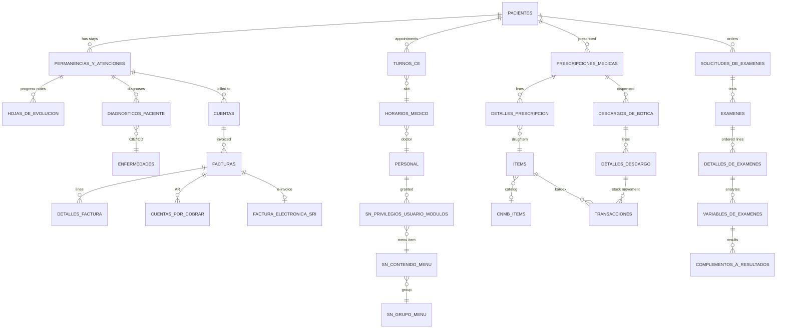

# Legacy System Audit

> Generated by reading the legacy codebase **SanoSoft** (Hospital Santa María) at repo root
> `\\10.1.1.4\xampp\htdocs\Sanosoft`, branch `main`, commit `f38bb2f3` (2026-06-29).
> Read-only, source-only audit (no live Oracle connection was made). Inferences are marked **INFERRED**.
> No secret values are reproduced — only the location of each secret is recorded.
> Produced by 6 parallel area audits (core/auth, HIS clinical, HAS finance, SGI/TIC, Api/integrations, reports/views).

---

## 1. Executive summary

SanoSoft is a large **hospital information + ERP system** for Hospital Santa María (Ecuador), built as a hand-rolled **server-rendered PHP** intranet app (no framework) talking to an **Oracle** database (`10.1.1.10/SMARIA`) through the legacy procedural **OCI8** API. It covers the full hospital lifecycle: admissions, outpatient/bed scheduling, the complete clinical record (Ecuador MSP "HCU" forms), nursing, pharmacy/inventory, clinical laboratory, imaging/PACS, surgery & anesthesia, billing + Ecuador **SRI electronic invoicing**, collections/AR, accounting, HR/payroll, quality (ISO/BSC), document management, occupational health & patient safety. Around the PHP core sit **three Node.js/Express microservices** (a WhatsApp/sales patient bot, an email/SMS verification API, and a payments API) and several external integrations (Twilio, Orthanc PACS, Ecuador Civil Registry, ORION lab, a payment gateway, Chatwoot, IESS/SOAMWEB).

- **Primary stack:** PHP (≈25,000 `.php` files, no framework, PHP 7.x on XAMPP/Windows INFERRED) + OCI8 → Oracle. Plus Node.js (Express 4 + `oracledb` + `sequelize-oracle`) for 3 APIs, a .NET CLI for SRI signing, and Python/EXE for DICOM conversion.
- **Databases:** Oracle is the system of record. **A second DBMS — Microsoft SQL Server — also exists** (accounting/"contable" in `GFN`, a token service, and a `LISTA_HABITANTES` citizen lookup). This is a heterogeneous, dual-DBMS landscape.
- **Scale:** ~7 top-level subsystems (HIS, HAS, SGI, TIC, Api, Reportes, SIS) → ~50+ business modules → **~250+ Oracle tables** + ~15 SQL Server tables/views identified from source (the live schema is certainly larger; see Coverage).
- **Top migration risks at a glance:**
  1. **Business logic lives in two invisible places:** ~30 Oracle **PL/SQL stored procedures** (billing, AR balance, credit notes, accounting, admissions) whose bodies are not in source, *and* in PHP itself (pharmacy stock/kardex math). Both must be reverse-engineered for dual-write.
  2. **Authentication = Oracle database accounts.** Each app user is a real Oracle user; login is an `oci_connect` with the typed credentials, and password changes run `ALTER USER ... IDENTIFIED BY`. There is no portable credential/role store — this cannot be carried to Postgres as-is.
  3. **Pervasive SQL injection + Oracle-dialect lock-in.** Nearly all SQL is built by string-concatenating `$_POST`/`$_GET` directly into query text, saturated with Oracle-only idioms (`SYS.DUAL`, `ROWNUM`, `DECODE`, `CONNECT BY`, sequences, `TO_DATE` masks).

---

## 2. Tech stack

| Layer | Technology | Version | Evidence (file) |
|-------|-----------|---------|-----------------|
| Language (core) | PHP | 5.5+ required; PHP 7.x INFERRED | `password_hash`/`PASSWORD_DEFAULT` `SIS/Login/core/controllers/loginControllers.php:369`; hardcoded `C:\xampp\htdocs\Sanosoft` `prueba.php:29` |
| Framework | None (hand-rolled front controller) | — | `index.php:3-13` dispatches `$_GET['view']` → `core/controllers/{view}Controllers.php` |
| ORM / data access (PHP) | **OCI8 procedural** (no ORM) | — | `core/conexion.php:2` `oci_connect(...,'AL32UTF8')`; wrappers `select_query`/`in_up_query` `core/conexion.php:108,220` |
| Secondary DB driver (PHP) | `sqlsrv` (SQL Server) | — | `core/conexion2.php`, `core/conexion.php:25-105`, `Modelo/conexion.php:27-32` |
| Build / packaging | None for PHP; `Jenkinsfile` present at root | — | repo root `Jenkinsfile` |
| Frontend | Server-rendered PHP + jQuery + Bootstrap 3 + AdminLTE/SB-Admin-2; DataTables, moment.js, alertify; **Vue 2** only in VIDEOS & some GFN screens | — | `views/general/header.php:1-10`, `footer.php:1-14`; `VIDEOS/GESTOR_VIDEOS/index.php:184` |
| Runtime / server | Apache (XAMPP) on Windows; multi-server (`10.1.1.4`, `10.1.1.16` facturación) | — | hardcoded UNC `\\10.1.1.4\...`; routing `loginControllers.php:112-173` |
| Database (primary) | **Oracle** (service `SMARIA`, host `10.1.1.10`, charset `AL32UTF8`) | unknown | `core/cofig.xml`; `loginControllers.php:95` |
| Database (secondary) | **Microsoft SQL Server** (`10.1.1.5\SQLEXPRESS` = `LISTA_HABITANTES`; `10.1.1.41\panacea` = `Ci`,`RRHH`,`Anexot`,`Adm`; accounting `TblCi*` in GFN; `dbo.TblCbToken`) | unknown | `Modelo/conexion.php:27-32`; `Api/token/token.php:16-19`; `GFN/solicitud_pago` |
| Node services | Node.js + Express `^4.21` + `oracledb ^6.6/6.7` + `sequelize ^6.37` + `sequelize-oracle ^3.3.2` | see §6 | `Api/CHATBOT/bot_ventas/package.json`, `Api/HSM_AUTH/package.json`, `Api/PAGOS/servicios_pagos/package.json` |
| SRI e-invoice signer | .NET CLI (`firmar.exe`, XAdES-BES + SOAP) | — | `FACTURACION/Facturar/fuente fatura electronia/firmar.sln` (`envio.cs`, `FirmaXMLFE.cs`) |
| DICOM converter | Python + PyInstaller EXE (`pngtodicom.exe`) | — | `Api/ORTHANC/pngtodicom.py` |
| Reporting | PHPExcel→TCPDF (primary), dompdf, FPDI/FPDF | — | `Reportes/HCU-003.../index.php:15-18,738`; `Reportes/HCU-005.../pdf.php:138` |
| Other notable libs | Twilio, nodemailer, puppeteer, tesseract.js, FusionCharts, PHPMailer | — | per-service package.json; `SGI/.../FusionCharts` |

**App type:** mixed — predominantly **server-rendered MVC-ish PHP** (each screen is a `SIS/<Module>/index.php` or `<Subsystem>/<module>/index.php` loaded into an `<iframe>` in the AdminLTE menu shell, with AJAX to a `comunes/index.php` SQL backend), **+ 3 Node REST APIs**, **+ external CLI/EXE helpers**.

**Entry points:**
- Root front controller `index.php` → `core/core.php` → `core/controllers/{view}Controllers.php`; default `indexControllers.php` → `SIS/Login/index.php` (login screen).
- Menu shell `SIS/Menu/index.php` (treeview built from DB `SN_*_MENU` tables; each leaf calls `buscar_web(archivo, ruta)` to load a module into `iframe#contenedor_web`).
- Node services: `Api/CHATBOT/bot_ventas/app.js` (port 3003), `Api/HSM_AUTH/app.js`, `Api/PAGOS/servicios_pagos/app.js`.

---

## 3. Module map

> Naming: **HIS** = clinical, **HAS** = admin/financial, **SGI** = management systems, **TIC** = IT/security, **Api** = backends/integrations, **Reportes/Modulos/views** = reporting & shared UI, **SIS/core/Modelo** = framework/auth.

### SIS / core / Modelo — framework, DB access, auth
- **Purpose:** App bootstrap, Oracle/SQL-Server connection layer, login/menu shell, query wrappers + error logging.
- **Entry points:** `index.php`, `core/core.php`, `core/conexion.php`/`conexion2.php`, `Modelo/conexion.php`, `SIS/Login/`, `SIS/Menu/`, `SIS/Log_error/`, `SIS/query/`.
- **Tables touched:** `PDP_LOG_REGISTRO_SESIONES`, `SEG_LOGS_ACCESOS`, `DBA_USERS`, `PERSONAL`, `SN_PERSONAL_AUDITOR`, `SN_PRIVILEGIOS_USUARIO_MODULOS`, `SN_*_MENU`, `SN_CAJA_USUARIO`, `CAJAS`, `SN_LOG_CONSULTAS`, `SN_LOG_ERRORES`.
- **Of interest:** Auth = Oracle account login (see §5). `Modelo/` holds **820 per-user `<COD>.xml` credential files** generated at login. One bind-variable use found in the whole layer; everything else is concatenated SQL. `SIS/query/archivo.sql` is a **7 MB** SQL dump (likely authoritative schema/DDL — unparsed).

### HIS — clinical (419 PHP files call `oci_*`)
- **FARMACIA** (pharmacy): inventory receiving/dispensing/returns/transfers, supplier mgmt, CNMB national drug catalog, ATC, psychotropics, price regulation. Stock ledger = `TRANSACCIONES` (kardex; balance computed in PHP, no balance table).
- **HCU** (historia clínica única): Ecuador MSP forms (001/003/005/008/012/017/020/022/024/033/051/053), epicrisis, consents, referrals, procedures.
- **LABORATORIO**: order→sample→result→validation across hematología/química/microbiología/citología/biopsia/COVID; results entered manually or uploaded as PDFs (no analyzer/HL7 link).
- **MEDICOS** (physician workstation): anamnesis, diagnoses, exam orders, prescriptions (CNMB), interconsultas, anesthesia/surgical records, epicrisis, neonatal, nosocomial infections, Orthanc PACS viewer (iframe).
- **ENFERMERIA** (nursing): evolution notes, vitals, intake/output, kardex med admin, blood transfusion (SMT), wristband verification, ward stock (botiquines), O2, farmacovigilancia.
- **DTM** (medical audit / tech-billing): record & billing audit, surgical parts costing, physician honoraria/commissions, OR (quirófano) costs. Uses a `Controllers/` MVC layout in `CQP`.
- **IMAGENES**: thin — only imaging-appointment scheduling (5 files); viewing is in `MEDICOS/ORTHANC`.

### HAS — admin / financial
- **FACTURACION** (billing) — *highest value*: patient invoicing, SRI electronic invoice, credit notes, advances, packages, cashier close. Multi-table transactional commits.
- **COB COBRANZA** (collections/AR): receivables, installments, liquidation, sales summaries; also re-runs the billing/SRI write path.
- **ADM ADMISION** (admissions): patient admission, stays (permanencias), beds, outpatient turns (turnos CE), referrals, diagnoses, promotions (~50 sub-apps; newer `ADMISION_HSP_V2`).
- **GFN** (finance) — *dual-DB*: period close, cash vales, bank deposits, payment requests, e-payments (Vue), accounting templates; uses **both Oracle and SQL Server** (`TblCi*`).
- **MKT** (CRM/cotizador): sales quotes, CRM pipeline/dashboards, pricing/coverage policy.
- **COA** (procurement): supplier promotion exceptions only.
- **MSG ADMINISTRACION**: payroll (NOMINA, on Oracle despite `Tbl*` names), waste (DESECHOS), laundry, maintenance.
- **GAA**: `GAA/GTH` directory **empty** in source (OPEN QUESTION).

### SGI — management systems (write into the shared HIS/billing schema — not isolated)
- **SGI/SGI**: strategic indicators / Balanced Scorecard (`SGI_ISO*`).
- **SGI/SGC**: quality management (ISO processes, indicators, action plans) + finance commission provisioning.
- **SGI/SGD**: document management (`SGD_ARCHIVOS`).
- **SGI/GFN**: master rate list & fee payments.
- **SGI/GGR**: medical honoraria/fees reporting.
- **SGI/GSP**: patient safety (event notification, wristband, surveys).
- **SGI/GTH**: HR — medical rest/leave certificates (writes into clinical tables).
- **SGI/SSA**: occupational health & safety (risk matrix, job posts, occupational medical files, odontogram) + HR dashboards.

### TIC/SEG — security/permissions (16 features)
- RBAC admin (Menu de Usuarios, Menu por Cargos, Maestro de Grupos), employee/user CRUD (`CRUD_Personal`), API-token issuance & audit, digital-signature management, doctor scheduling, production reports, internal ticketing, a payroll-cache ETL (`Procesos_bd`), a generic table viewer.

### Api — backends & integrations (see §6)
- **CHATBOT/bot_ventas** (Node): WhatsApp/sales patient bot. **HSM_AUTH** (Node): email/SMS verification. **PAGOS/servicios_pagos** (Node): payments + 5-min cron to cancel unpaid appointments. PHP submodules: `REG_CIVIL`, `ORION`, `MAIL`, `ORTHANC`, `PAGOS`, `Proc_contables`, `FIN`, `SOAMWEB`, `DBMS_JOBS`, `token` (SQL Server), `Comun`, CRUD helpers (`Creacion/Insert/Select/Update`), `RRHH`, `HSM_DOCS`, `CRM_VENTAS`.

### Reportes / Modulos / views / VIDEOS / ETIQUETAS_SANGRE
- **Reportes**: printable MSP clinical forms + expense reports (PHPExcel/TCPDF/dompdf/FPDI).
- **Modulos**: shared pieces incl. **COBERTURA_SALUD** (shells out to `MspCoberturas.exe`).
- **views**: shared frontend (headers/footers/JS libs); **signatures = static PNGs keyed by staff code** (no crypto signing).
- **VIDEOS**: waiting-room digital-signage manager (Vue 2; `MKT_VIDEOS`/`RUTAS`).
- **ETIQUETAS_SANGRE**: empty placeholder (`1.php`, 1 byte) — not implemented in source.

---

## 4. Database — table inventory

> All Oracle tables below are **migration class `OLD`** (they exist in the Oracle system of record and require dual-write during transition). **SQL Server tables are tagged `SQLSVR`** — they are *not* in Oracle and are a separate migration problem (the accounting/contable and citizen-lookup systems).
> "Written by": **app** = PHP/OCI8 inline SQL; **node** = Node Sequelize/oracledb; **proc** = Oracle PL/SQL; **sqlsrv** = SQL Server. PK/FK are shown where evidenced in source (mostly inferred from `*_SEQ` usage and join columns); blank = not determinable from source.

### 4.1 Summary (grouped by domain)

#### People, org & security
| Table | Owning module | Purpose | PK (inferred) | Key FKs | Written by | Class | Notes |
|-------|--------------|---------|---------------|---------|-----------|-------|-------|
| PERSONAL | core/TIC | Staff master = app users | CODIGO | ESPPRS→ESPECIALIDAD_PERSONAL | app | OLD | Holds FIRMA_RUBRICA/SELLO, PASSWORD_HASH (write-only/vestigial), TIPO_SERVIDOR; soft-delete via ESTADO_DE_DISPONIBILIDAD |
| ESPECIALIDAD_PERSONAL / ESPECIALIDADES / ESPECIALIDADES_MEDICOS | core | Staff specialties | CODIGO | → PERSONAL | app/node | OLD | reference/lookup |
| CARGOS | TIC | Job positions | | | app | OLD | "role" source via CG_REF_CODES domain 'CARGO' |
| DEPARTAMENTOS | core | Departments | | | app/node | OLD | reference/lookup |
| AREAS | core | Physical areas | CODIGO | | app | OLD | reference/lookup |
| SN_GRUPO_MENU | TIC | Menu groups | ID_GRUPO_MENU | | app | OLD | RBAC menu tree |
| SN_SUBGRUPO_MENU | TIC | Menu subgroups | ID_SUBGRUPO | → SN_GRUPO_MENU | app | OLD | |
| SN_CONTENIDO_MENU | TIC | Menu leaf items / routing | ID_CONTENIDO | → SN_GRUPO_MENU | app | OLD | NOMBRE_ARCHIVO maps menu→PHP file |
| SN_PRIVILEGIOS_USUARIO_MODULOS | TIC | User↔menu grant junction | (CODIGO_USUARIO,ID_CONTENIDO) | → PERSONAL, SN_CONTENIDO_MENU | app | OLD | ESTATUS A/I soft-revoke; the RBAC core |
| SN_PERSONAL_AUDITOR | core | Auditor role flag | | → PERSONAL | app | OLD | ID_AUDITOR IN ('A04','A06') |
| SN_CAJA_USUARIO | core | Cashbox→user binding | | → CAJAS, PERSONAL | app | OLD | |
| SN_CONSULTORIO_MEDICO / SN_CONSULTORIOS / SN_CONSULTORIO_TURNO / SN_CONSULTORIO | TIC/HIS | Consulting-room & room-turn binding | | → PERSONAL | app | OLD | |
| SN_SOLICITUDES_INTERNAS | TIC | Internal tickets | | | app | OLD | transactional |
| ADM_SERVIDORES / ADM_SERVIDORES_NODO | core/Api | App-server queue/registry | | | app/node | OLD | fed by proc ADM_PROC_SERVIDORES |
| PDP_LOG_REGISTRO_SESIONES | core | Login attempt/session log | | | app | OLD | ACCESO_INCORRECTOS counter; seq SECU_PDP_LOG_REGISTRO_SESIONES |
| SEG_LOGS_ACCESOS | core | Access audit (INICIO/FIN) | | → PERSONAL | app | OLD | append-only |
| SN_LOG_CONSULTAS | core | Failed-query audit log | ID_CONSULTA | | app | OLD | CONSULTA likely CLOB (INFERRED) |
| SN_LOG_ERRORES | core | PHP error sink | ID | | app | OLD | append-only |
| SEG_FIRMAS_RESPONSABILIDAD | TIC | Responsibility signatures | | | app | OLD | |

#### Patients, encounters, scheduling
| Table | Owning module | Purpose | PK (inferred) | Key FKs | Written by | Class | Notes |
|-------|--------------|---------|---------------|---------|-----------|-------|-------|
| PACIENTES | HIS/HAS/Api | Patient master | (HC / CEDULA) | | app/node | OLD | central entity; also PACIENTES_TEMPORALES staging (bot) |
| PERMANENCIAS_Y_ATENCIONES | HAS/HIS | Admission/stay/encounter = episode key | | → PACIENTES | app/proc | OLD | **referenced everywhere**; proc CREA_PERMANENCIA |
| EMERGENCIAS / EMERGENCIAS_OBSTETRICAS | HIS | ER / obstetric ER episodes | | → PACIENTES | app | OLD | transactional |
| REGISTROS_PACIENTE | HIS | Patient record entries | | → PACIENTES | app | OLD | seq RGTPCN_SEQ |
| TURNOS_CE | HAS/HIS/Api | Outpatient appointment turns | | → PACIENTES, HORARIOS_MEDICO | app/node/proc | OLD | **write-heavy/transactional**; touched by billing, bot, PAGOS cron |
| TURNOS_CAMAS | HAS/HIS | Bed-turn assignments | | → CAMAS_HOSPITALIZACION | app | OLD | transactional |
| CAMAS_HOSPITALIZACION | HIS | Hospital beds | | | app | OLD | |
| ADM_TURNOS_LLEGADA | HAS | Turn arrival tracking | | → TURNOS_CE | app/proc | OLD | procs ADM_PROC_*_TURNO_LLEGADA; seq SECU_ADM_TURN_LLEG |
| HORARIOS_MEDICO / HORARIOS_AMPLIACION / HORARIO_FALTA | HIS/TIC/Api | Doctor schedules / extensions / absences | | → PERSONAL | app/node | OLD | DELETE+INSERT churn |
| SECU_COLA_ESP | HIS | Waiting-queue counter | | | app | OLD | sequence-like |
| VISITAS_CONVENIOS | HIS | Insurer visit tracking | | | app | OLD | |

#### Clinical record
| Table | Owning module | Purpose | PK (inferred) | Key FKs | Written by | Class | Notes |
|-------|--------------|---------|---------------|---------|-----------|-------|-------|
| HOJAS_DE_EVOLUCION | HIS/SGI | Clinical progress/evolution notes | | → PERMANENCIAS, PERSONAL | app | OLD | central; seq HOJEVL_SEQ (32 uses); written by SGI/GTH too |
| HOJAS_EVOLUCIONES_ENFERMERIA / REGISTRO_ENFERMERIA_HJEVL | HIS(ENF) | Nursing notes | | → PACIENTES | app | OLD | |
| DIAGNOSTICOS_PACIENTE | HIS | Patient diagnoses | | → ENFERMEDADES | app | OLD | seq DGNPCN_SEQ |
| ENFERMEDADES | HIS | Disease/CIE-ICD catalog | | | app/node | OLD | reference/lookup |
| SIGNOS_VITALES | HIS | Vital signs | | → PACIENTES | app | OLD | transactional |
| DIURESIS / INGESTAS_Y_ELIMINACIONES | HIS(ENF) | Fluid balance / intake-output | | → PACIENTES | app | OLD | |
| MOMENTOS_CUMPLIMIENTO | HIS | Med-administration timing (MAR) | | → DETALLES_PRESCRIPCION | app | OLD | |
| INFORMACION_DE_CUIDADO | HIS | Care info | | | app | OLD | |
| ANTECEDENTES_PERSONALES / _FAMILIARES / TIPOS_ANTECEDENTES_* / ANTECEDENTES_GINECO_OBSTETRICO / _INFANTILES | HIS | Patient history | | → PACIENTES | app | OLD | |
| ALERGIAS / TIPOS_DE_ALERGIAS / HABITOS / INMUNIZACIONES | HIS | Allergies/habits/immunizations | | | app | OLD | |
| MOTIVOS / MOTIVOS_DE_CONSULTAS | HIS | Consultation reasons | | | app | OLD | reference/lookup |
| CATEGORIZACION | HIS(ENF) | Patient acuity categorization | | | app | OLD | |
| CONSENTIMIENTOS_INFORMADOS / MODELO_CONSENTIMIENTO | HIS | Informed consents + templates | | | app | OLD | |
| AUTORIZACIONES_PACIENTES | HIS | Patient authorizations | | | app | OLD | |
| DIETAS_PEDIDOS / DIETAS_DETALLE | HIS | Diet orders | | | app | OLD | seq DIETA_PED_SEQ |
| TRANSFERENCIA_PACIENTES | HIS(ENF) | Patient transfers | | | app | OLD | |
| BRAZALETE_VERIFICACION / BRAZALETE / BRAZALETE_REPOSICION / BRAZALETE_RECHAZO | HIS(ENF)/SGI(GSP) | Wristband ID & verification | | → PACIENTES | app | OLD | |
| EPICRISIS | HIS | Discharge summaries | | → PERMANENCIAS | app | OLD | |
| DTMCRM_CERTIFICADO_REPOSO / DTMCRM_CONTINGENCIAS | HIS/SGI(GTH) | Medical rest/leave certificates | | → PACIENTES | app | OLD | SGI/GTH writes these |

#### Referrals
| Table | Owning module | Purpose | Written by | Class | Notes |
|-------|--------------|---------|-----------|-------|-------|
| REFERENCIAS_DIAGNOSTICOS | HIS | Referral diagnoses | app | OLD | seq RFRDGN_SEQ |
| CONTRA_REFERENCIAS / _EXM / _DIAG | HIS/Api | Counter-referrals (+exams/dx) | app/node | OLD | seq CNTRFR_SEQ |
| REFERENTES | HIS | Referring contacts | app | OLD | |
| ESTABLECIMIENTOS_DE_SALUD | HIS | National health-facility registry | app | OLD | reference/lookup (MSP) |
| INTERCONSULTAS | HIS(MEDICOS) | Inter-consultation requests | app | OLD | seq INTCNS_SEQ |

#### Orders, exams & laboratory
| Table | Owning module | Purpose | Written by | Class | Notes |
|-------|--------------|---------|-----------|-------|-------|
| SOLICITUDES_DE_EXAMENES | HIS/Api | Exam order header | app/node | OLD | seq NUMEROSOLEXA_SEQ |
| EXAMENES | HIS/Api | Exam/test catalog + instances | app/node | OLD | seq NUMEROEXA_SEQ; TPOEXM_ID='IM' = imaging |
| DETALLES_DE_EXAMENES / DETALLE_DE_EXAMEN | HIS/SGI | Ordered test lines / results | app | OLD | result done = FECHA_RESULTADOS not null |
| VARIABLES_DE_EXAMENES | HIS/Api | Analytes per exam | app/node | OLD | |
| COMPLEMENTOS / COMPLEMENTOS_A_RESULTADOS / COMPLEMENTOS_DE_VARIABLES | HIS/SGI | Result values/complements | app | OLD | seq DTLCMP_SEQ |
| RANGOS_DE_NORMALIDAD / RANGOS_NORMALIDAD_COMPLEMENTOS | HIS | Reference ranges | app | OLD | reference/lookup |
| TIPOS_DE_EXAMENES / LAB_TIPOS_DE_EXAMENES | HIS | Exam-type catalog | app | OLD | reference/lookup |
| RUTAS | HIS/HAS | File-path config (results, e-invoice dirs, videos) | app | OLD | multi-purpose path registry |
| VALIDA_HOJA_RUTA / VALIDACION_HOJA_RUTA | HIS(LAB) | Lab worklist validation | app | OLD | |
| PDP_LOG_SEGUNDA_VERIFICACION | HIS/Api | Second-verification / OTP-lockout log | app/node | OLD | bot OTP lockout (max 4) |
| GERMENES / GERMENES_DE_PRUEBAS / GERMENES_EN_PAPS / COMPORTAMIENTOS_GERMEN / ANTIBIOTICOS | HIS(LAB) | Microbiology: germs, sensitivities, antibiotics | app | OLD | |
| BIOPSIAS / BIOPSIAS_DETALLES / CITOLOGIAS / PAPANICOLAOUS | HIS(LAB) | Pathology / cytology | app | OLD | |
| RIS_EQUIPO_TRABAJO | HIS(IMAGENES) | RIS modality/worklist | app | OLD | INFERRED RIS link |

#### Pharmacy & inventory
| Table | Owning module | Purpose | Written by | Class | Notes |
|-------|--------------|---------|-----------|-------|-------|
| TRANSACCIONES | HIS(FARMACIA) | **Central kardex/stock movement ledger** | app | OLD | **write-heavy**; snapshots STOCK_ANTERIOR/COSTO_*; balance computed in PHP, no balance table; seq TRNID_SEQ + MAX+1 fallback |
| INGRESOS_DE_BOTICA | HIS(FARMACIA) | Receiving headers | app | OLD | transactional; counter via CG_CODE_CONTROLS 'INGBTC_SEQ' |
| DESCARGOS_DE_BOTICA / DETALLES_DESCARGO | HIS(FARMACIA)/ENF | Dispensing header/lines | app | OLD | seq DSCBTC_SEQ; FIRMA_PACIENTE base64 |
| EGRESOS_DE_BOTICA / EGRESOS_SUBBODEGAS | HIS(FARMACIA) | Stock issues | app | OLD | transactional |
| TRANSFERENCIAS | HIS(FARMACIA) | Inter-warehouse transfers | app | OLD | transactional |
| REGULACIONES | HIS(FARMACIA) | Stock adjustments | app | OLD | transactional |
| ITEMS | HIS/HAS | Product/billable-item master | (ITM_TIPO,SBS_SCC,SBS,CODIGO) | app | OLD | **composite natural key** |
| SUB_BODEGAS / SECCIONES / SUBSECCIONES | HIS(FARMACIA) | Warehouse hierarchy | app | OLD | |
| BOTIQUINES / BOTIQUINES_TIPO_SERVICIO / BOTIQUINES_FORMATOS | HIS(ENF) | Ward drug stock | app | OLD | links to DESCARGOS_DE_BOTICA |
| CNMB / CNMB_ITEMS / CNMB_ITEM_CONV | HIS(FARMACIA) | National drug catalog (Ecuador CNMB) | app | OLD | reference/lookup |
| ATC / PRESENTACION / CONCENTRACION / NIVELES_DESAGREGACION / PRM_VIA_ADMINISTRACION_MED | HIS(FARMACIA) | Drug classification & forms | app | OLD | reference/lookup |
| PROVEEDORES | HIS/HAS/SGI | Suppliers | app | OLD | also SQL-Server TBLGEPROVEEDOR |
| CAMBIO_PRECIOS | HIS(FARMACIA) | Price-change history | app | OLD | |
| ENF_DEVOLUCIONES_D | HIS | Nursing returns | app | OLD | |

#### Prescriptions
| Table | Owning module | Purpose | Written by | Class | Notes |
|-------|--------------|---------|-----------|-------|-------|
| PRESCRIPCIONES_MEDICAS / DETALLES_PRESCRIPCION | HIS(MEDICOS)/Api | Prescriptions + lines | app/node | OLD | FK→CNMB/ITEMS; seq SECU_INDICACIONES_MED |

#### Surgery, anesthesia & medical audit (DTM)
| Table | Owning module | Purpose | Written by | Class | Notes |
|-------|--------------|---------|-----------|-------|-------|
| REGISTROS_OPERATORIOS | HIS/DTM | Operative records | app | OLD | |
| PARTES_OPERATORIOS / _SOLICITUD | HIS/DTM | Surgical parts + requests | app | OLD | seq PRTOPR_SEQ |
| EQUIPOS_OPERATORIOS / _SOLICITUD | DTM | OR teams | app | OLD | |
| PROTOCOLOS_QUIRURGICO / _PROC / PROTOCOLOS | DTM | Surgical protocols | app | OLD | |
| REGISTROS_TRANS_ANESTESICOS / TRANS_ANTESTESICOS / POST_ANESTESICOS | HIS/DTM | Anesthesia records | app | OLD | |
| AGENTES | HIS(MEDICOS) | Anesthetic agents | app | OLD | reference/lookup |
| PROCEDIMIENTOS_HOSPITALARIOS / _REALIZADOS / _MENORES / _SOLICITADOS | HIS/DTM | Procedures | app | OLD | seq PRCRLZ_SEQ |
| DETALLES_COMPLICACIONES / LOCALIZACION_DE_LESIONES | HIS/DTM | Complications / lesion localization | app | OLD | |
| HONORARIOS_MEDICOS | HAS/DTM | Physician fees | app/proc | OLD | seq SN_HNRMED_SEQ; proc FACTURACION_HONORARIO |
| FORM_GASTOS_QUIROFANO_DET / form_gastos_quirofano_det / GASTOS_QUIROFANO_V | HAS/DTM | OR expense form + values view | app | OLD | V = view |
| PARTES_DESCARGOS | DTM | Parts discharges | app | OLD | |
| DTM_AUDITORIA_MEDICA_H / _DET | DTM | Medical audit header/detail | app | OLD | |
| DTM_AUDITORIA_DOC / _DET / DTM_AUDITORIAS / DTM_CRITERIOS_AUDITORIA / DTM_PARAMETROS / DTM_MODELO | DTM | Audit docs, criteria, config | app | OLD | |

#### Blood bank (SMT)
| Table | Owning module | Purpose | Written by | Class |
|-------|--------------|---------|-----------|-------|
| SMT_SOLICITUDES_TRANSFUSION / SMT_DETALLES_TRANSFUSION_FINAL / SMT_UNIDADES / SMT_FRACCIONAMIENTOS_UNIDADES | HIS(ENF/MEDICOS) | Transfusion requests, units, fractionation | app | OLD |

#### Billing, AR & cashier
| Table | Owning module | Purpose | PK | Written by | Class | Notes |
|-------|--------------|---------|----|-----------|-------|-------|
| FACTURAS | HAS(FACTURACION/COB) | Invoices | | app/proc | OLD | **write-heavy**; procs ANULA_FACTURAS, SN_NC_FACTURAS |
| DETALLES_FACTURA | HAS | Invoice line items | | app | OLD | seq DTLDSC_SEQ |
| CUENTAS_POR_COBRAR | HAS(COB) | Accounts receivable | | app/proc | OLD | seq CTACBR_SEQ; proc ACT_SALDO_CUENTAS_POR_COBRAR |
| CUOTAS_A_COBRAR | HAS(COB) | Installments receivable | | app/proc | OLD | proc CREA_NOTAS_CUOTAS_COBRAR |
| NOTAS | HAS | Payment receipt notes | | app | OLD | seq NTA_SEQ |
| CUENTAS | HAS/HIS | Patient account / charges | | app/proc | OLD | **write-heavy**; seq CNTS_SEQ; **DELETEd by SGI/produccion** |
| CUENTAS_CARGOS2 / CARGOS | HAS/DTM | Account charges | | app | OLD | |
| CUENTAS_COPAGO | HAS/HIS | Copayments | | app | OLD | also DELETEd by SGI/produccion |
| CUENTAS_EN_PAQUETES | HAS | Package accounts | | app | OLD | |
| CABECERA_INSUMOS | HAS | Supply header | | app | OLD | seq CBCINS_SEQ |
| ANTICIPOS | HAS | Patient advances | | app/proc | OLD | proc LIBERA_ANTICIPOS |
| DESCUENTOS_GENERADOS / DETALLES_DESCUENTO | HAS | Discounts | | app | OLD | seq DSCGNR_SEQ |
| AUTORIZA_PAGO / AUTORIZA_PAGO_FACTURA | HAS(COB) | Payment authorizations | | app | OLD | |
| CLIENTES_PAGAN | HAS(COB) | Paying clients/payers | | app | OLD | |
| MODO_DE_PAGO / MODO_DE_PAGO_CUENTAS | HAS | Payment methods | | app | OLD | reference/lookup |
| CAJAS | core/HAS | Cashier tills | CODIGO | app | OLD | reference/lookup |
| CG_CODE_CONTROLS | HAS/HIS | App-managed document/code counters | (CC_DOMAIN) | app | OLD | **concurrency-critical**; invoice numbering; CC_NEXT_VALUE |
| CG_REF_CODES | all | Universal reference-code dictionary | (RV_DOMAIN,RV_LOW_VALUE) | app | OLD | Oracle-Designer legacy; the system-wide enum store |
| COMPANIAS | HAS | Companies/payers | | app/node | OLD | |
| FAC_WK_HOJA_RUTA / FAC_WK_SEMAFORO_PROMOCION | HAS | Billing work/scratch tables | | app | OLD | INFERRED transient |

#### Electronic invoicing (SRI)
| Table | Owning module | Purpose | Written by | Class | Notes |
|-------|--------------|---------|-----------|-------|-------|
| FACTURA_ELECTRONICA_SRI | HAS | E-invoice header/status | app | OLD | **write-heavy**; AUTORIZADO/NUMERO_AUTORIZACION/ESTADO |
| FACTURA_ELECTRONICA_DTL_SRI / DTLIMP_FACTURA_ELECTRONICA_SRI | HAS | E-invoice detail + tax detail | app/proc | OLD | procs CARGA_DETALLES_FCT_ELEC/_DETA/_IMG |
| NOTA_CREDITO_ELECTRONICA | HAS | E-credit notes | app | OLD | |
| PARAMETROS_EMPRESAS | HAS | Per-company params (TIPO_AMBIENTE_SRI) | app | OLD | drives test/prod SRI |

#### Insurance, tariffs & promotions
| Table | Owning module | Purpose | Written by | Class | Notes |
|-------|--------------|---------|-----------|-------|-------|
| TARIFARIOS / TARIFARIOS_ITEMS / GRUPOS_TARIFARIO / SUBGRUPOS_TARIFARIO | HIS/HAS | Price lists | app | OLD | reference/lookup |
| CONVENIOS_EQUIVALENCIAS / _ITEMS | HIS/HAS | Insurer item equivalences | app | OLD | hardcoded 'SNSENE2015'/'AMCSPW6' seen |
| CONVENIOS_PROMOCIONES | HAS | Agreement promotions | app | OLD | |
| PROMOCIONES / PROMOCIONES_CONVENIOS / PROMOCIONES_PACIENTES / TIPOS_PROMOCIONES / EXCEPCIONES_PROMOCIONES | HAS/Api | Promotions/agreements/beneficiaries | app/node | OLD | seqs PRMCNV_SEQ, PRMPCN_SEQ; PROMOCIONES_CONVEVIO is a typo'd alias |
| ENTIDADES_BENEFICIARIAS / MAESTROS_BENEFICIARIOS | HAS/HIS | Beneficiary entities | app | OLD | |
| POLITICA_COBERTURA_PLAN / POLITICA_PRECIOS | HAS | Coverage/price policy | app | OLD | |
| CUENTAS_PAGOS_API | HAS/Api | Online-payment token→account | app/node | OLD | ESTADO 0/2; PAGOS cron resolves |

#### Geography & misc catalogs
| Table | Owning module | Purpose | Written by | Class |
|-------|--------------|---------|-----------|-------|
| PROVINCIAS / CANTONES / PARROQUIAS | HIS/Api | Geographic catalog | app/node | OLD |
| OCUPACIONES | HIS/Api | Occupation catalog | app/node | OLD |
| HABITANTES | HAS | Resident/citizen master (Oracle) | app | OLD |
| MKT_VIDEOS / RUTAS | VIDEOS/MKT | Digital-signage playlist | app | OLD |

#### CRM / quotes (MKT)
| Table | Owning module | Purpose | Written by | Class |
|-------|--------------|---------|-----------|-------|
| COT_COTIZADOR / _DETALLE_ITEMS / _CIRUGIA / _DETALLE_EQUIPO | HAS(MKT) | Sales quotes + lines | app | OLD |
| COT_PROSPECTO / COT_EMPRESA_TRABAJO / COT_PLANES | HAS(MKT) | CRM prospects/plans | app | OLD |

#### SGI module-owned (management systems)
| Table | Owning module | Purpose | Written by | Class | Notes |
|-------|--------------|---------|-----------|-------|-------|
| SGI_ISO* (PERSPECTIVAS, OBJETIVOS, DPTO, CARGO, AREAS, DIVISION, ORGANIGRAMA, PROCESOS, NODO_ORG) | SGI/SGI | Strategic planning / BSC | app | OLD | |
| SGI_INDICADORES / SGI_INDICADORESMEDICION | SGI/SGI | KPIs + measurements | app | OLD | proc SGI_PRC_GENERA_KPI |
| SGI_PROCESO / _SUBPROCESO / _TIPO_PROCESO / (SGI_)BALANCE_SCORE_CARD | SGI/SGI | Process model / scorecard | app | OLD | |
| SGC_* (PROCESO, SUBPROCESO, TIPO_PROCESO, INDICADORES, DESPLIEGUE_OBJETIVOS, SEGUIMIENTO, PLAN_ACCION, RECURSOS, CATALOGOS, REGISTROS, REQUISITOS, COMUNICACIONES, PROCESOS_VINCULADOS) | SGI/SGC | Quality management (ISO) | app | OLD | |
| SGD_ARCHIVOS | SGI/SGD | Document management metadata | ID_ARCHIVO | app | OLD | files on disk |
| GSP_* (EVENTO_NOTIFICACION, INDICADOR, GESTION_REALIZADA/_ANALISIS/_MULT, NATURALEZA, VERIFICACION_CRUZADA, RESULTADOS_DETALLE, ENCUESTAS, MODELO, TIPO_EVENTO/_DESENLACE/_CRITERIOS) | SGI/GSP | Patient safety | app | OLD | |
| SSA_* (RIESGO_MATRIZ/FACTOR_RIESGO/METODOLOGIA/CRITERIO/CONTROLES/INTERVENCION/MEDIDA/TIPO_MEDIDA, NIVEL_N[CDEPR], PUESTOS_TRABAJO/_SUT, CLASIFICACION_OCUPACIONES, DASHBOARD_PARAMETROS, APTITUD_MEDICA, VACUNAS, CERTIFICADOS) | SGI/SSA | Occupational health & safety | app | OLD | |
| ODONTOGRAMA / ODONTOGRAMA_G / TRAT_ODONTOLOGICO | SGI(SSA)/HIS | Dental chart | app/proc | OLD | seq ODONTO_SEQ; proc GUARDA_IMAGENES |
| GFN_LISTA_MAESTRA / GFN_PAGO_LISTAMAESTRA | SGI/GFN | Master rate list + fee payments | app | OLD | |
| FIN_ASIENTO_COM_MED_CABECERA / _DETALLE / _AUXILIAR / FIN_PLAN_CTA_PROVISION | SGI(SGC)/HAS | Medical-commission accounting entries | app/proc | OLD | proc FIN_ASIENTO_COM_MEDICAS |
| DEPOSITOS_BANCARIOS / LOG_CIERRE_PERIODOS / SGI_CAB_VALES_CAJA | HAS(GFN) | Bank deposits, period-close log, cash vales | app | OLD | |
| NOM_CONTRATO_CACHE / NOM_CERT_TRABAJO_PLANTILLA / _CAMPOS / _REL_MOD_CON / _REG | SGI(GTH/SSA)/Api | Payroll contract cache + work-cert templates | app | OLD | DELETE+bulk-INSERT ETL |

#### Oracle data-dictionary objects queried directly (not app tables — migration-relevant)
| Object | Used for | Evidence |
|--------|---------|----------|
| DBA_USERS | Auth — join app users to Oracle accounts | loginControllers.php:133 |
| ALL_TAB_COLUMNS / USER_TAB_COLUMNS | Dynamic SELECT building, generic table viewer | core/conexion.php:264; TIC/contenido_tablas |
| USER_ERRORS | (SGI) PL/SQL error inspection | SGI scan |
| SYS.DUAL | Sequence NEXTVAL / scalar selects | everywhere |

#### SQL Server tables (separate DBMS — NOT Oracle)
| Table | System | Purpose | Written by | Class | Evidence |
|-------|--------|---------|-----------|-------|----------|
| TblCiSolicitudPago, TblCiCabMovimiento, TblCiDetMovimiento, TblCiCabMvtosBcos, TblCiRelConceptosSolicitudPago | Accounting (`Ci`) | Payment requests, accounting movements, bank movements | sqlsrv | **SQLSVR** | GFN/solicitud_pago, consola_pagos |
| TblCbDetPlantilla | Accounting (`Cb`) | Accounting templates | sqlsrv | SQLSVR | GFN/plantillas_contables |
| TblGeSecuencia | Accounting (`Ge`) | SQL-Server-side sequence table | sqlsrv | SQLSVR | GFN |
| TBLNOEMPLEADO, TblNoCargo | Payroll (Oracle, despite name) | Employee master / positions | app | OLD | MSG/NOMINA/Crud_empleados.php:2,17 (oci) — *Oracle, not SQL Server* |
| TBLGEPROVEEDOR | Accounting | Supplier bridge | sqlsrv/app | SQLSVR? | SGI/GFN — VERIFY which DB |
| dbo.TblCbToken | Token service | Short-lived single-use tokens | sqlsrv | SQLSVR | Api/token/token.php:16-19 |
| (DB) LISTA_HABITANTES @ 10.1.1.5\SQLEXPRESS | Citizen lookup | Resident registry | sqlsrv | SQLSVR | Modelo/conexion.php:27-29 |
| (DBs) Ci, RRHH, Anexot, Adm @ 10.1.1.41\panacea | Panacea ERP | External accounting/HR | sqlsrv | SQLSVR | core/conexion.php:25-105 |

### 4.2 Core tables — column detail

Source-only audit could not safely enumerate full column lists for most tables (would require the live data dictionary or parsing the 7 MB `SIS/query/archivo.sql`). The few with column-level evidence from code:

**PERSONAL** (staff master = app users) — observed columns: `USUARIO`, `CODIGO`, `NOMBRES`, `APELLIDOS`, `CARGO`, `EMAIL`, `CEDULA`, `TIPO_SERVIDOR`, `ESPPRS_CODIGO`, `AREA_FISICA_ASIGNADA`, `DEPARTAMENTO_FISICO_ASIGNADO`, `FIRMA_RUBRICA`, `SELLO`, `FIRMA_Y_SELLO`, `PASSWORD_HASH` (bcrypt, write-only), `ESTADO_DE_DISPONIBILIDAD` (`D`/`N` soft-delete). Evidence: `loginControllers.php:134,369`, `valida.php:38,57`, `CRUD_Personal/comunes/index.php`.

**TRANSACCIONES** (kardex movement) — observed: `TRN_ID` (PK, via seq/MAX+1), `CANTIDAD`, `STOCK_ANTERIOR`, `COSTO_ANTERIOR`, `COSTO_TOTAL`, `PRECIO_VENTA`, `STOCK_GLOBAL_ANTERIOR`, `SENTIDO`, doc-type discriminators `INGBDG_TIPO`/`INGBTC_TIPO`/`EGRBDG_TIPO`/`EGRBTC_TIPO`/`RGL_TIPO`/`EGRSBB_TIPO`/`TRNSFR_TIPO`, item key `ITM_TIPO`/`ITM_SBS_SCC_CODIGO`/`ITM_SBS_CODIGO`/`ITM_CODIGO`. Evidence: `FARMACIA/ingreso_botica/comunes/index.php:178,249`.

**SN_PRIVILEGIOS_USUARIO_MODULOS** (RBAC grant) — observed: `CODIGO_USUARIO`, `ID_GRUPO`, `ID_CONTENIDO`, `ID_MENU`, `ESTATUS` (`A`/`I`). Evidence: `Menu de Usuarios/comunes/index.php:96,137,247,250`.

**FACTURA_ELECTRONICA_SRI** (e-invoice) — observed: `AUTORIZADO`, `NUMERO_AUTORIZACION`, `ESTADO`, `FECHA_AUTORIZACION` (+ claveAcceso/ambiente/estab/ptoEmi/secuencial built in `genera_xml.php`). Evidence: `sri.php:490-491`.

> Full column inventories for the remaining ~250 tables should be extracted from the DB data dictionary (read-only) or from `SIS/query/archivo.sql` in a follow-up pass — see Open Questions.

### 4.3 Relationships (core entity graph)

> Note: most FKs are **not declared/visible in source** (joins are by string-concatenated keys; some keys are composite, e.g. `ITEMS` = `ITM_TIPO||ITM_SBS_SCC_CODIGO||ITM_SBS_CODIGO||ITM_CODIGO`). The real FK graph must be confirmed against the DB.

### 4.4 PL/SQL, triggers, sequences, views

**Stored procedures (called from PHP as `BEGIN <proc>(...); END;` — bodies are DB-resident, NOT in source):**

| Object | Type | Tables affected (inferred) | Mutates data? | Purpose | Evidence |
|--------|------|----------------------------|---------------|---------|----------|
| ADM_PROC_SERVIDORES | proc | ADM_SERVIDORES | Yes | App-server / login queue (INS/DEL, 'ENT') | loginControllers.php:227-230 |
| ANULA_FACTURAS | proc | FACTURAS, CUENTAS_POR_COBRAR… | Yes | Void invoice | anular_factura.php:100 |
| LIBERA_ANTICIPOS | proc | ANTICIPOS | Yes | Release advances | anular_factura.php:152 |
| SN_NC_FACTURAS / LIBERA_NC / SN_NC_PORCENTAJE | proc | NOTA_CREDITO*, FACTURAS | Yes | Credit notes | nota_credito.php:133,145,208 |
| ACT_SALDO_CUENTAS_POR_COBRAR | proc | CUENTAS_POR_COBRAR | Yes | Recompute AR balance (~10 call sites) | cargar_facturas_pac.php |
| CREA_NOTAS_CUOTAS_COBRAR | proc | NOTAS, CUOTAS_A_COBRAR | Yes | Installment receipts | cargar_facturas_pac.php:2569 |
| COB_PRC_CIERRE_FAC / FAC_PRC_CIERRE | proc | FACTURAS, CUENTAS | Yes | Invoice/billing close | COB |
| COB_PRC_RESUMEN / COB_PRC_VENTAS_RES_CONVENIO | proc | (summary tables) | Yes | Collection/sales summaries | COB |
| FACTURACION_HONORARIO | proc | HONORARIOS_MEDICOS | Yes | Physician-fee billing | COB |
| FIN_ASIENTO_COM_MEDICAS | proc | FIN_ASIENTO_COM_MED_*, (SQL-Server bridge) | Yes | Accounting entry — **Oracle→SQL-Server bridge** | COB / SGI |
| CARGA_DETALLES_FCT_ELEC / _DETA / _IMG | proc | FACTURA_ELECTRONICA_*_SRI | Yes | Load e-invoice detail/tax | COB |
| CIERRE_DIARIO | proc | (billing) | Yes | Daily close | funciones.php:998 |
| SN_ALTA_AUTOMATICA | proc | PERMANENCIAS… | Yes | Automatic admission/discharge | funciones.php:1041 |
| CREA_PERMANENCIA | proc | PERMANENCIAS_Y_ATENCIONES | Yes | Create stay | procesos.php:371 |
| ADM_PROC_TURNO_LLEGADA_DEV / ADM_PROC_UPT_TURNO_LLEGADA | proc | ADM_TURNOS_LLEGADA, TURNOS_CE | Yes | Appointment arrival | Citas_medicas |
| CARGA_CUENTA_SN / CARGA_EXAMEN_CUENTA / FIN_ATENC_MED | proc | CUENTAS, EXAMENES | Yes | Load account/exam charges | Citas_medicas |
| HEREDAR_MENU | proc | SN_PRIVILEGIOS_USUARIO_MODULOS | Yes | Clone user privileges | CRUD_Personal/comunes/index.php:323 |
| GUARDA_IMAGENES | proc | ODONTOGRAMA / images | Yes | Store images/odontogram (8 sites) | SSA/ssa_ocupacional:213 |
| SGI_PRC_GENERA_KPI / ADM_COLAS_FUNC / ACTUALIZA_PILAR_TIPO_DERIVADO | proc | SGI_* | Yes | KPI gen, queues | SGI |
| ACTUALIZA_PERMANENCIA_CUENTA / ACTUALIZA_CUENTAS_PRE / ACTUALIZA_DIAG_PERMANENCIA / ACTUALIZA_FIRMA_PACIENTE / ACTUALIZA_DEPARTAMENTOS_AREA | proc | CUENTAS, PERMANENCIAS, DESCARGOS_DE_BOTICA, DEPARTAMENTOS | Yes | Various updates | TIC |
| BUSCA_NOMBRE_CARPETA_PRMPCN_ID / CALCULA_EDAD | function | (read) | No | Folder lookup / age calc — inline in SQL | COBERTURA; HCU-001 index.php:19 |
| gestion_job_procedure | proc | (Oracle scheduler) | Yes | CRUD over DBMS_JOB/SCHEDULER | Api/DBMS_JOBS/index.php:33 |

**Sequences (`<NAME>.NEXTVAL FROM SYS.DUAL`):** SECU_PDP_LOG_REGISTRO_SESIONES, HOJEVL_SEQ, RGTPCN_SEQ, TRNID_SEQ, CNTS_SEQ, DGNPCN_SEQ, DSCBTC_SEQ, CTACBR_SEQ, NTA_SEQ, DSCGNR_SEQ, DTLDSC_SEQ, CBCINS_SEQ, PRMPCN_SEQ, PRMCNV_SEQ, SN_HNRMED_SEQ, RFRDGN_SEQ, CNTRFR_SEQ, NUMEROEXA_SEQ, NUMEROSOLEXA_SEQ, DTLCMP_SEQ, PRCRLZ_SEQ, INTCNS_SEQ, SECU_COLA_ESP, SECU_ADM_TURN_LLEG, SECU_INDICACIONES_MED, PRTOPR_SEQ, ODONTO_SEQ, DIETA_PED_SEQ.

**Competing ID-generation (migration hazard — non-atomic):** (a) native sequences; (b) `CG_CODE_CONTROLS(CC_DOMAIN, CC_NEXT_VALUE)` counter read+UPDATE in app; (c) `SELECT MAX(id)+1 ... WHERE ROWNUM=1`. (b) and (c) are race-prone.

**Views:** V_FIN_COMISIONES_MEDICOS / _FIJO, V_COMBOX_ADMISION, GASTOS_QUIROFANO_V, V_SSA_MATRIZ_RIESGOS, V_SSA_PUESTOS_TRABAJOS, V_SSA_DASHBOARD(_DETALLE), V_SSA_FICHAS_OCUPACIONALES, SGI_V_*.

**Triggers:** none visible from source. Given the app-managed numbering and audit columns, DB-side triggers likely exist — **must be confirmed against the DB** (dual-write hazard).

---

## 5. Auth & roles

- **Authentication = Oracle database accounts.** Login (`SIS/Login/core/controllers/loginControllers.php:95`) does `oci_connect(UPPER(user), UPPER(pass), "10.1.1.10/SMARIA")`; a successful connection *is* the authentication. Profile/role data then loaded by joining `DBA_USERS` ↔ `PERSONAL` ↔ `SN_PERSONAL_AUDITOR` (`:130-136`).
- **Password lifecycle via Oracle DDL:** change = `ALTER USER <u> IDENTIFIED BY 
` (`cambio_clave.php:15`); unlock/reset = `ALTER USER <u> ACCOUNT UNLOCK` (`desbloqueo_usuario.php:7,14`). A bcrypt `PERSONAL.PASSWORD_HASH` is written each login but **never used to verify** (vestigial).
- **Per-user DB credentials on disk:** login generates `Modelo/<PERSONAL.CODIGO>.xml` (820 files) holding that user's Oracle server/user/password; module pages connect with their own user's XML. These are plaintext credential files (secrets).
- **Roles/permissions = menu-driven RBAC, no role table.** "Role" = `PERSONAL.CARGO` (decoded via `CG_REF_CODES` domain `'CARGO'`). Permissions are per-user-per-menu-item rows in `SN_PRIVILEGIOS_USUARIO_MODULOS` (ESTATUS `A`/`I`), bulk-assignable by Cargo or Department, clonable via `HEREDAR_MENU`. Privileged user codes are also **hardcoded in PHP** (`AD00, A035, AD87, M001, A037, AD95, AD96, M033, M614` — `loginControllers.php:232`).
- **Sessions are weak/largely disabled.** `$_SESSION` keys exist but most `session_start()` calls and the `valida.php` session-validation block are **commented out**; SGI/TIC modules have **no** `$_SESSION`/`$_COOKIE` usage at all — the current user `CODIGO` arrives as a trusted POST param. **RBAC appears to be UI-level (menu hiding) only**, with no per-request server-side privilege enforcement observed → endpoints are directly callable with arbitrary user codes. DB-side login auditing exists (`PDP_LOG_REGISTRO_SESIONES`, `SEG_LOGS_ACCESOS`).
- **API auth (Node):** bot_ventas uses a static API key header (`API_KEY`); patient identity via Twilio Verify OTP with lockout in `PDP_LOG_SEGUNDA_VERIFICACION`; `HSM_AUTH /api/enviarSMS` appears **unauthenticated**. `token` service issues short-lived single-use tokens in SQL Server. External-API tokens cached in `API_TOKENS`/`API_TOKENS_LOG`.

---

## 6. Integrations & background work

| System / job | Type | Direction | Trigger/schedule | Purpose | Evidence |
|--------------|------|-----------|------------------|---------|----------|
| **SRI (Ecuador tax)** | SOAP + XAdES-BES via .NET `firmar.exe` | Outbound | Per invoice | Electronic invoice signing/authorization; XML in PHP, signed/authorized files exchanged over SMB `\\10.1.1.7\facturacion\FACT_ELECTRONICA\...` | `sri.php:394,415-486`; `envio.cs:149,153` (test `celcer.sri.gob.ec`, prod `cel.sri.gob.ec`) |
| **Twilio Verify** | REST (OTP/SMS/WhatsApp) | Outbound | On bot/verification flow | OTP + messaging | `bot_ventas/integrations/Twilio/sentOTP.js:7-13`; HSM_AUTH |
| **Orthanc (DICOM/PACS)** | REST + iframe | Bidirectional | On imaging upload/view | Push converted DICOM, view studies | `Api/ORTHANC/uploadstudy.php:97,113-129` (`http://10.1.1.92:8042`); `MEDICOS/ORTHANC/index.php:14` |
| **Registro Civil (REG_CIVIL)** | REST (cURL) | Outbound | On patient lookup | Citizen/NUI lookup; **TLS verify disabled** | `REG_CIVIL/index.php:60,144-154`; token cached `API_TOKENS` |
| **ORION (external lab)** | REST | Bidirectional | On orders/results | Lab orders + results mapping to EXAMENES/VARIABLES | `ORION/index.php:6-7,159,176`; `resultados_examen.php` |
| **Payment gateway (PAGOS_MEDIOS)** | REST (Bearer) | Outbound | On charge | `payment-requests`; provider name not in source | `PAGOS/.../citasController.js:83,93,129` |
| **MAIL API** | REST | Outbound | On notification | Template email send; logs `MAIL_INTERNO` | `MAIL/make_mail.php:6,11` |
| **Chatwoot** | REST | Outbound | Support conversations | Customer support | `chat_woot.env` envs |
| **IESS / SOAMWEB** | Email (PHPMailer) | Outbound | On derivation event | Notify referral approvals (HCU-053 PDFs) | `SOAMWEB/.../notificar_derivacion.php:34-36` |
| **GFN ↔ SQL Server accounting** | `sqlsrv` cross-DB | Bidirectional | On payment/accounting | Accounting movements (`TblCi*`), templates | `GFN/solicitud_pago`, `consola_pagos` |
| **MspCoberturas.exe** | Local EXE (`exec`) | Outbound (scrape) | On coverage lookup | Scrapes `coberturasalud.msp.gob.ec`; **command-injection risk** | `Modulos/COBERTURA_SALUD/comunes/ejecuta_exe.php:6` |
| **Oracle scheduler (DBMS_JOBS)** | PL/SQL `gestion_job_procedure` | Internal | DB-defined | CRUD over Oracle jobs; **schedules live in DB** | `Api/DBMS_JOBS/index.php:33` |
| **PAGOS appointment-cancel cron** | node-cron | Internal | **Every 5 min** (`*/5 * * * *`) | Cancel unpaid appointments (`CUENTAS_PAGOS_API` ESTADO 0→2, cancel TURNOS_CE) | `PAGOS/servicios_pagos/app.js:39`; `job/Anularturnos.js` |
| **Proc_contables accounting batch** | PHP (cron INFERRED) | Internal | Recurring (daily logs through 2026-06) | Invoices, cash receipts, accounting entries, bank journal | `Proc_contables/iniciador.php`, `facturas.php`, `acientos.php` |
| **Email notifications (HAS)** | PHP | Outbound | On event / `envio_email_12h` | Patient/billing notifications | `FACTURACION/.../envio_email.PHP`, `gestor_correos/` |

---

## 7. Configuration & environments

- **Oracle connection config:** `core/cofig.xml` (prod, user `sis`) and `core/cofig2.xml` (dev, user `DESARROLLO2`) — server `10.1.1.10/SMARIA` + **plaintext password** (secret present, not copied). Duplicated reader in `Modelo/conexion.php`. Some reports embed Oracle creds inline (`Reportes/HCU-001/conexion.php:4`, HCU-020, HCU-022), and `SIS/query/index.php:3-5` hardcodes them. SGI/TIC has ~32 per-folder `comunes/conexion.php` with hardcoded creds.
- **Per-user Oracle credentials:** `Modelo/<CODIGO>.xml` (820 files), plaintext (secrets).
- **SQL Server connections:** hardcoded creds in `core/conexion.php:25-105`, `core/conexion2.php`, `Modelo/conexion.php:27-32` — `10.1.1.5\SQLEXPRESS` (`LISTA_HABITANTES`, `sa`/`sa`) and `10.1.1.41\panacea` (`Ci`,`RRHH`,`Anexot`,`Adm`). GFN's accounting SQL-Server DSN location is **not yet located** (OPEN QUESTION).
- **PHP env files:** `core/envs/*.env` loaded by `core/controllers/envControllers.php` (`cargarEnv()`): `registroC_api.env`, `orion_api.env`, `mail_api.env`, `chat_woot.env` — hold external API URLs/users/passwords/tokens (secrets, names only).
- **Node env files:** `Api/CHATBOT/bot_ventas/.env`, `Api/HSM_AUTH/.env`, `Api/PAGOS/servicios_pagos/.env` — Oracle creds (`DB_HOSTNAME/PORT/SID/USERNAME/PASSWORD`), Twilio SID/auth/Verify SID, API keys, payment API key (secrets).
- **Environment-specific / coupling concerns:** heavy hardcoding of Windows paths and IPs — `C:\xampp\htdocs\Sanosoft`, UNC `\\10.1.1.4`, `\\10.1.1.3`, `\\10.1.1.7\facturacion`, servers `10.1.1.4`/`10.1.1.16`, Orthanc `10.1.1.92:8042`, bot PDF mount `Y:/`, port 3003. Schema prefix `'SIS.'` returned by `conexion.php ambiente()`. Two ambientes (test/prod) for SRI keyed by `PARAMETROS_EMPRESAS.TIPO_AMBIENTE_SRI`.

---

## 8. Oracle-specific features that complicate a Postgres port

- **Auth bound to Oracle accounts** — `oci_connect`-as-login, `ALTER USER` DDL, `DBA_USERS` reads. No portable credential/role store; the entire login + per-user-XML scheme must be rebuilt.
- **PL/SQL business logic** — ~30 procedures (billing void/credit-note/AR-balance/close/accounting/admission) plus inline functions (`CALCULA_EDAD`, `BUSCA_NOMBRE_CARPETA_PRMPCN_ID`); bodies are DB-resident and must be reverse-engineered/ported.
- **Sequences + competing counters** — `<seq>.NEXTVAL FROM SYS.DUAL`, the `CG_CODE_CONTROLS` counter table, and `MAX+1/ROWNUM` for document numbering (esp. FACTURAS/NOTAS/CUENTAS_POR_COBRAR). Race-prone; must be unified to atomic sequences/identities with care.
- **Oracle SQL idioms (very high frequency)** — `SYS.DUAL`, `ROWNUM` top-N/paging (hundreds of uses), `DECODE`, `NVL`, `CONNECT BY` (hierarchical), `MINUS`, `ADD_MONTHS`, `(+)`-style joins, `TO_DATE`/`TO_CHAR` with `'DD/MM/YYYY HH24:MI'` masks (incl. a `MM`-for-minutes bug at `sri.php:159`), `||` concatenation, multi-table `UPDATE t1,t2 SET`. All need translation.
- **Data-dictionary dependence** — `ALL_TAB_COLUMNS`/`USER_TAB_COLUMNS` used at runtime to build dynamic SQL and a generic table viewer; `USER_ERRORS`. Requires elevated privileges and has no direct Postgres equivalent.
- **`CG_REF_CODES`/`CG_CODE_CONTROLS`** — repurposed Oracle Designer repository tables acting as the system-wide enum store and sequence counters; a schema smell to resolve.
- **Composite natural keys joined by string concatenation** (e.g. `ITEMS`) — must be preserved or replaced with surrogate keys.
- **Inventory integrity in PHP** — kardex balance computed app-side and snapshotted per `TRANSACCIONES` row with no balance table; concurrency-unsafe and must be re-modeled.
- **Manual transaction control** — `OCI_NO_AUTO_COMMIT` + scattered `oci_commit`/`oci_rollback`; multi-table writes are non-atomic if a mid-flow proc fails.
- **Heterogeneous DBs** — Oracle + SQL Server (accounting, token, citizen lookup, Panacea). The Oracle→SQL-Server accounting bridge (`FIN_ASIENTO_COM_MEDICAS`) and `CHARSET AL32UTF8` semantics must be reconciled.
- **Out-of-DB state** — signatures as filesystem PNGs, lab/SRI documents on SMB shares, EXE/CLI dependencies (SRI signer, MspCoberturas, DICOM converter) — all Windows-host-bound.

---

## 9. Open questions / could-not-determine

1. **`SIS/query/archivo.sql` (7 MB)** is unparsed and likely the authoritative schema (DDL, sequences, triggers, packages). Parse it (or read the DB dictionary read-only) to get full column lists, FKs, triggers, and PL/SQL bodies.
2. **PL/SQL procedure & trigger bodies** are DB-resident — extract them to see the *actual* table writes (critical for dual-write planning), especially the billing/AR/accounting procs and the Oracle→SQL-Server bridge.
3. **GAA/GTH directory is empty** — where does that module's code live?
4. **Which payment provider** backs `PAGOS_MEDIOS_API_LINK` / `CUENTAS_PAGOS_API` (PagosenLinea)? Not named in source.
5. **GFN SQL Server connection string** (accounting `TblCi*`) — its DSN/creds location was not found; locate it.
6. **RisPacs/** contains only an empty `PRUEBAS/` folder — is RIS/PACS fully delegated to `Api/ORTHANC`, or is code elsewhere?
7. **Massive duplicated/working-copy folders** obscure the live code path (e.g. `ENFERMERIA/evolucion_enfermeria_1..13` + `.zip`, `MEDICOS/Examenes` vs `Examenes_2`/`_modificado`, `HCU-005` vs `HCU-005 HOJA DE EVOLUCION`, `*- Copy`, `*_antiguo`, `COB_VENTAS_POR_CLASE - Copy`). Which are production? Not determinable from source.
8. **Missing PHP source** under `Modulos/{examen_fisico,Genera_solicitudes,HCU- Form-012A,Reporte_anamnesis,barra2}/comunes/` and `views/{Login,Menu}/core/controllers/` (only log/sample files present) — gitignored, deployed separately, or dead?
9. **Server-side authorization:** confirm whether any endpoint enforces RBAC per-request, or whether security is purely UI menu-hiding (current evidence: the latter). High security risk if so.
10. **SQL Server `token.php`** connection setup not visible — where is its DSN/creds?
11. **`HSM_AUTH /api/enviarSMS`** appears unauthenticated — is there an upstream gateway?
12. **`Api/Comun/cofig.xml`** (misspelled) vs `core/cofig.xml` — confirm the canonical DB-creds file(s) and deployment location.
13. **`PERSONAL.PASSWORD_HASH`** (bcrypt) — used for verification anywhere, or fully vestigial?
14. **DBMS_JOBS schedules** live inside the `gestion_job_procedure` PL/SQL + an action lookup table — enumerate from the DB.
15. **Dead dependencies?** `views/lib/` ships installer ZIPs (`php_imagick`) and an `xml2pdf` legacy lib; three PDF engines coexist — confirm the live path per report.

---

## 10. Coverage notes

- **Fully covered (source-level):** subsystem/module map; tech stack & entry points; auth model; integration inventory; config/secret locations; Oracle-specific risk catalog; module→table mapping. Audited all of `core/`, `Modelo/`, `SIS/`, `HIS/`, `HAS/`, `SGI/`, `TIC/`, `Api/`, `RisPacs/`, `Reportes/`, `Modulos/`, `views/`, `VIDEOS/`, `ETIQUETAS_SANGRE/`.
- **Sampled, not exhaustive:** the table inventory lists **every table observed in source (~250 Oracle + ~15 SQL Server)**, but the live schema is certainly larger; column-level detail was only recoverable for a handful of tables (§4.2). Table-usage was also inflated by heavy copy-paste duplication — counts deduped, but the live-vs-dead folder question (Open Q #7) remains.
- **Not covered (out of source scope / requires DB):** full column lists, real FK/constraint graph, triggers, PL/SQL & view bodies, Oracle job schedules, exact row volumes. All require **read-only** access to the Oracle data dictionary or parsing `SIS/query/archivo.sql` — recommended as the immediate follow-up, since dual-write planning depends on the procedure/trigger bodies.
- **Method:** 6 parallel read-only area audits over a slow SMB mount; no code modified, no DB connection made, no secret values reproduced.
