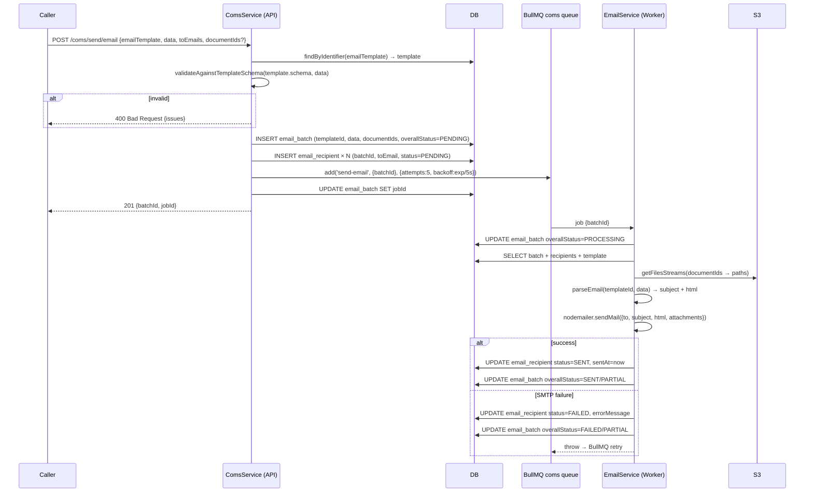
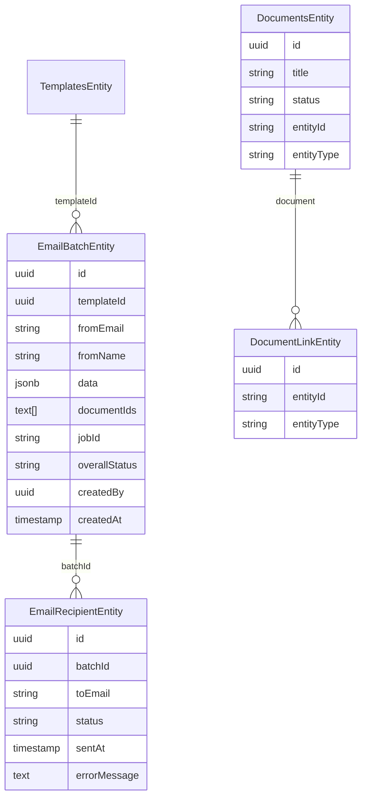

# feat: Complete email and document modules with send logging and entity linking

## Summary

Implements production-ready email sending and document management across `@hsm/api`, `@hsm/worker`, and `@hsm/database`. The email side adds pre-send template-schema validation, two audit tables (`email_batch` + `email_recipient`), and per-batch / per-recipient resend. The document side wires entity linking through upload/generate flows and adds a paginated list endpoint. Attachment references in send-email payloads change from raw S3 paths to document IDs; the worker resolves IDs to S3 streams before calling nodemailer.

---

## Problem Frame

The templates module is live but its two primary consumers are stubs. Email sending exists only as a queue enqueue with no logging, no schema validation, and no resend capability. Document management has no list endpoint, no entity linking on create/upload, and does not yet pass `entityId`/`entityType` through the generation pipeline. (See origin for full requirements.)

---

## Requirements

- R1. `POST /v1/coms/send/email` validates caller data against the template's schema before queuing; returns `400` with field-level detail on failure.
- R2. Every send creates one `email_batch` row and one `email_recipient` row per recipient.
- R3. `POST /v1/coms/emails/batches/:id/resend` re-queues the original job using stored batch data.
- R4. `POST /v1/coms/emails/recipients/:id/resend` re-queues the job for a single recipient.
- R5. `GET /v1/coms/emails/batches`, `GET /v1/coms/emails/batches/:id`, `GET /v1/coms/emails/recipients`, `GET /v1/coms/emails/recipients/:id` provide paginated, filterable email log queries.
- R6. The worker resolves `documentIds[]` to S3 streams and attaches them to the outgoing SMTP message.
- R7. Worker updates `email_recipient.status` (and `email_batch.overallStatus`) to `SENT` on success, `FAILED` on error.
- R8. `POST /v1/docs/generate` and `POST /v1/docs/upload` accept optional `entityId`/`entityType`, creating a `DocumentLinkEntity` row when supplied.
- R9. `GET /v1/docs` returns a paginated list of the caller's documents; supports `entityId`/`entityType` filtering via `DocumentLinkEntity` join.
- R10. All new endpoints have Swagger docs, class-validator DTOs, and at least one unit test per service method.
- R11. Failed send and generate jobs are retried by BullMQ until success; retry options set at enqueue time.
- R-W1. `POST /v1/coms/webhooks/:provider` receives provider events, verifies the signature, and persists each event to `email_webhook_event` before enqueuing a processing job.
- R-W2. For hard bounces and spam complaints, a row is upserted in `email_suppression`; future sends skip suppressed addresses automatically.
- R-W3. Webhook handling is provider-agnostic: adding a new provider requires only a new `IEmailWebhookAdapter` implementation — no changes to the endpoint, storage, or processing logic.
- R-W4. `email_recipient.status` is updated to the normalized delivery outcome (DELIVERED, BOUNCED_HARD, BOUNCED_SOFT, SPAM) when a webhook event is processed.
- R-W5. Bounce/spam events enqueue a downstream alert job for later notification handling.

---

## Scope Boundaries

- SMS module (separate work item)
- Email provider webhooks or bounce callbacks
- Document content editing after initial upload
- Non-PDF document generation (`ExcelGenerationService` unchanged)
- Shared document access (documents always scoped to `createdBy`; entity-link lookup does not override ownership)
- Unsubscribe management UI or email preference center
- Click/open tracking business logic (events stored if received, no further action)
- Automatic email address correction on bounce
- Per-provider webhook dashboards or replay tools

### Deferred to Follow-Up Work

- Worker `SmsModule` real implementation: separate PR
- `GET /docs/:id/url` shared-access via `entityId` lookup: separate PR after access-control model is defined

---

## Context & Research

### Relevant Code and Patterns

- Worker processor pattern: `apps/backend/worker/src/modules/core/docs/docs-processor.service.ts` — extends `QueueWorkerHost`, uses `switch (job.name)`, three-phase try/catch (PROCESSING → work → COMPLETED; catch: S3 compensating delete → FAILED → rethrow). **Mirror this exactly.**
- Worker queue host: `packages/queue/src/queue.worker-host.ts` — `process()` delegates to abstract `handle(job)`; `QueueService` is property-injected, **do not inject in constructor**.
- PDF generation: `apps/backend/worker/src/modules/core/docs/generation/generation.service.ts` — `GenerationService.generatePDF(html)` is already implemented with a warm `@sparticuz/chromium-min` + `generic-pool` pool. **No new Puppeteer setup needed.**
- Template schema validation: `packages/common/src/utils/template-schema.util.ts` → `validateAgainstTemplateSchema(schema, data)` returns `{ valid, issues? }`. **Not AJV — call this directly in service methods.**
- Entity registration: `packages/database/src/sources/postgres/database-postgres.entities.ts` — spread pattern using `Object.values(domainEntities)`.
- Enum migration safety: use `ALTER TYPE ... ADD VALUE IF NOT EXISTS` — do NOT rely on TypeORM's auto-enum rename for non-public schemas (see Institutional Learnings).
- Test mocking: `apps/backend/api/src/modules/core/docs/docs.service.spec.ts` — use `getRepositoryToken(Entity, DatabasesEnum.HsmDbPostgres)` token; `getQueueToken(QueueEnum.X)` for queue mocks.

### Institutional Learnings

- **BullMQ S3 orphan + UNIQUE constraint** (`docs/solutions/logic-errors/bullmq-retry-unique-constraint-s3-orphan-version-hardcode-2026-05-04.md`): track S3 upload key before DB transaction; delete it in the catch block. Use `COALESCE(MAX(v), 0) + 1` with pessimistic write lock for versioned unique fields. Wrap FAILED status update in its own nested try/catch.
- **TypeORM enum migration failure** (`docs/solutions/database-issues/typeorm-enum-schema-qualified-migration-failure-2026-05-12.md`): non-public schema enum additions crash TypeORM synchronize. Use `queryRunner.query('ALTER TYPE ... ADD VALUE IF NOT EXISTS ...')` in explicit migrations.
- **Entity barrel circular import** (`docs/solutions/runtime-errors/typeorm-entity-circular-import-silent-drop-2026-05-04.md`): add `export * from './coms'` to `entities/modules/core/index.ts`; never re-export entity arrays from `sources/postgres/index.ts`; import via `@hsm/database/entities` root path only.
- **Config Joi test failures** (`docs/solutions/test-failures/nestjs-config-joi-validation-dotenv-conflict-2026-05-06.md`): any new required env vars (SMTP creds already exist) must have dummy values in `apps/backend/api/src/test-setup.ts`.
- **Unit test mocking** (`docs/solutions/developer-experience/nestjs-unit-test-mocking-patterns-2026-05-06.md`): use `getRepositoryToken(Entity, DatabasesEnum.HsmDbPostgres)` not bare `getRepositoryToken(Entity)`.
- **HTTP file convention** (`docs/solutions/developer-experience/http-test-files-vscode-rest-client-convention-2026-05-07.md`): co-locate `.http` files; use `[variable]` notation (not `{{variable}}`) in example Handlebars-containing bodies.

---

## Key Technical Decisions

- **Template schema validation at service level, not Pipe**: The commented-out `EmailTemplateDataPipe` approach required a pre-built DTO class map per template — not workable at runtime. Instead, `ComsService.sendEmail()` and `DocsService.generateDocument()` call `validateAgainstTemplateSchema()` directly after loading the template entity. Catches template-not-found and validation failures before any DB write or queue push.

- **`send-email` job payload is `{ batchId, recipientId? }`**: The worker loads all needed data (template, recipients, documentIds, fromEmail) from the DB using `batchId`. Keeps job payloads small, makes resend trivial (re-queue the same `batchId`), and avoids duplicating large `data` objects in the queue.

- **`email_batch.overallStatus` added beyond requirements spec**: The requirements doc omits a batch-level status, but `GET /coms/emails/batches?status=SENT` requires one. Worker sets it to `PROCESSING` on start, `SENT`/`PARTIAL`/`FAILED` based on aggregate recipient outcomes.

- **`DocumentStatusEnum.COMPLETED` used instead of `READY`**: `READY` is not in the existing `DocumentStatusEnum` enum (`PENDING`, `PROCESSING`, `COMPLETED`, `FAILED`). Using `COMPLETED` to match the existing enum, which the `docs-processor.service.ts` already uses.

- **Denormalized `entityId`/`entityType` on `DocumentsEntity`**: Both stored on the entity directly AND via `DocumentLinkEntity` for explicit joins. The denormalized columns allow a simple `WHERE entity_id = ? AND entity_type = ?` without a join for the common case; `DocumentLinkEntity` supports many-to-many future use.

- **Puppeteer PDF generation already fully implemented**: `DocsProcessorService.processGenerateDocument()` already branches on `docMeta.format === DocumentFormatsEnum.PDF` and calls `generationService.generatePDF(html)`. U7 adds only the `DocumentLinkEntity` creation step and sets the denormalized entity columns on `DocumentsEntity` — no new generation code needed.

- **BullMQ retry options at enqueue time**: Email jobs: `{ attempts: 5, backoff: { type: 'exponential', delay: 5000 } }`. PDF generation jobs: `{ attempts: 3, backoff: { type: 'exponential', delay: 10000 } }`. Set as the third argument to `queue.add()`.

- **`TemplatesModule` imported in API `ComsModule`**: The API's `TemplatesModule` (already used for CRUD) exports `TemplatesService`, which has `findByIdentifier()`. Importing it in `ComsModule` avoids a raw repository injection for template lookup.

---

## Open Questions

### Resolved During Planning

- **Puppeteer lifecycle**: Already solved — `GenerationService` uses a warm `generic-pool` of pages on `OnModuleInit`. No per-job browser launch.
- **BullMQ retry policy**: Email 5 attempts / 5s exponential; PDF 3 attempts / 10s exponential. Set at `queue.add()` call site.
- **Doc visibility**: Always scoped to `createdBy`. Shared access deferred.
- **`READY` vs `COMPLETED`**: Use `DocumentStatusEnum.COMPLETED`.
- **`overallStatus` on `email_batch`**: Added as a plan-time decision (values: `PENDING`, `PROCESSING`, `SENT`, `PARTIAL`, `FAILED`).

### Deferred to Implementation

- Exact `Attachment.filename` strategy in nodemailer (UUID vs original filename from document title): decide at implementation based on the loaded document entity's `title` field.
- Whether `email_batch.overallStatus = PARTIAL` vs `FAILED` when only some recipients succeed: implementation-time judgment call in the worker.

---

## High-Level Technical Design

> *This illustrates the intended approach and is directional guidance for review, not implementation specification. The implementing agent should treat it as context, not code to reproduce.*

### Email send flow



### New entity relationships



---

## Implementation Units

### U1. `coms` database schema — email batch and recipient entities

**Goal:** Create the persistence layer for email audit logging and register it with TypeORM.

**Requirements:** R2, R5, R7

**Dependencies:** None

**Files:**
- Create: `packages/database/src/entities/modules/core/coms/email-batch.entity.ts`
- Create: `packages/database/src/entities/modules/core/coms/email-recipient.entity.ts`
- Create: `packages/database/src/entities/modules/core/coms/index.ts`
- Modify: `packages/database/src/sources/postgres/database-postgres.schemas.ts`
- Modify: `packages/database/src/entities/modules/core/index.ts`
- Modify: `packages/database/src/sources/postgres/database-postgres.entities.ts`

**Approach:**
- Add `COMS = 'coms'` to `SchemasEnum` in `database-postgres.schemas.ts`.
- `EmailBatchEntity`: columns `id` (uuid PK), `templateId` (uuid, nullable FK to `templates.templates`), `fromEmail` (varchar nullable), `fromName` (varchar nullable), `data` (jsonb), `documentIds` (text array nullable), `jobId` (varchar nullable), `overallStatus` (enum: `EmailBatchStatusEnum`), `createdBy` (uuid nullable), `createdAt` (timestamptz auto). Relation: `@OneToMany` to `EmailRecipientEntity`.
- `EmailRecipientEntity`: columns `id` (uuid PK), `batchId` (uuid FK), `toEmail` (varchar), `status` (enum: `EmailRecipientStatusEnum`), `sentAt` (timestamptz nullable), `errorMessage` (text nullable). Relation: `@ManyToOne` to `EmailBatchEntity`.
- Barrel `index.ts` exports both entities.
- Add `export * from './coms'` to `entities/modules/core/index.ts` — **this is the most common silent-drop bug** per institutional learning.
- Spread `...Object.values(comsEntities)` in `databasePostgresEntities` array. Import as `import * as comsEntities from '../../entities/modules/core/coms'`.
- Use `DatabasePostgresSchemasEnum.COMS` in both entity `@Entity` decorators.

**Patterns to follow:**
- `packages/database/src/entities/modules/core/docs/` (entity structure, decorator usage)
- `packages/database/src/sources/postgres/database-postgres.entities.ts` (import + spread pattern)

**Test scenarios:**
- Test expectation: none — entity/barrel registration has no behavioral unit to test. Verification is runtime DI.

**Verification:**
- `pnpm --filter @hsm/api start:dev` reaches DB connection phase without `UnknownDependenciesException` or entity-registration errors.
- `pnpm --filter @hsm/api build` compiles clean.

---

### U2. Extend `DocumentsEntity` and document job DTOs

**Goal:** Add `entityId`/`entityType` to `DocumentsEntity` for denormalized filtering, and extend the generate-document job + request DTOs to carry those fields through the pipeline.

**Requirements:** R8, R9

**Dependencies:** None (parallel with U1)

**Files:**
- Modify: `packages/database/src/entities/modules/core/docs/documents.entity.ts`
- Modify: `packages/common/src/dtos/docs.dto.ts`

**Approach:**
- Add `entityId?: string` and `entityType?: string` (both `@Column({ nullable: true })`) to `DocumentsEntity`.
- In `docs.dto.ts`, extend `GenerateDocumentJobPayloadDto` with optional `entityId?: string` + `entityType?: string`.
- In `docs.dto.ts`, extend `GenerateDocumentRequestDto` with optional `entityId?: string` + `entityType?: string` (both with `@IsOptional() @IsString()` + `@ApiProperty({ required: false })`).
- In `docs.dto.ts`, add a `ListDocumentsQueryDto` with optional `entityId`, `entityType`, `type` (`DocumentTypeEnum`), `status` (`DocumentStatusEnum`), `page` (number, default 1), `limit` (number, default 20).

**Patterns to follow:**
- Existing optional fields in `GenerateDocumentRequestDto` (`description`)
- `@IsOptional()` + `@ApiProperty({ required: false })` pattern throughout `docs.dto.ts`

**Test scenarios:**
- Test expectation: none — pure DTO/entity field additions. TypeScript compilation confirms shapes.

**Verification:**
- `pnpm build` compiles without type errors.
- `pnpm --filter @hsm/api start:dev` syncs the new columns without migration errors in dev.

---

### U3. Common package — coms enums and updated DTOs

**Goal:** Define all new data contracts: email status enums, updated `SendEmailPayloadDto` (documentIds replaces documents), new batch/recipient response DTOs, resend request DTOs, and the internal `SendEmailJobDto`.

**Requirements:** R1, R2, R3, R4, R5

**Dependencies:** U1 (needs `EmailBatchStatusEnum` values finalised)

**Files:**
- Modify: `packages/common/src/enums/coms.enum.ts`
- Modify: `packages/common/src/dtos/coms.dto.ts`

**Approach:**
- In `coms.enum.ts`: add `EmailRecipientStatusEnum` (`PENDING`, `SENT`, `FAILED`) and `EmailBatchStatusEnum` (`PENDING`, `PROCESSING`, `SENT`, `PARTIAL`, `FAILED`).
- In `coms.dto.ts`: update `SendEmailPayloadDto` — remove the `extends PartialType(DocumentsPayloadDto)` inheritance (which brought in the raw S3 path `documents` array) and replace with `@IsOptional() @IsArray() @IsUUID('4', { each: true }) documentIds?: string[]`.
- Add `SendEmailJobDto` (internal, not exposed via Swagger): `{ batchId: string; recipientId?: string }`.
- Add `EmailBatchResponseDto` and `EmailRecipientResponseDto` (response shapes for CRUD queries).
- Add `ListEmailBatchesQueryDto` (filter by `templateId`, `overallStatus`, `createdBy`, `fromDate`, `toDate`, pagination `page`/`limit`).
- Add `ListEmailRecipientsQueryDto` (filter by `batchId`, `toEmail`, `status`, pagination).
- Add `ResendBatchResponseDto` and `ResendRecipientResponseDto` (simple `{ jobId: string }`).

**Patterns to follow:**
- `@ApiSchema({ name: '...' })` on every exported DTO
- `@ApiProperty({ description, example, required, enum })` on every field
- `PartialType` from `@nestjs/swagger` for update shapes

**Test scenarios:**
- Test expectation: none — pure DTO/enum declarations. TypeScript confirms shapes.

**Verification:**
- `pnpm build` compiles across all packages without type errors.
- No existing code that used `SendEmailPayloadDto.documents` (S3 paths) compiles — catch and fix any call sites (expected: only the worker's `EmailService.sendEmail()` which U6 will rewrite).

---

### U4. API ComsModule — full service + controller

**Goal:** Implement all eight email API endpoints with pre-send validation, batch/recipient persistence, resend logic, and paginated log queries.

**Requirements:** R1, R2, R3, R4, R5, R10, R11

**Dependencies:** U1, U3

**Files:**
- Modify: `apps/backend/api/src/modules/core/coms/coms.service.ts`
- Modify: `apps/backend/api/src/modules/core/coms/coms.module.ts`
- Modify: `apps/backend/api/src/modules/core/coms/coms.controller.ts`
- Modify: `apps/backend/api/src/modules/core/coms/coms.http`
- Modify: `apps/backend/api/src/modules/core/coms/coms.service.spec.ts`
- Modify: `apps/backend/api/src/modules/core/coms/coms.controller.spec.ts`

**Approach:**

*Module wiring (`coms.module.ts`):*
- Import `TemplatesModule` (already in API core — exports `TemplatesService`).
- Register `@InjectRepository(EmailBatchEntity, DatabasesEnum.HsmDbPostgres)` and `@InjectRepository(EmailRecipientEntity, ...)` providers via the global `DatabaseModule` (no explicit import needed).

*`ComsService` methods:*
- `sendEmail(dto, userId?)`:
  1. `templateResult = await templatesService.findByIdentifier(dto.emailTemplate)` — `TemplateNotFoundError` already extends `NotFoundException`; let it propagate naturally, do not re-wrap.
  2. `result = validateAgainstTemplateSchema(templateResult.template.schema, dto.data)` — **note:** `findByIdentifier` returns `TemplateWithBaseResponseDto` whose shape is `{ template: TemplateDetailDto, baseTemplate: ... }`; the schema lives at `templateResult.template.schema`, not `templateResult.schema`.
  3. If `!result.valid`, throw `BadRequestException({ message: 'Template data validation failed', issues: result.issues })`.
  4. Wrap steps 4–6 in a `dataSource.manager.transaction(async manager => {...})` so a partial recipient insert never leaves an orphaned batch row.
  5. Inside the transaction: persist `EmailBatchEntity` (with `templateId = templateResult.template.id`, `overallStatus: EmailBatchStatusEnum.PENDING`), then for each `dto.toEmails` entry: check `EmailSuppressionEntity` by email — if found, persist recipient with `status: SUPPRESSED`; otherwise `status: PENDING`.
  6. Outside the transaction: `job = await comsQueue.add('send-email', { batchId } as SendEmailJobDto, { attempts: 5, backoff: { type: 'exponential', delay: 5000 } })`.
  7. `UPDATE email_batch SET jobId = job.id`. Return `{ batchId, jobId }`.
- `resendBatch(batchId)`: `findOneOrFail`, re-queue `{ batchId }`, update `overallStatus = PENDING` **and** `jobId = newJob.id`. Return `{ jobId }`.
- `resendRecipient(recipientId)`: `findOneOrFail` with `relations: { batch: true }`, re-queue `{ batchId: recipient.batch.id, recipientId }`. Return `{ jobId }`.
- `listBatches(query)`: TypeORM `findAndCount` with `where` filters + `skip`/`take` for pagination. Return `{ data, total, page, limit }`.
- `getBatch(id)`: `findOneOrFail` with `relations: { recipients: true }`.
- `listRecipients(query)`: `findAndCount` with filters.
- `getRecipient(id)`: `findOneOrFail`.

*`ComsController` endpoints:*
- `POST /coms/send/email` → `sendEmail(@Body() dto, @Req() req)` — `@Roles()`, returns `201`.
- `POST /coms/emails/batches/:id/resend` → `resendBatch(@Param('id'))` — `@Roles()`.
- `POST /coms/emails/recipients/:id/resend` → `resendRecipient(@Param('id'))` — `@Roles()`.
- `GET /coms/emails/batches` → `listBatches(@Query() q)` — `@Roles()`.
- `GET /coms/emails/batches/:id` → `getBatch(@Param('id'))` — `@Roles()`.
- `GET /coms/emails/recipients` → `listRecipients(@Query() q)` — `@Roles()`.
- `GET /coms/emails/recipients/:id` → `getRecipient(@Param('id'))` — `@Roles()`.
- Remove the `POST /coms/resend/email` stub (replaced by per-batch resend above).
- Keep `POST /coms/send/sms` stub unchanged (out of scope).

*`.http` file:* Add one request block per new endpoint following the co-located convention. Use `[variable]` notation in any request body that contains Handlebars-style template variable examples.

**Patterns to follow:**
- `apps/backend/api/src/modules/core/docs/docs.service.ts` for repository injection + NotFoundException pattern
- `apps/backend/api/src/modules/core/docs/docs.controller.ts` for `@ApiDocumentation()`, `@Roles()`, `@Req() req` usage

**Test scenarios:**
- Happy path — `sendEmail`: template found, data valid → batch + N recipients persisted in one transaction → job queued → `{ batchId, jobId }` returned
- Error path — `sendEmail` with unknown template: `TemplateNotFoundError` propagates as `NotFoundException`; no DB writes occur
- Error path — `sendEmail` with invalid data: `validateAgainstTemplateSchema` returns `{ valid: false, issues }` → `BadRequestException` thrown with issues; no DB writes or queue pushes
- Error path — `sendEmail` where batch INSERT succeeds but `queue.add` throws: batch row exists at `PENDING` with no `jobId`; verify the transaction rolls back the batch + recipients in this case (or document the orphan as acceptable)
- Happy path — `resendBatch`: batch exists → job re-queued → `overallStatus` reset to `PENDING` + `jobId` updated
- Error path — `resendBatch` with unknown id: `NotFoundException` thrown
- Happy path — `resendRecipient`: recipient + batch loaded → job re-queued with `recipientId`
- Happy path — `listBatches` with filters: returns paginated `{ data, total, page, limit }`
- Happy path — `getBatch` with recipients: returns batch + nested recipients
- Happy path — `listRecipients` filtered by `batchId`
- Edge case — `sendEmail` with `documentIds: []`: batch persisted, no attachment metadata in job, no error
- Edge case — `sendEmail` with `documentIds: ['non-existent-uuid']`: validation passes at API layer (UUID format valid); error surfaces in worker

**Verification:**
- `pnpm --filter @hsm/api test -- --testPathPattern=coms.service` passes.
- `pnpm --filter @hsm/api start:dev` reaches port without DI errors; Swagger at `/api` shows all new endpoints.

---

### U5. API DocsModule — list endpoint and entityLink wiring

**Goal:** Add `GET /v1/docs` with filtering/pagination and wire `entityId`/`entityType` through the upload and generate flows.

**Requirements:** R8, R9, R10

**Dependencies:** U2

**Files:**
- Modify: `apps/backend/api/src/modules/core/docs/docs.service.ts`
- Modify: `apps/backend/api/src/modules/core/docs/docs.module.ts`
- Modify: `apps/backend/api/src/modules/core/docs/docs.controller.ts`
- Modify: `apps/backend/api/src/modules/core/docs/docs.http`
- Modify: `apps/backend/api/src/modules/core/docs/docs.service.spec.ts`
- Modify: `packages/common/src/dtos/docs.dto.ts`

**Approach:**

*`docs.module.ts`:* Register `@InjectRepository(DocumentLinkEntity, ...)` provider (global DB module handles the connection; only token registration needed).

*`DocsService` additions/changes:*
- `listDocuments(query: ListDocumentsQueryDto, userId: string)`: build a `find` query on `DocumentsEntity` scoped to `createdBy = userId`. When `entityId` + `entityType` present, use a subquery or inner join through `DocumentLinkEntity` (or use denormalized `entityId`/`entityType` columns directly with `WHERE`). Apply `type`, `status` filters. Return `{ data, total, page, limit }` with `skip`/`take` pagination.
- `uploadDocuments(payload, files, userId?)`: **The current implementation only calls S3 — it does not create `DocumentsEntity` rows.** U5 must add entity creation: for each uploaded file, create `DocumentsEntity` (type `UPLOADED`, source `MANUAL`, status `COMPLETED`) + `DocumentsVersionEntity` (version=1, mimeType from file, size from buffer) + `DocumentStorageObjectEntity` (using S3 upload result's `fileId`/`key`). After persistence, if `payload.entityId` + `payload.entityType` are present, create a `DocumentLinkEntity` row for each new document and set its `entityId`/`entityType` columns. Return document IDs alongside S3 metadata.
- `generateDocument(dto, userId?)`: pass `entityId`/`entityType` from the request DTO into `GenerateDocumentJobPayloadDto` (U2 added those fields).

*`UploadDocumentPayloadDto` change:* Add optional `entityId?: string` and `entityType?: string` as **plain top-level class fields** (`@IsOptional() @IsString()`) on `UploadDocumentPayloadDto`. These are separate multipart form fields — they do **not** pass through the `@Transform` / `JSON.parse` decorator on the `payload` array field; **do not change that decorator**. Entity linking is per-batch (all files in one upload share the same entity reference); per-file entity linking is out of scope.

*`DocsController` additions:*
- `GET /docs` → `listDocuments(@Query() q, @Req() req)` — `@Roles()`, `@ApiDocumentation()`.
- Update `POST /docs/generate` to accept and forward `entityId`/`entityType`.
- Update `POST /docs/upload` to accept `entityId`/`entityType` in the body.

**Patterns to follow:**
- `listBatches()` pagination pattern from U4
- `DocsService.generateDocument()` for the queue job payload construction pattern
- `UploadDocumentPayloadDto` `@Transform` pattern for multipart JSON parsing

**Test scenarios:**
- Happy path — `listDocuments`: returns paginated list scoped to `createdBy`
- Happy path — `listDocuments` with `entityId`/`entityType`: returns only documents linked to that entity
- Happy path — `listDocuments` with `type=GENERATED` filter: returns only generated docs
- Happy path — `uploadDocuments` with `entityId`/`entityType`: `DocumentLinkEntity` row created; `document.entityId` set
- Happy path — `uploadDocuments` without `entityId`: no `DocumentLinkEntity` row created
- Happy path — `generateDocument` with `entityId`: job payload includes `entityId`/`entityType`
- Edge case — `listDocuments` empty result: returns `{ data: [], total: 0, page: 1, limit: 20 }`

**Verification:**
- `pnpm --filter @hsm/api test -- --testPathPattern=docs.service` passes.
- `GET /v1/docs?entityId=X&entityType=Y` returns filtered results in manual test via `.http` file.

---

### U6. Worker EmailService — job format, documentId resolution, and status tracking

**Goal:** Update the worker's `EmailService` to load batch data from DB, resolve document IDs to S3 streams, and write send outcomes back to the batch and recipient rows.

**Requirements:** R6, R7, R11

**Dependencies:** U1, U3

**Files:**
- Modify: `apps/backend/worker/src/modules/core/coms/coms.service.ts` ← update job data cast from `SendEmailPayloadDto` to `SendEmailJobDto`
- Modify: `apps/backend/worker/src/modules/core/coms/email/email.service.ts`
- Modify: `apps/backend/worker/src/modules/core/coms/email/email.module.ts`
- Modify: `apps/backend/worker/src/modules/core/coms/email/email.service.spec.ts` ← also update as part of U3's `SendEmailPayloadDto` breaking change (removes `.documents` field that the existing spec references)

**Approach:**

*`email.module.ts`:* No new imports needed — `DatabaseModule` is global; `DocsModule` and `TemplatesModule` are already imported. The `@InjectRepository` tokens for `EmailBatchEntity` and `EmailRecipientEntity` are available via the global `databasePostgresEntities` registration.

*`coms.service.ts` (worker `@Processor`):* Update the job data cast in `handle()` from `job.data as SendEmailPayloadDto` to `job.data as SendEmailJobDto`.

*`EmailService.sendEmail(payload: SendEmailJobDto)` rewrite:*
1. Load `EmailBatchEntity` with `relations: { recipients: true }`.
2. `await batchRepo.update(batchId, { overallStatus: EmailBatchStatusEnum.PROCESSING })`.
3. Determine `recipients`: if `payload.recipientId` → single recipient row (filter from loaded relations); otherwise **only recipients where `status IN (PENDING, FAILED)`** — never resend to already-`SENT` recipients.
4. Resolve attachments via `resolveDocumentAttachments(batch.documentIds ?? [])` private method:
   a. For each ID, load `DocumentsEntity` with `relations: { versions: { storage: true } }`.
   b. Check `document.status === COMPLETED` — if not `COMPLETED`, throw a clear error (e.g., `'Document {id} is not ready (status: {status})'`) so BullMQ retries until the document finishes generating.
   c. Select the latest version: `versions.slice().sort((a, b) => b.version - a.version)[0]`.
   d. Decompose `storage.path` into `folderName`/`fileId` using the same `splitStoragePath` logic as in `DocsService` (split on last `/`).
   e. Call `docsService.getDocumentsStreams({ documents: [{ bucket: storage.bucket, files: [{ folderName, fileInfo: { fileId } }] }] })`.
   f. Convert stream: `Readable.from(file.fileStream.transformToWebStream())`. Use document `title` as the attachment filename, `version.mimeType` as content type.
5. `const { subject, html } = await templatesService.parseEmail(batch.templateId, batch.data)`.
6. `await smtpClient.sendMail({ from: batch.fromEmail, to: recipients.map(r => r.toEmail), subject, html, attachments })` — single SMTP call. **Known limitation:** all recipients appear in each other's `To:` header; delivery is confirmed at SMTP submission time only (no bounce tracking).
7. On success: `UPDATE email_recipient SET status=SENT, sentAt=now()` for targeted recipients; update `email_batch.overallStatus` based on aggregate (all `SENT` → `SENT`; any `FAILED` remaining → `PARTIAL`; all `FAILED` → `FAILED`). Also update `email_batch.providerMessageId` with the `messageId` field from the nodemailer `sendMail` result.
8. On any failure: `UPDATE email_recipient SET status=FAILED, errorMessage`; update batch `overallStatus`; **rethrow** so BullMQ retries.
- Inject: `@InjectRepository(EmailBatchEntity, ...)`, `@InjectRepository(EmailRecipientEntity, ...)`, keep existing `DocsService`, `TemplatesService`, `'SMTP_CLIENT'`.

**Patterns to follow:**
- Three-phase try/catch from `docs-processor.service.ts` (PROCESSING start → work → outcome; catch: status update → rethrow)
- `DocsService.getDocumentsStreams()` for S3 streaming call shape
- Existing `EmailService` attachment construction pattern (`Readable.from(fileStream.transformToWebStream())`)

**Test scenarios:**
- Happy path — batch with 2 recipients, no documents: only `PENDING`/`FAILED` recipients targeted; both updated to `SENT`; batch `overallStatus = SENT`
- Happy path — batch with `documentIds`: `splitStoragePath` decomposes `storage.path`; `docsService.getDocumentsStreams` called with `{ folderName, fileId }`; attachments added to `sendMail` call
- Happy path — single-recipient resend (`payload.recipientId` present): only that recipient's row updated; other recipients untouched; `sendMail` receives only that recipient's email
- Happy path — batch resend after partial failure: batch has 2 `SENT` + 1 `FAILED`; worker selects only the `FAILED` recipient; no duplicate emails to already-`SENT` recipients
- Error path — SMTP failure: recipients updated to `FAILED`, batch updated to `FAILED`, error rethrown for BullMQ retry; on retry only still-`FAILED` recipients are targeted
- Error path — document not `COMPLETED` (e.g., still `PENDING`): `resolveDocumentAttachments` throws descriptive error; no `sendMail` call; BullMQ retries until document finishes generating
- Error path — document not found (S3 stream undefined): throws error, no email sent, recipient stays `FAILED`
- Error path — template not found: `parseEmail` throws, job fails and retries
- Integration — `sendMail` succeeds but DB status update throws: error is rethrown; BullMQ retries; on retry recipient status is still `PENDING`/`FAILED` so email is resent (idempotency trade-off — acceptable, document in System-Wide Impact)

**Verification:**
- `pnpm --filter @hsm/worker test -- --testPathPattern=email.service` passes.
- `pnpm --filter @hsm/worker start:dev` processes a test `send-email` job and creates the expected DB rows.

---

### U7. Worker DocsProcessorService — entity link persistence

**Goal:** Write `DocumentLinkEntity` rows and set `document.entityId`/`entityType` at the end of a successful `generate-document` job when the payload carries those fields.

**Requirements:** R8

**Dependencies:** U1, U2

**Files:**
- Modify: `apps/backend/worker/src/modules/core/docs/docs-processor.service.ts`
- Modify: `apps/backend/worker/src/modules/core/docs/docs.module.ts`
- Modify: `apps/backend/worker/src/modules/core/docs/docs-processor.service.spec.ts`

**Approach:**

*`docs.module.ts`:* Register `@InjectRepository(DocumentLinkEntity, DatabasesEnum.HsmDbPostgres)` in `providers` (global DB module handles the connection).

*`DocsProcessorService` change:*
- Inside the `docsRepo.manager.transaction(async manager => {...})` block, after saving `DocumentsGeneratedEntity`: if `data.entityId` + `data.entityType` are present, add:
  - `manager.create(DocumentLinkEntity, { document: { id: data.documentId }, entityId: data.entityId, entityType: data.entityType })`
  - `manager.save(DocumentLinkEntity, link)`
  - `manager.update(DocumentsEntity, data.documentId, { entityId: data.entityId, entityType: data.entityType })`
- **Important split:** The `entityId`/`entityType` update runs inside the transaction; the `status = COMPLETED` update (line ~169 in the existing code) runs **outside** the transaction as a separate `docsRepo.update()` call. Do not consolidate these into one update — the COMPLETED status update's separate call site is load-bearing for the three-phase error isolation pattern.
- No change to PDF/Excel generation logic, S3 upload, or the three-phase try/catch structure.

**Patterns to follow:**
- Existing `manager.create` + `manager.save` pattern in the same transaction block
- `DocumentLinkEntity` constructor shape from `packages/database/src/entities/modules/core/docs/document-link.entity.ts`

**Test scenarios:**
- Happy path — payload has `entityId` + `entityType`: `DocumentLinkEntity` row created; `DocumentsEntity.entityId`/`entityType` updated inside the same transaction
- Happy path — payload has no `entityId`: no `DocumentLinkEntity` row created; no entity update
- Error path — `DocumentLinkEntity` save fails inside transaction: entire transaction rolls back; processor catches, marks doc FAILED, rethrows for BullMQ retry

**Verification:**
- `pnpm --filter @hsm/worker test -- --testPathPattern=docs-processor` passes.
- After a successful `generate-document` job with `entityId`, `GET /v1/docs?entityId=X&entityType=Y` returns the generated document.

---

### U8. `coms` DB additions — webhook event + suppression entities

**Goal:** Persist incoming webhook events (raw + normalized) and track suppressed email addresses; extend the recipient + batch models for richer delivery status.

**Requirements:** R-W1 (webhook event storage), R-W2 (suppression tracking), R-W4 (status enrichment)

**Dependencies:** U1

**Files:**
- Create: `packages/database/src/entities/modules/core/coms/email-webhook-event.entity.ts`
- Create: `packages/database/src/entities/modules/core/coms/email-suppression.entity.ts`
- Modify: `packages/database/src/entities/modules/core/coms/index.ts` — add new entity exports
- Modify: `packages/database/src/sources/postgres/database-postgres.entities.ts` — already spreads `comsEntities`; new entities are picked up automatically once exported from the barrel
- Modify: `packages/database/src/entities/modules/core/coms/email-recipient.entity.ts` — add `messageId?: string` column (nullable varchar); extend status enum usage to cover new values
- Modify: `packages/database/src/entities/modules/core/coms/email-batch.entity.ts` — add `providerMessageId?: string` column (nullable varchar; set from nodemailer `sendMail` result)
- Modify: `packages/common/src/enums/coms.enum.ts` — extend `EmailRecipientStatusEnum` with `DELIVERED`, `BOUNCED_HARD`, `BOUNCED_SOFT`, `SPAM`, `SUPPRESSED`; add `EmailWebhookEventTypeEnum` (`DELIVERED`, `BOUNCED_HARD`, `BOUNCED_SOFT`, `SPAM`, `DEFERRED`, `OPEN`, `CLICK`, `UNSUBSCRIBED`, `UNKNOWN`)

**Approach:**
- `EmailWebhookEventEntity`: columns `id` (uuid PK), `provider` (varchar — e.g. `'mandrill'`), `eventType` (`EmailWebhookEventTypeEnum`), `rawPayload` (jsonb), `recipientEmail` (varchar), `messageId` (varchar nullable — provider's message ID), `recipient` (nullable `@ManyToOne EmailRecipientEntity` — populated by the processing job), `processedAt` (timestamptz nullable), `createdAt` (timestamptz auto). Index on `recipientEmail` + index on `messageId` for fast webhook correlation.
- `EmailSuppressionEntity`: columns `id` (uuid PK), `email` (varchar, `@Unique`), `reason` (enum: `HARD_BOUNCE`, `SPAM_COMPLAINT`, `MANUAL`), `sourceWebhookEvent` (nullable `@ManyToOne EmailWebhookEventEntity`), `createdAt` (timestamptz auto). Index on `email` (unique constraint already implies it).
- `EmailRecipientStatusEnum` additions use `ALTER TYPE ... ADD VALUE IF NOT EXISTS` in production migrations (see TypeORM enum migration institutional learning — never rely on auto-sync for non-public schemas).

**Patterns to follow:**
- Existing `EmailBatchEntity` / `EmailRecipientEntity` structure from U1

**Test scenarios:**
- Test expectation: none — entity registration. Run `start:dev` to verify DI after U8.

**Verification:**
- `pnpm --filter @hsm/api start:dev` reaches DB connection without errors.
- New columns appear on `email_batch` and `email_recipient` tables after dev sync.

---

### U9. Webhook adapter infrastructure

**Goal:** Define the `IEmailWebhookAdapter` interface and a normalized event model; implement the `MandrillWebhookAdapter` as the first concrete provider.

**Requirements:** R-W3 (provider-agnostic normalization)

**Dependencies:** U8

**Files:**
- Create: `packages/common/src/interfaces/email-webhook-adapter.interface.ts`
- Create: `packages/common/src/types/email-webhook.type.ts` (normalized event type + `WebhookVerificationResult`)
- Modify: `packages/common/src/interfaces/index.ts` and `packages/common/src/types/index.ts` — add new exports
- Create: `apps/backend/api/src/modules/core/coms/webhook/adapters/mandrill-webhook.adapter.ts`
- Create: `apps/backend/api/src/modules/core/coms/webhook/adapters/mandrill-webhook.adapter.spec.ts`
- Create: `apps/backend/api/src/modules/core/coms/webhook/email-webhook-adapter.factory.ts`

**Approach:**

*Interface (`IEmailWebhookAdapter`):*
- `verify(headers: Record<string, string>, rawBody: Buffer, signingKey: string): boolean` — HMAC/signature check
- `normalize(rawPayload: unknown): NormalizedWebhookEvent[]` — parses provider-specific shape into common events

*`NormalizedWebhookEvent` type:*
```
{
  eventType: EmailWebhookEventTypeEnum
  recipientEmail: string
  providerMessageId?: string
  timestamp: Date
  reason?: string        // bounce diagnostic text
  rawPayload: unknown
}
```

*`MandrillWebhookAdapter`:*
- `verify`: Mandrill uses HMAC-SHA1 over `webhookKey + url + sorted_POST_params` — implement using Node `crypto.createHmac('sha1', key)`.
- `normalize`: Mandrill POSTs `mandrill_events` form field (JSON array). Each item has `event`, `msg.email`, `msg._id`, `ts`, `msg.diag`. Map `event` values: `send` → `DELIVERED`; `hard_bounce` → `BOUNCED_HARD`; `soft_bounce` → `BOUNCED_SOFT`; `spam` → `SPAM`; `reject` → `BOUNCED_HARD`; `deferral` → `DEFERRED`; `open` → `OPEN`; `click` → `CLICK`; `unsub` → `UNSUBSCRIBED`; others → `UNKNOWN`.

*`EmailWebhookAdapterFactory`:*
- A simple map/registry: `{ mandrill: MandrillWebhookAdapter }`.
- `getAdapter(provider: string): IEmailWebhookAdapter | undefined` — returns adapter or `undefined` for unknown providers.
- Adding a new provider later = add one entry to the map.

**New env var:** Add `COMS_WEBHOOK_SIGNING_KEYS` to `@hsm/config` as an optional JSON object string: `{ "mandrill": "secret123", "sendgrid": "..." }`. Parsed at config load time. Dummy value must be added to `apps/backend/api/src/test-setup.ts`.

**Patterns to follow:**
- Existing `@hsm/common/interfaces/` export pattern
- NestJS provider factory pattern for the adapter registry

**Test scenarios (MandrillWebhookAdapter):**
- Happy path — `verify`: valid HMAC-SHA1 signature returns `true`
- Error path — `verify`: tampered payload / wrong key returns `false`
- Happy path — `normalize`: `hard_bounce` event → `EmailWebhookEventTypeEnum.BOUNCED_HARD`, correct `recipientEmail`, `providerMessageId`, `timestamp`, `reason`
- Happy path — `normalize`: `send` event → `DELIVERED`
- Happy path — `normalize`: `spam` event → `SPAM`
- Edge case — `normalize`: unknown event type → `UNKNOWN`; does not throw
- Edge case — `normalize`: malformed JSON / missing fields → throws descriptive error

**Verification:**
- `pnpm --filter @hsm/api test -- --testPathPattern=mandrill-webhook.adapter` passes.

---

### U10. API webhook receiver endpoint

**Goal:** Expose `POST /v1/coms/webhooks/:provider`, verify the provider signature, persist raw events, and enqueue `process-webhook-event` jobs — one job per normalized event.

**Requirements:** R-W1, R-W2, R-W3

**Dependencies:** U8, U9

**Files:**
- Create: `apps/backend/api/src/modules/core/coms/webhook/coms-webhook.controller.ts`
- Create: `apps/backend/api/src/modules/core/coms/webhook/coms-webhook.service.ts`
- Create: `apps/backend/api/src/modules/core/coms/webhook/coms-webhook.controller.spec.ts`
- Create: `apps/backend/api/src/modules/core/coms/webhook/coms-webhook.service.spec.ts`
- Modify: `apps/backend/api/src/modules/core/coms/coms.module.ts` — add `WebhookController` + `WebhookService` providers
- Modify: `apps/backend/api/src/modules/core/coms/coms.http` — add webhook request blocks

**Approach:**

*Controller (`POST /coms/webhooks/:provider`):*
- `@Public()` — providers call this endpoint without auth tokens.
- Uses `@RawBody()` (enable `rawBody: true` in NestJS bootstrap if not already set) to get the unmodified body buffer for HMAC verification **before** JSON parsing.
- Returns `200 OK` with an empty body immediately after enqueueing — providers retry on non-2xx.

*`ComsWebhookService.receiveWebhook(provider, headers, rawBody)`:*
1. `adapter = adapterFactory.getAdapter(provider)` — if `undefined`, log and return `{ skipped: true }` (unknown provider, no error).
2. `signingKey = envs.COMS_WEBHOOK_SIGNING_KEYS[provider]` — if missing, throw `BadRequestException('No signing key configured for provider')`.
3. `valid = adapter.verify(headers, rawBody, signingKey)` — if `false`, throw `UnauthorizedException('Webhook signature invalid')`.
4. `events = adapter.normalize(JSON.parse(rawBody.toString()))`.
5. For each event: persist `EmailWebhookEventEntity` (raw + normalized fields, `processedAt = null`).
6. For each persisted event: `comsQueue.add('process-webhook-event', { webhookEventId: event.id }, { attempts: 5, backoff: { type: 'exponential', delay: 3000 } })`.
7. Return `{ received: events.length }`.

**Patterns to follow:**
- `ComsController` for `@ApiDocumentation()`, `@Public()` usage
- `ComsService` for `@InjectQueue(QueueEnum.Coms)` pattern

**Test scenarios:**
- Happy path — valid Mandrill signature + well-formed events: events persisted + jobs queued; `200 OK` returned
- Error path — invalid signature: `UnauthorizedException` thrown; no DB write, no queue push
- Error path — unknown provider: logged, returns gracefully (no error thrown — avoids alerting providers on misconfiguration)
- Error path — missing signing key in config: `BadRequestException` thrown
- Edge case — empty events array from `normalize()`: no DB writes, no queue pushes, `200 OK` with `{ received: 0 }`
- Integration — `rawBody` passed to `adapter.verify()` unmodified: signature computed over original bytes, not re-serialized JSON

**Verification:**
- `pnpm --filter @hsm/api test -- --testPathPattern=coms-webhook` passes.
- Manual Mandrill webhook simulation via `.http` file returns `200`.

---

### U11. Worker webhook event processor

**Goal:** Implement the `process-webhook-event` job: resolve the event to a recipient row, update delivery status, create suppression entries, and enqueue downstream alert/notification jobs.

**Requirements:** R-W2, R-W4, R-W5

**Dependencies:** U8, U10

**Files:**
- Modify: `apps/backend/worker/src/modules/core/coms/coms.service.ts` — add `'process-webhook-event'` case in `handle()`
- Create: `apps/backend/worker/src/modules/core/coms/webhook/email-webhook.service.ts`
- Create: `apps/backend/worker/src/modules/core/coms/webhook/email-webhook.service.spec.ts`
- Modify: `apps/backend/worker/src/modules/core/coms/coms.module.ts` — add `EmailWebhookService` provider

**Approach:**

*`EmailWebhookService.processWebhookEvent(webhookEventId: string)`:*
1. Load `EmailWebhookEventEntity` (throw if not found or already `processedAt != null` to prevent duplicate processing).
2. Resolve recipient: query `EmailRecipientEntity` by `event.recipientEmail`. If the batch stored a `providerMessageId`, narrow the search with an additional filter. If multiple recipients match (same email in different batches), update the most recent unresolved one (status `SENT` or `PENDING`).
3. If recipient found: update `email_recipient.status` to the normalized `eventType` value (`BOUNCED_HARD` → `BOUNCED_HARD`, `SPAM` → `SPAM`, `DELIVERED` → `DELIVERED`, etc.). Update `emailWebhookEvent.recipient = recipient`.
4. If `eventType IN (BOUNCED_HARD, SPAM)`: upsert `EmailSuppressionEntity` (email + reason; ignore if already exists via ON CONFLICT on the unique email column).
5. `await webhookEventRepo.update(event.id, { processedAt: new Date() })`.
6. If `eventType IN (BOUNCED_HARD, SPAM, BOUNCED_SOFT)`: enqueue a `send-alert` job (or `notification` queue) with the event details for downstream alerting — **the alert job itself is a stub for now** (a future notification module will handle it).
7. Wrap steps 2–5 in a `dataSource.manager.transaction` so status update + suppression upsert + processedAt are atomic.

*Worker `ComsService.handle()` update:*
- Add `case 'process-webhook-event': return await this.webhookService.processWebhookEvent(job.data.webhookEventId)`.

**Patterns to follow:**
- Three-phase try/catch from `docs-processor.service.ts`
- `QueueWorkerHost` injection pattern (do not re-inject `QueueService` in constructor)
- BullMQ `@InjectQueue(QueueEnum.Coms)` for downstream enqueue

**Test scenarios:**
- Happy path — `DELIVERED` event: recipient status updated to `DELIVERED`; no suppression row; event `processedAt` set
- Happy path — `BOUNCED_HARD` event: recipient status updated to `BOUNCED_HARD`; suppression row upserted; alert job enqueued; `processedAt` set
- Happy path — `SPAM` event: same as BOUNCED_HARD but reason = `SPAM_COMPLAINT`
- Happy path — already-suppressed email receives a second bounce: upsert is idempotent (no duplicate suppression row, no error)
- Edge case — webhook event `recipientEmail` does not match any `email_recipient` row: log warning; mark `processedAt` anyway (avoid infinite retry); no status update
- Edge case — event already has `processedAt != null` (duplicate delivery by provider): skip processing silently; return without error
- Error path — transaction fails mid-way: rolls back; `processedAt` remains null; BullMQ retries

**Verification:**
- `pnpm --filter @hsm/worker test -- --testPathPattern=email-webhook.service` passes.
- Full flow: send email → receive simulated Mandrill webhook → recipient status updated in DB.

---

## System-Wide Impact

- **Interaction graph:** `ComsController` → `ComsService` → `TemplatesService` (template lookup) + `EmailBatchRepo` + `EmailRecipientRepo` + `EmailSuppressionRepo` + `comsQueue`. `ComsWebhookController` (new) → `ComsWebhookService` → `AdapterFactory` + `EmailWebhookEventRepo` + `comsQueue`. Worker `ComsService` → `EmailService` (send path) or `EmailWebhookService` (process-webhook path). `EmailWebhookService` → `EmailWebhookEventRepo` + `EmailRecipientRepo` + `EmailSuppressionRepo` + `comsQueue` (alert jobs). `DocsProcessorService` → `DocumentLinkRepo` (new) + `DocumentsRepo.update` (new path).
- **Breaking change — `SendEmailPayloadDto`:** Removes `documents` (raw S3 paths) and replaces with `documentIds` (UUIDs). The only existing caller is the worker `EmailService`, which U6 rewrites. No external callers known — verify before merging.
- **Breaking auth change — `POST /coms/send/email`:** Currently decorated `@Public()`. U4 changes it to `@Roles()` (auth required). Any existing caller that sends without a Bearer token will receive `401`. Update the `.http` file and any test automation to include an `Authorization: Bearer {{at_token}}` header.
- **Error propagation:** API layer throws `NotFoundException` for missing templates; `BadRequestException` with schema issues before any DB write. Worker layer throws and lets BullMQ retry — never swallows errors. Nested try/catch in worker ensures secondary status-update failures are logged but do not mask the original error.
- **State lifecycle risks:** Batch and recipient rows are created at `PENDING` before the job is queued. If the app crashes between DB write and `queue.add`, rows remain `PENDING` indefinitely — acceptable for now; a sweeper job could address this in a follow-up.
- **API surface parity:** The `resendBatch`/`resendRecipient` endpoints replace the existing `POST /coms/resend/email` stub. Remove the stub; do not leave both routes active.
- **Integration coverage:** Unit tests alone will not prove the full `sendEmail` → DB → BullMQ → worker → nodemailer → DB-status-update chain. Manual smoke test via `.http` file after `start:dev` is the primary end-to-end verification path.
- **Retry idempotency trade-off:** If `sendMail` succeeds but the DB status update fails and the job is retried, the email may be sent twice to the targeted recipients. This is accepted — filtering to `PENDING`/`FAILED` prevents re-sending to confirmed `SENT` recipients, but the failure window between SMTP send and DB write cannot be closed without two-phase commit. Document in runbook.
- **Unchanged invariants:** Existing `GET /docs/:id`, `GET /docs/:id/url`, `POST /docs/generate`, `POST /docs/upload`, `DELETE /docs/:id` endpoints retain their current request/response shapes (U5 adds fields, does not change existing required fields). `DocsProcessorService` PDF/Excel generation logic is unchanged by U7.

---

## Risks & Dependencies

| Risk | Mitigation |
|------|------------|
| Entity barrel wiring bug silently drops `coms` entities at runtime | Follow three-step checklist from institutional learning exactly; run `start:dev` (not just `build`) to verify after U1 |
| TypeORM enum migration crash in dev on first sync of new enum columns | Design `EmailBatchStatusEnum` and `EmailRecipientStatusEnum` upfront; if dev startup fails on enum sync, run `DROP SCHEMA coms CASCADE` once to reset, then restart — expect this once per enum column addition |
| `SendEmailPayloadDto` breaking change + worker spec compilation | Search monorepo for `.documents` usages before merging U3; update `email.service.spec.ts` as part of U3 (it uses the removed `.documents` field); do not leave a compilation gap between U3 and U6 |
| S3 orphaned files on email attachment resolution failure | `EmailService` only reads S3 streams, never uploads — no orphan risk. (PDF generation orphan risk is already handled in `docs-processor.service.ts`.) |
| BullMQ retry causes duplicate emails if status update fails after `sendMail` | Worker filters recipients to `PENDING`/`FAILED` only — a `SENT` recipient is never re-targeted even on retry. The remaining edge case (sendMail succeeds, status update fails before commit) is accepted as a known trade-off; document in runbook. |
| `email_batch.overallStatus = PARTIAL` vs `FAILED` heuristic | Implement: any `FAILED` with some `SENT` = `PARTIAL`; all `FAILED` = `FAILED`. Defer edge cases (zero recipients) to implementation. |
| Batch resend re-emails `SENT` recipients without status filter | Worker always filters to `status IN (PENDING, FAILED)` before selecting recipients — prevents duplicate sends. Unit test required (see U6 test scenarios). |
| Document still `PENDING` when email job fires | `resolveDocumentAttachments` checks `document.status === COMPLETED`; throws descriptive error if not ready; BullMQ retries; document generation will eventually complete if enqueued correctly. |
| SMTP `verify()` on module init blocks worker startup if SMTP is down | **Existing behavior** — not introduced by this plan. Acceptable for now; a follow-up could make `verify()` non-blocking with a warning log instead of throwing. |
| `POST /coms/send/email` auth change from `@Public()` to `@Roles()` | Breaking change. Update `.http` file and any test automation to include Bearer token. Document in operational notes. |
| `@sparticuz/chromium-min` binary not present in worker Docker image | Existing PDF generation already works — no new binary needed |
| `pnpm build` succeeds but `start:dev` fails with DI errors after entity registration | Always run `start:dev` after U1 and U7 — build alone does not catch NestJS DI wiring failures |
| Mandrill resends the same webhook event on retry (providers guarantee at-least-once) | `processWebhookEvent` checks `processedAt != null` before doing any work — idempotent by design |
| Webhook endpoint receives requests before signing key is configured | `ComsWebhookService` throws `BadRequestException` for missing keys — log and alert ops; provider will retry |
| Multiple `email_recipient` rows match the same email address across batches | Process logic picks the most-recent unresolved one; all others are left untouched — document limitation in runbook |
| `COMS_WEBHOOK_SIGNING_KEYS` not added to `@hsm/config` Joi schema | New env var must be added to Joi schema AND to `apps/backend/api/src/test-setup.ts` simultaneously per institutional learning |

---

## Documentation / Operational Notes

- Update `apps/backend/api/src/modules/core/coms/coms.http` and `apps/backend/api/src/modules/core/docs/docs.http` with request blocks for all new endpoints.
- The new `coms` schema must be created before entity sync runs. In dev, TypeORM's `synchronize: true` + the existing `CREATE SCHEMA IF NOT EXISTS` hook in `DatabasePostgresModule.onModuleInit` will handle it automatically once `COMS = 'coms'` is added to the schema enum — no manual DDL needed in dev.
- For production: write a TypeORM migration that creates schema `coms`, creates the two new tables, adds `entity_id`/`entity_type` to `docs.documents`, and creates the enum types using `CREATE TYPE IF NOT EXISTS ... AS ENUM (...)` (not the TypeORM auto-migration path).
- SMTP credentials (`SMTP_ADDRESS`, `SMTP_PORT`, `SMTP_USERNAME`, `SMTP_PASSWORD`, `SMTP_SECURE`) are already in `@hsm/config` and the worker container.
- New env var required: `COMS_WEBHOOK_SIGNING_KEYS` — optional JSON string, e.g. `{"mandrill":"secret123"}`. Must be added to `@hsm/config` Joi schema (as `joi.string().optional()`) and to `apps/backend/api/src/test-setup.ts` with a dummy value. When `start:dev`, set this in `.env` to test webhook signature verification locally.
- The webhook endpoint URL must be registered in the email provider's dashboard (e.g., Mandrill's Webhook settings page). For local development, use a tunnel (ngrok or similar) to expose port 10001.
- Production migration must add: `email_webhook_event` table, `email_suppression` table, `provider_message_id` column on `email_batch`, `message_id` column on `email_recipient`, and new enum values (`DELIVERED`, `BOUNCED_HARD`, `BOUNCED_SOFT`, `SPAM`, `SUPPRESSED`) on the `email_recipient` status enum — using `ALTER TYPE ... ADD VALUE IF NOT EXISTS` for each value.

---

## Sources & References

- **Origin document:** [docs/brainstorms/email-and-document-modules-requirements.md](docs/brainstorms/email-and-document-modules-requirements.md)
- BullMQ S3 orphan learning: `docs/solutions/logic-errors/bullmq-retry-unique-constraint-s3-orphan-version-hardcode-2026-05-04.md`
- TypeORM enum migration: `docs/solutions/database-issues/typeorm-enum-schema-qualified-migration-failure-2026-05-12.md`
- Entity barrel wiring: `docs/solutions/runtime-errors/typeorm-entity-circular-import-silent-drop-2026-05-04.md`
- Unit test mocking: `docs/solutions/developer-experience/nestjs-unit-test-mocking-patterns-2026-05-06.md`
- HTTP file convention: `docs/solutions/developer-experience/http-test-files-vscode-rest-client-convention-2026-05-07.md`
- Reference processor: `apps/backend/worker/src/modules/core/docs/docs-processor.service.ts`
- Reference service: `apps/backend/api/src/modules/core/docs/docs.service.ts`
- Template schema validation util: `packages/common/src/utils/template-schema.util.ts`
