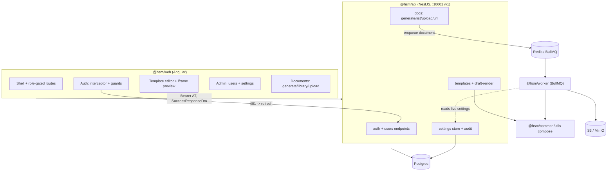
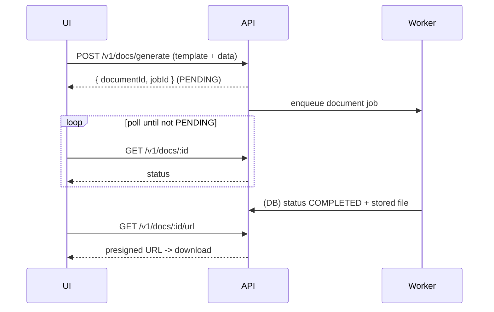
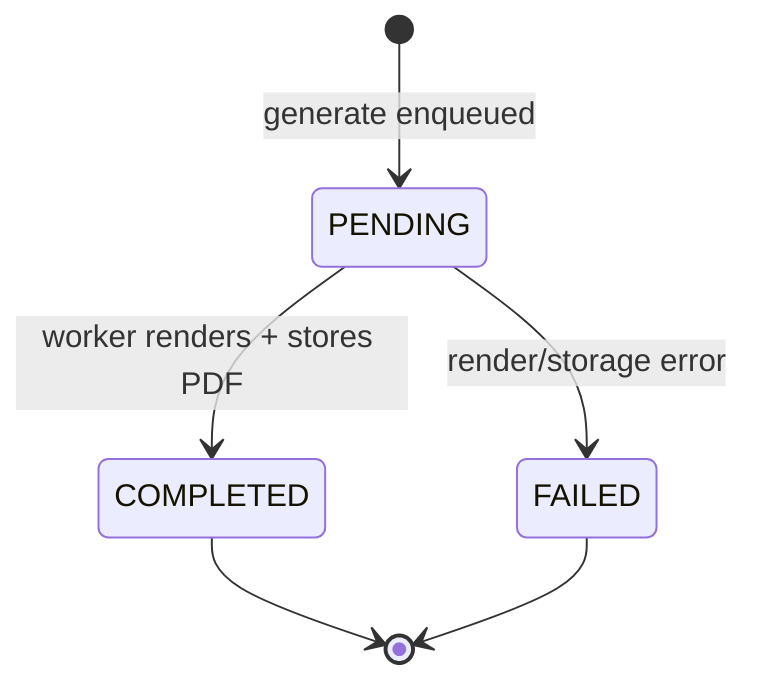

# Internal web console for the HSM backend (auth, users/admin, docs)

## Summary

Build the empty `@hsm/web` Angular app into an internal back-office console over two sequenced tracks: a backend track (draft-render endpoint, runtime settings store with audit, and the missing user-management endpoints) and the Angular build (auth foundation, multi-module shell, user self-service, admin panel, and the full docs surface). The shell mounts future internal or customer-facing modules without reworking auth or layout.

---

## Problem Frame

The backend is rich — JWT auth, role-based access, templates with base-template inheritance, queue-driven document generation/upload, and email/comms — but none of it is reachable by a non-developer; `apps/frontend/web` is a placeholder whose `build`/`dev` scripts echo `TODO`. The only way to exercise the API today is Swagger or a REST client. The app has no real users yet, so this is greenfield: no data migration, no UI to stay compatible with.

Research confirmed three backend gaps the brainstorm did not fully enumerate. First, no render/preview endpoint exists — composition of base + child + data into HTML lives only in the worker's generation job (`apps/backend/worker/src/modules/core/templates/templates.service.ts`), so the true-preview-on-save gate needs new backend work. Second, operational config is read once at boot through `@hsm/config` (Joi-validated, `Object.freeze`d), so "takes effect without restart" requires both a new store and a refactor of how consumers read it. Third, the user-management controller endpoints (`apps/backend/api/src/modules/core/users/user.controller.ts`) are unwired TODO skeletons and `UsersService` has no list method — so the self-service and admin user requirements (R5–R7) need backend units, not just frontend screens.

---

## Requirements

Carried from the origin document (`see origin`), with backend-prerequisite requirements R23–R24 added to make the discovered scope explicit.

### Auth and app shell

- R1. Users authenticate with email/password against the existing JWT access+refresh flow; the app holds both tokens and refreshes the access token transparently.
- R2. Unauthenticated users are redirected to login; all non-public routes are guarded.
- R3. Navigation and controls are role-gated — a non-admin never sees admin-only routes or actions.
- R4. The shell's routing, layout, and auth are structured so future modules mount without reworking the foundation.

### User self-service

- R5. A signed-in user can change their own password, name, and email.
- R6. A user cannot change their own role.

### Admin panel

- R7. An admin can list users, view a user, and change that user's role.
- R8. An admin can view and edit operational config across all categories: email/SMTP, webhook signing keys, storage/S3, and app-behavior toggles (rate limits, token TTLs, feature flags).
- R9. Config edits persist to the backend settings store and take effect at runtime with no restart; deploy-time env seeds the defaults when a value is unset.
- R10. Secret-valued settings are masked in the UI — displayed obscured, replaceable, never read back.
- R11. Every config change is recorded in an audit log capturing who changed which setting and when; secret values are never written to the log in plaintext.

### Template authoring

- R12. The editor shows a foldable metadata bar (name, description, category, base-template selector) above a split code-editor / live-preview area.
- R13. An author may select a BASE template; if none is selected, the author writes the full template content.
- R14. The code editor edits Handlebars/HTML template content with syntax highlighting.
- R15. A sample-data panel, seeded from the template's schema, supplies the values the preview renders against; the author can edit that sample data.
- R16. The live preview renders client-side and updates as the content or the sample data changes.
- R17. On Save, the app calls the backend render endpoint and shows the true server-composed output (including base-template composition) in a confirm step; the template persists only after the author confirms.

### Document generation and library

- R18. A user can pick a template, fill in its data, generate a PDF, and download it.
- R19. Generated and uploaded documents appear in a browsable list scoped to the user.
- R20. A user can upload existing files into the document store.

### Backend prerequisites

- R21. The backend exposes a draft-render endpoint that composes content + optional base template + sample data into HTML matching generation output, callable for unsaved drafts.
- R22. The backend provides a runtime settings store (seeded by env) with endpoints to read and update the R8 config categories, returning secret values as write-only and recording changes for R11's audit log.
- R23. The backend exposes self-service endpoints to update the caller's own profile (name, email) and change their own password, with the caller's role immutable through these endpoints. *(Discovered during planning — the controller endpoints are unwired today.)*
- R24. The backend exposes admin-only endpoints to list users (paginated), view a single user, and change a user's role. *(Discovered during planning — `UsersService` has no list method and the controller endpoints are unwired.)*

---

## Key Technical Decisions

- KTD1. **Frontend stack: PrimeNG + Monaco + full Handlebars build.** PrimeNG over Angular Material for its production-grade data table (`p-table` with sorting/filtering/pagination) that the user and settings screens lean on — Material ships only the low-level CDK table. Monaco for the code editor: its built-in `handlebars` language gives HTML + `{{...}}` highlighting with no extra wiring (CodeMirror 6 has no official Handlebars mode). The `handlebars` npm package's **full** build (with compiler, not the runtime-only build) bundles client-side for live preview, since authors compile templates in the browser.
- KTD2. **Auth via a functional `HttpInterceptorFn` with a single in-flight refresh.** On a 401 (excluding the refresh call itself), the first failure triggers one refresh against `GET /v1/auth/refresh`; concurrent 401s queue on a shared token subject and retry once the new access token arrives, avoiding a refresh stampede. Refresh failure clears tokens and redirects to login.
- KTD3. **Draft-render runs synchronously inside the API.** The worker's base+child+data composition is extracted into a pure, framework-agnostic util in `@hsm/common/utils` (mirroring the existing `validateAgainstTemplateSchema` precedent). The new API endpoint calls it inline and returns HTML in the request — not via the `templates` queue — because preview-on-save needs an immediate response. The worker is refactored to call the same util so client preview, server preview, and generation share one composition path.
- KTD4. **Settings store: DB-backed, env-seeded, secret write-only, audited; infra stays deploy-only.** A settings table holds per-key values with a category and an `isSecret` flag; reads fall back to `@hsm/config` env when a key is unset. Secret values are never returned (masked placeholder; saving blank leaves the stored value unchanged). Every update writes an audit row with no plaintext secret. DB/Redis/JWT secrets and throttler limits stay deploy-only per the brainstorm — only email/SMTP, webhook keys, storage/S3, and app-behavior toggles are store-managed.
- KTD5. **Live consumption via a short-TTL cache with cross-process invalidation.** The settings store is read through a small cached accessor. Consumers already reading per-request (webhook signing keys) point at the store directly; boot-constructed consumers (SMTP transport, S3 client) are refactored to rebuild lazily when their settings change. Because the API process writes settings while the worker holds the SMTP transport, invalidation crosses processes — a short cache TTL (seconds) is the baseline, with Redis pub/sub as the upgrade path if propagation latency matters. See Risks.
- KTD6. **Document generation is async; the frontend polls.** `POST /v1/docs/generate` enqueues and returns `{ documentId, jobId }` immediately. The frontend polls `GET /v1/docs/:id` until status leaves `PENDING`, then fetches the presigned URL from `GET /v1/docs/:id/url` (this resolves the brainstorm's open question).
- KTD7. **Live preview in a sandboxed iframe.** Rendered template output goes into an `<iframe srcdoc>` with `sandbox="allow-scripts"` only (never combined with `allow-same-origin`), debounced ~300ms after typing. This isolates author HTML/scripts from the console DOM while keeping the preview accurate; the true-preview-on-save gate (KTD3) is the fidelity backstop for any client/server divergence.
- KTD8. **Multi-module shell via lazy-loaded, role-gated routes.** Feature areas mount as lazy routes under a shared layout with role-gated navigation, so future internal or customer-facing modules attach without touching auth or layout.

---

## High-Level Technical Design

### Component topology



### Auth refresh (single in-flight)

```mermaid
sequenceDiagram
  participant Q as Queued requests
  participant I as Interceptor
  participant API as /v1/auth/refresh
  Q->>I: request (AT attached)
  API-->>I: 401 (AT expired)
  Note over I: first 401 -> isRefreshing=true
  I->>API: refresh (Bearer RT)
  API-->>I: new AT + RT
  Note over I: push AT to subject; isRefreshing=false
  I->>Q: retry all queued with new AT
  Note over I: refresh fails -> clear tokens, redirect to login
```

### True-preview-on-save gate

```mermaid
sequenceDiagram
  participant Author
  participant Editor
  participant API as POST /v1/templates/draft-render
  participant Persist as POST/PUT /v1/templates
  Author->>Editor: edit content + sample data
  Editor->>Editor: client-side Handlebars -> iframe preview (debounced)
  Author->>Editor: Save
  Editor->>API: draft (content, baseTemplateId?, sampleData)
  API-->>Editor: server-composed HTML (base + child)
  Editor->>Author: confirm dialog shows true output
  alt Confirm
    Author->>Persist: persist template
  else Cancel
    Note over Author,Editor: nothing saved; keep editing
  end
```

### Async document generation



### Document status lifecycle



---

## Output Structure

Expected Angular app layout (the per-unit `Files` lists remain authoritative; the implementer may adjust):

```text
apps/frontend/web/
├── angular.json
├── package.json
├── biome-aligned config
└── src/
    ├── main.ts
    ├── environments/            # API base URL -> http://localhost:10001/v1
    └── app/
        ├── app.config.ts        # provideHttpClient(withInterceptors([...]))
        ├── app.routes.ts        # lazy, role-gated feature routes
        ├── core/
        │   ├── api/             # typed client; SuccessResponseDto unwrap, ErrorResponseDto surface
        │   └── auth/            # token storage, auth service, interceptor, guards, role directive
        ├── layout/              # shell, nav (role-gated)
        └── features/
            ├── auth/login/
            ├── profile/         # self-service (R5, R6)
            ├── admin/
            │   ├── users/       # list, view, role change (R7)
            │   └── settings/    # live config by category (R8–R11)
            ├── templates/editor/ # editor + preview + save gate (R12–R17)
            └── documents/        # generate/poll/download, library, upload (R18–R20)
```

---

## Implementation Units

Three phases: backend track (U1–U5) unblocks the frontend; frontend foundation (U6–U9) precedes feature screens (U10–U15).

### Phase A — Backend track

#### U1. Shared Handlebars compose util + worker refactor

- **Goal:** Extract base+child+data composition into one shared, framework-agnostic function so client preview, server draft-render, and generation share a single path.
- **Requirements:** R21 (enables), KTD3, KTD7.
- **Dependencies:** none.
- **Files:** `packages/common/src/utils/` (new compose util + barrel export), `apps/backend/worker/src/modules/core/templates/templates.service.ts` (refactor `parse`/`compile` to call the util), `apps/backend/worker/src/modules/core/templates/templates.service.spec.ts`.
- **Approach:** Pure function `composeTemplate({ content, baseContent, data })` using `Handlebars.compile`; when a base is present, render child first then `base({ ...data, body: childHtml })` — mirroring the worker's current logic. No Nest providers (keeps `@hsm/common` provider-free). Register no helpers (none exist server-side today); centralize here so any future helper stays parity-shared.
- **Patterns to follow:** existing `validateAgainstTemplateSchema` in `@hsm/common/utils`; current worker composition in `templates.service.ts`.
- **Test scenarios:**
  - Child-only template (BASE category or no base) renders content against data.
  - Child + base composes `{{body}}` into the base with data spread through.
  - Worker `parse` produces byte-identical output before and after the refactor (characterization).
  - Handlebars runtime error surfaces as the existing error code path, not an unhandled throw.
- **Execution note:** Add characterization coverage of the current worker output before refactoring, then move logic to the util.
- **Verification:** Worker generation output unchanged; util unit tests pass; `pnpm --filter @hsm/worker start:dev` reaches DB phase with no DI errors.

#### U2. Draft-render API endpoint

- **Goal:** Expose `POST /v1/templates/draft-render` returning server-composed HTML for an unsaved draft.
- **Requirements:** R21; advances R17.
- **Dependencies:** U1.
- **Files:** `apps/backend/api/src/modules/core/templates/templates.controller.ts`, `templates.service.ts`, `templates.http`, co-located `*.spec.ts`; `packages/common/src/dtos/templates.dto.ts` (`DraftRenderPayloadDto`, `DraftRenderResponseDto`) + barrel.
- **Approach:** Payload carries `content`, optional `baseTemplateId`, and `sampleData`. Service resolves the base content (when `baseTemplateId` set) and calls the U1 util inline — no queue. Auth-required (`@Roles()`), not `@Public()`. Return the composed HTML in `data`; the global `ResponseInterceptor` wraps it.
- **Patterns to follow:** existing `validate` endpoint shape and DTO conventions in the templates module; `@hsm/common/dtos` file/barrel naming.
- **Test scenarios:**
  - Draft with no base renders content against `sampleData`.
  - Draft with `baseTemplateId` composes the base; output matches generation composition.
  - Covers AE2. A base-composition difference vs. client preview is visible in the returned HTML (the draft endpoint includes base composition).
  - Missing/invalid `baseTemplateId` returns the templates module's not-found/validation error, not a 500.
  - Handlebars syntax error in `content` returns a structured compile error.
  - Unauthenticated request is rejected by the global auth guard.
- **Verification:** Endpoint returns true composed HTML for drafts; specs pass; `.http` block added.

#### U3. Runtime settings store + secret masking + audit log

- **Goal:** DB-backed, env-seeded settings store with read/update endpoints, write-only secrets, and an audit trail.
- **Requirements:** R8, R10, R11, R22; partial R9.
- **Dependencies:** none (parallel to U1/U2).
- **Files:** `packages/database/src/entities/modules/core/settings/` (`app-setting.entity.ts`, `app-setting-audit.entity.ts`) + module barrel and `forFeature` registration; new API module `apps/backend/api/src/modules/core/settings/{settings.module,controller,service}.ts` + `settings.http` + specs (wired into `core.module.ts`); `packages/common/src/dtos/` settings DTOs + enums (category enum) + barrels; dummy env values already exist in `@hsm/config` so no `test-setup.ts` change unless new env keys are added.
- **Approach:** `AppSettingEntity` keyed by setting key, with `category`, `value`, `isSecret`, `updatedBy`, `updatedAt`. Reads fall back to `envs` when a key row is absent (env as seed/default). `GET /v1/settings?category=` returns values with secrets replaced by a masked placeholder; `PUT /v1/settings` updates and, when a secret field is blank, leaves the stored value unchanged. Each update writes an `AppSettingAuditEntity` row (key, changedBy, changedAt, masked old/new — never plaintext secret). Admin-only (`@Roles(RolesEnum.System.Admin)`).
- **Patterns to follow:** entity registration and barrel rules in `packages/database/CLAUDE.md` (avoid the circular-import silent-drop documented in `docs/solutions/runtime-errors/2026-05-04-typeorm-entity-circular-import-silent-drop.md`); enum-in-non-public-schema handling per `docs/solutions/database-issues/2026-05-12-typeorm-enum-schema-qualified-migration-failure.md`; `@hsm/database` `@InjectRepository(Entity, DatabasesEnum.HsmDbPostgres)`.
- **Test scenarios:**
  - Reading a category returns env-seeded defaults when no rows exist.
  - Reading a secret returns a masked placeholder, never the stored value.
  - Covers AE3. Saving a blank secret leaves the stored value unchanged; a real change is persisted.
  - Covers AE3. Every update writes an audit row; the audit row never contains the plaintext secret.
  - Non-admin is rejected (403) on read and update.
  - Updating a non-secret value returns the new value on the next read.
- **Verification:** Settings CRUD works admin-only; audit rows written without plaintext secrets; `pnpm --filter @hsm/api start:dev` reaches DB phase with no DI errors.

#### U4. Live config consumption

- **Goal:** Make store-managed config take effect at runtime without restart.
- **Requirements:** R9.
- **Dependencies:** U3.
- **Files:** `apps/backend/api/src/modules/core/coms/webhook/coms-webhook.service.ts` (read keys from store), `apps/backend/worker/src/modules/core/coms/` SMTP transport factory (lazy rebuild on change), `packages/storage/src/s3/s3.provider.ts` (lazy client rebuild on change), a cached settings accessor shared by consumers, plus specs.
- **Approach:** Introduce a cached accessor over the U3 store with a short TTL (seconds). Webhook signing keys (already read per-request) point at the store. SMTP transport and S3 client move from boot-time singletons to lazily-rebuilt instances keyed on a settings version/hash, so a change invalidates and reconstructs them. Cross-process propagation (API writes; worker holds the transport) relies on the TTL; document Redis pub/sub as the upgrade if latency is unacceptable.
- **Patterns to follow:** current factory providers for SMTP (`email.module.ts`) and S3 (`s3.provider.ts`); `getWebhookSigningKeys` per-request lookup.
- **Test scenarios:**
  - Changing webhook signing keys takes effect on the next webhook request without restart.
  - Changing an app-behavior toggle is reflected on the next read after the cache TTL.
  - SMTP transport rebuilds after an SMTP setting changes (next send uses new config).
  - S3 client rebuilds after a storage setting changes.
  - Infra keys (DB/Redis/JWT, throttler) are not exposed to the store and remain env-sourced.
- **Execution note:** Start with the already-per-request webhook path (lowest risk), then the rebuildable SMTP/S3 consumers.
- **Verification:** A settings change observably alters behavior within the TTL window with no process restart.

#### U5. User endpoints: self-service + admin

- **Goal:** Wire the unimplemented user controller for self-service profile/password updates and admin user management.
- **Requirements:** R5, R6, R7, R23, R24.
- **Dependencies:** none (parallel to U1/U3).
- **Files:** `apps/backend/api/src/modules/core/users/user.controller.ts`, `users.service.ts` (add `findAll` paginated; profile/password update paths), co-located specs and `.http`; `packages/common/src/dtos/` (`UpdateOwnProfileDto`, `ChangePasswordDto`, admin `ChangeUserRoleDto`, list query) + barrels.
- **Approach:** Self-service `PATCH /v1/user/me` updates name/email only — role and other users' records are not reachable; `POST /v1/user/me/password` verifies the current password (bcrypt) before setting the new one. Admin `GET /v1/user` (paginated via `SuccessResponseDto` pagination metadata), `GET /v1/user/:id`, and a role-change endpoint guarded by `@Roles(RolesEnum.System.Admin)`, updating `UserRoleEntity`. Reuse existing `UsersService` methods; add `findAll`.
- **Patterns to follow:** existing `UsersService` transaction patterns and `UserRoleEntity` junction handling; auth bcrypt usage in `auth.service.ts`; mocking patterns in `docs/solutions/developer-experience/2026-05-06-nestjs-unit-test-mocking-patterns.md`.
- **Test scenarios:**
  - Self-update changes own name/email; a role field in the payload is ignored/rejected (R6).
  - Password change rejects a wrong current password and accepts a correct one.
  - Covers AE4. Self-service endpoints expose no path to change own or others' roles.
  - Admin lists users with pagination metadata; non-admin is rejected (403).
  - Admin changes another user's role; the change persists and is reflected on next fetch.
  - Admin views a single user by id; unknown id returns 404.
- **Verification:** Self-service and admin user flows work with correct role gating; specs pass; `start:dev` clean.

### Phase B — Frontend foundation

#### U6. Scaffold Angular app + tooling

- **Goal:** Replace the placeholder with a real Angular app (standalone + signals) wired to PrimeNG, Monaco, and Handlebars, talking to the API at `:10001/v1`.
- **Requirements:** R4 (foundation); KTD1.
- **Dependencies:** none.
- **Files:** `apps/frontend/web/` (`angular.json`, `package.json` with real `build`/`dev`, `src/main.ts`, `src/app/app.config.ts`, `src/environments/*`), `apps/frontend/web/CLAUDE.md` (update once scaffolded).
- **Approach:** Latest stable Angular, standalone bootstrap, `provideHttpClient`. Add `primeng`, `monaco-editor` (+ Angular wrapper), `handlebars` (full build). Environment holds the API base URL. Keep package name `@hsm/web` and the workspace path. Lint/format with the repo Biome config — no ESLint/Prettier.
- **Patterns to follow:** `apps/frontend/web/CLAUDE.md` conventions (port 10001, `/v1`, Biome, reuse `@hsm/common`).
- **Test scenarios:** `Test expectation: none — scaffolding.` A trivial app-boots smoke test is acceptable.
- **Verification:** `pnpm --filter @hsm/web dev` serves the app; `pnpm --filter @hsm/web build` succeeds; Biome passes.

#### U7. API client + response-wrapper handling + token storage

- **Goal:** A typed HTTP layer that unwraps `SuccessResponseDto`, surfaces `ErrorResponseDto`, and stores tokens.
- **Requirements:** R1 (enables); KTD2.
- **Dependencies:** U6.
- **Files:** `apps/frontend/web/src/app/core/api/*`, `apps/frontend/web/src/app/core/auth/token-storage.*`, specs.
- **Approach:** A small client that maps `data` out of `SuccessResponseDto` and normalizes `ErrorResponseDto` (`issue.code`/`message`/`field`) into a typed error. Reuse `@hsm/common` DTOs/enums rather than redefining shapes. Token storage abstracts AT/RT persistence.
- **Patterns to follow:** `SuccessResponseDto`/`ErrorResponseDto` from `@hsm/common/dtos`; `ITokens` from `@hsm/common/interfaces`.
- **Test scenarios:**
  - Successful response unwraps `data` for the caller.
  - Error response maps `issue` fields to a typed client error.
  - Paginated response exposes `metadata.extra.pagination`.
  - Token storage round-trips AT/RT and clears on logout.
- **Verification:** Client returns typed payloads/errors; specs pass.

#### U8. Auth: login + refresh interceptor + guards + role gating

- **Goal:** Working login, transparent refresh, route protection, and role-gated visibility.
- **Requirements:** R1, R2, R3, R4.
- **Dependencies:** U7; backend already provides login/refresh/profile.
- **Files:** `apps/frontend/web/src/app/core/auth/*` (auth service, `HttpInterceptorFn`, auth guard, role guard + structural directive), `apps/frontend/web/src/app/features/auth/login/*`, route wiring, specs.
- **Approach:** Login posts to `POST /v1/auth/login`, stores `{ access_token, refresh_token }`. Interceptor attaches the AT and, on 401 (excluding the refresh call), performs a single in-flight refresh against `GET /v1/auth/refresh` while concurrent 401s queue on a shared subject (KTD2). Auth guard redirects unauthenticated users to login; role guard/directive reads roles (from the profile / `RolesEnum`) to hide admin-only routes and controls.
- **Patterns to follow:** research-confirmed functional-interceptor + single-subject refresh pattern; `RolesEnum` from `@hsm/common/enums`; `GET /v1/auth/profile` for the signed-in user.
- **Test scenarios:**
  - Valid login stores tokens and lands on an authenticated route.
  - Invalid credentials surface the API error without navigating.
  - A 401 triggers exactly one refresh; the original request retries with the new AT.
  - Multiple concurrent 401s trigger a single refresh; all queued requests retry once the new AT arrives (no stampede).
  - Refresh failure clears tokens and redirects to login.
  - Covers AE4. A non-admin is blocked from admin routes and sees no admin nav/controls.
  - Unauthenticated navigation to a guarded route redirects to login.
- **Verification:** Login, refresh-on-expiry, guard redirect, and role gating all work end-to-end against the API.

#### U9. App shell + multi-module routing

- **Goal:** A layout and lazy, role-gated route structure that future modules mount into without rework.
- **Requirements:** R3, R4.
- **Dependencies:** U8.
- **Files:** `apps/frontend/web/src/app/layout/*`, `apps/frontend/web/src/app/app.routes.ts`, specs.
- **Approach:** PrimeNG-based shell (nav + content outlet). Feature areas register as lazy routes; nav items are role-gated via the U8 directive. Structure routes so an additional internal or customer-facing module is a new lazy route + nav entry, not an auth/layout change.
- **Patterns to follow:** Angular standalone lazy `loadComponent`/`loadChildren`; KTD8.
- **Test scenarios:**
  - Admin sees admin nav entries; non-admin does not.
  - A lazy feature route loads only when navigated to.
  - Adding a route does not require touching the auth guard wiring (structural check via a stub route).
- **Verification:** Shell renders with role-correct nav; lazy routes resolve.

### Phase C — Frontend features

#### U10. User self-service screens

- **Goal:** Profile edit and password change for the signed-in user, with no role control.
- **Requirements:** R5, R6.
- **Dependencies:** U9, U5.
- **Files:** `apps/frontend/web/src/app/features/profile/*`, specs.
- **Approach:** Forms for name/email (`PATCH /v1/user/me`) and password change (`POST /v1/user/me/password`). No role field is rendered.
- **Patterns to follow:** PrimeNG forms; U7 client error surfacing.
- **Test scenarios:**
  - Editing name/email persists and reflects on reload.
  - Password change requires current password; server rejection surfaces inline.
  - Covers AE4. No role-change control is present on the profile screen.
- **Verification:** Self-service updates succeed against the API; no role control rendered.

#### U11. Admin: user management

- **Goal:** Admin list/view/role-change screens.
- **Requirements:** R7, R3.
- **Dependencies:** U9, U5.
- **Files:** `apps/frontend/web/src/app/features/admin/users/*`, specs.
- **Approach:** PrimeNG `p-table` user list with server pagination (`GET /v1/user`), a view, and a role-change control (`RolesEnum`) posting to the admin role endpoint. Admin-only route.
- **Patterns to follow:** PrimeNG lazy table + pagination metadata from `SuccessResponseDto`.
- **Test scenarios:**
  - List renders paginated users; paging requests the next page.
  - Changing a user's role calls the admin endpoint and reflects the new role.
  - Covers AE4. The route and controls are unreachable for a non-admin.
- **Verification:** Admin can list and re-role users; non-admin blocked.

#### U12. Admin: live settings

- **Goal:** Category-tabbed settings screens with masked secrets and live persistence.
- **Requirements:** R8, R9, R10, R11.
- **Dependencies:** U9, U3 (U4 makes edits take effect live).
- **Files:** `apps/frontend/web/src/app/features/admin/settings/*`, specs.
- **Approach:** One screen per category (email/SMTP, webhook keys, storage/S3, app toggles). Secret fields render a masked placeholder; submitting blank leaves them unchanged. Save calls `PUT /v1/settings`; surface a saved confirmation.
- **Patterns to follow:** PrimeNG forms; KTD4 masking semantics.
- **Test scenarios:**
  - Covers AE3. A stored secret shows a masked placeholder, never the value.
  - Covers AE3. Submitting a blank secret leaves it unchanged; a real change saves.
  - Editing a non-secret value persists and reflects on reload.
  - Covers AE4. The settings area is unreachable for a non-admin.
- **Verification:** Settings edit/save works admin-only with correct secret masking.

#### U13. Template editor shell + client preview

- **Goal:** The foldable-metadata + Monaco + sample-data + live-preview authoring surface.
- **Requirements:** R12, R13, R14, R15, R16.
- **Dependencies:** U9.
- **Files:** `apps/frontend/web/src/app/features/templates/editor/*`, specs.
- **Approach:** Foldable metadata bar (name, description, category, base-template selector) above a split Monaco editor / preview. Sample-data panel seeds from the template `schema` (jsonb shape) and is editable. Client-side Handlebars compiles content and renders into a sandboxed `<iframe srcdoc>` (`allow-scripts` only), debounced ~300ms, re-rendering on content or sample-data change.
- **Patterns to follow:** Monaco `handlebars` language; KTD7 iframe sandbox; template `schema` shape from `@hsm/common` template DTOs.
- **Test scenarios:**
  - Covers AE5. Opening a template with a schema pre-populates an editable sample-data panel.
  - Editing content updates the preview after the debounce.
  - Editing sample data updates the preview.
  - Selecting no base lets the author write full content (R13); the base selector lists BASE-category templates.
  - The preview iframe is sandboxed (`allow-scripts`, not `allow-same-origin`).
- **Verification:** Live client preview reflects content and sample-data edits; sample data seeds from schema.

#### U14. True-preview-on-save gate + persist

- **Goal:** On Save, show the server-composed output and persist only on confirm.
- **Requirements:** R17.
- **Dependencies:** U13, U2.
- **Files:** `apps/frontend/web/src/app/features/templates/editor/*` (save flow + confirm dialog), specs.
- **Approach:** Save calls `POST /v1/templates/draft-render` with current content/base/sample data, renders the returned true HTML in a confirm dialog; confirm persists via create/update, cancel returns to editing with nothing saved.
- **Patterns to follow:** KTD3 draft-render; existing templates create/update endpoints.
- **Test scenarios:**
  - Covers AE1. Save shows the server-rendered output and persists nothing until confirm.
  - Covers AE1. Cancel saves nothing and keeps the editor state.
  - Covers AE2. A base-composition difference vs. the client preview is visible in the confirm dialog, and the author can cancel to keep editing.
  - A draft-render error surfaces without persisting.
- **Verification:** No template persists without an explicit confirm of the true-rendered output.

#### U15. Documents: generate, library, upload

- **Goal:** Generate (async, polled), browse the user-scoped library, and upload files.
- **Requirements:** R18, R19, R20.
- **Dependencies:** U9; backend docs endpoints already exist.
- **Files:** `apps/frontend/web/src/app/features/documents/*`, specs.
- **Approach:** Generate flow picks a DOCS template, fills data, posts `POST /v1/docs/generate`, then polls `GET /v1/docs/:id` until status leaves `PENDING`, then downloads via `GET /v1/docs/:id/url` (KTD6). Library is a PrimeNG table over `GET /v1/docs` (user-scoped, paginated). Upload posts multipart to `POST /v1/docs/upload`.
- **Patterns to follow:** async-poll then presigned-URL fetch; PrimeNG table + file upload.
- **Test scenarios:**
  - Covers R18. Generate enqueues, polls to COMPLETED, and downloads the PDF.
  - A generated document then appears in the library list.
  - A FAILED generation surfaces an error and stops polling.
  - Upload adds a file that appears in the list.
  - The library shows only the signed-in user's documents (scoping respected by the API).
  - Polling backs off / terminates rather than looping forever on a stuck job.
- **Verification:** Generate→poll→download and upload→list both work against the API.

---

## Scope Boundaries

### Deferred for later

- Email/comms management screens (sends, batches, recipients, webhook events) — backend supports them; not in this cut (see origin).
- Customer-facing modules — the shell must not preclude them, but none ship here.
- The mobile app (`@hsm/mobile`) remains a placeholder.

### Outside this cut

- SMS features (backend is a stub).
- Editing infrastructure config that can't change on a running process (DB/Redis connection, JWT secrets, throttler limits) — stays deploy-only (see origin and KTD4).
- Per-file entity linking and document-content editing after upload.

### Deferred to follow-up work

- Redis pub/sub for settings invalidation — only if the short-TTL cache (U4/KTD5) shows unacceptable propagation latency in practice.
- Making token TTLs and throttler limits store-managed — they are hardcoded today; treat as a later enhancement, not part of R8's first cut.

---

## Risks & Dependencies

- **Cross-process settings invalidation (U4).** The API writes settings while the worker holds the SMTP transport and the storage layer holds the S3 client. The short-TTL cache bounds staleness but doesn't eliminate it; if near-instant propagation is required, escalate to Redis pub/sub (deferred). Mitigation: keep TTL short and document the propagation window; rebuild boot-time singletons lazily on settings-version change.
- **Client/server preview divergence (U13/U14).** Client-side Handlebars may diverge from server composition (helpers, partials, base composition). Mitigation: the true-preview-on-save gate (KTD3) is the backstop; no helpers are registered server-side today, and the shared compose util (U1) keeps the paths aligned.
- **Greenfield frontend, no local patterns.** `@hsm/web` has zero existing Angular code, so conventions are set here. Mitigation: KTD1 stack choices are research-backed; update `apps/frontend/web/CLAUDE.md` once scaffolded.
- **Backend track gates the frontend.** Feature screens U12/U14/U10/U11 depend on U2/U3/U5. Sequence the backend track first; U6–U9 (foundation) can proceed in parallel with the backend track.
- **New entities and enums.** U3 adds entities/enums to `@hsm/database`; follow the documented circular-import and non-public-schema-enum pitfalls (`docs/solutions/runtime-errors/2026-05-04-typeorm-entity-circular-import-silent-drop.md`, `docs/solutions/database-issues/2026-05-12-typeorm-enum-schema-qualified-migration-failure.md`) and add dummy env values to `src/test-setup.ts` if any new required env key is introduced.

---

## Acceptance Examples

- AE1. **Covers R17.** Given an author has edited template content, when they click Save, then the app shows the server-rendered output in a confirm dialog and persists nothing until they confirm; if they cancel, no changes are saved.
- AE2. **Covers R17, R16.** Given a draft whose client-side preview looked correct, when the true preview reveals a base-composition difference, then the author can cancel the save and keep editing.
- AE3. **Covers R10, R11.** Given a secret setting has a stored value, when an admin opens Settings, then the field shows a masked placeholder; saving a blank secret leaves the stored value unchanged; and any actual change is recorded in the audit log without the plaintext secret.
- AE4. **Covers R3, R6.** Given a non-admin user, when they view their profile or navigate the app, then no role-change control and no admin route is reachable.
- AE5. **Covers R15.** Given a template with a schema, when the editor opens, then the sample-data panel is pre-populated with values derived from that schema and is editable.

---

## Open Questions

- **Cross-process invalidation TTL value (U4).** The exact cache TTL (and whether to ship Redis pub/sub now) depends on observed propagation latency — resolve during implementation against real behavior.
- **Monaco Angular wrapper choice (U6).** Whether to use a maintained wrapper package or integrate `monaco-editor` directly — settle when scaffolding, based on current package health.

---

## Sources / Research

- `apps/backend/api/src/modules/core/templates/templates.controller.ts`, `templates.service.ts` — `validate` checks schema + `Handlebars.precompile` (syntax only); no render endpoint exists (drives U1/U2).
- `apps/backend/worker/src/modules/core/templates/templates.service.ts` — server-side `parse`/`compile` composition (`base({ ...data, body: childHtml })`); no helpers registered (drives U1).
- `packages/database/src/entities/modules/core/template/templates.entity.ts` — base-template CHECK constraint and jsonb `schema` column (drives U13 sample-data seeding).
- `packages/config/src/envs.ts` — env Joi-validated and frozen at boot; SMTP/S3/JWT/webhook/throttler classification (drives U3/U4 and the deploy-only boundary).
- `apps/backend/api/src/modules/core/users/user.controller.ts`, `users.service.ts` — user endpoints are unwired TODO skeletons, no `findAll` (drives U5, R23/R24).
- `apps/backend/api/src/modules/core/docs/` — `generate` enqueues and returns `{ documentId, jobId }`; `GET /v1/docs`, `:id`, `:id/url`, `upload` exist (drives U15, KTD6).
- `apps/backend/api/src/guards/auth.guard.ts`, `modules/security/roles/` — global JWT AT guard + `@Roles()`/`RolesGuard`; `@Public()` opt-out (drives U8).
- `packages/common/src/dtos/common-response.dto.ts`, `interfaces/security-auth.interface.ts` — `SuccessResponseDto`/`ErrorResponseDto`, `ITokens` (drives U7).
- External (2026): PrimeNG vs Angular Material for data-table-heavy consoles; Monaco's built-in `handlebars` language vs CodeMirror 6; `handlebars` full vs runtime build; functional `HttpInterceptorFn` single in-flight refresh; sandboxed `<iframe srcdoc>` with `allow-scripts` only for preview safety (drives KTD1, KTD2, KTD7).
- `docs/solutions/` — entity circular-import silent drop, non-public-schema enum migration, NestJS test mocking, config Joi/dotenv conditional (referenced in U1/U3/U5).
