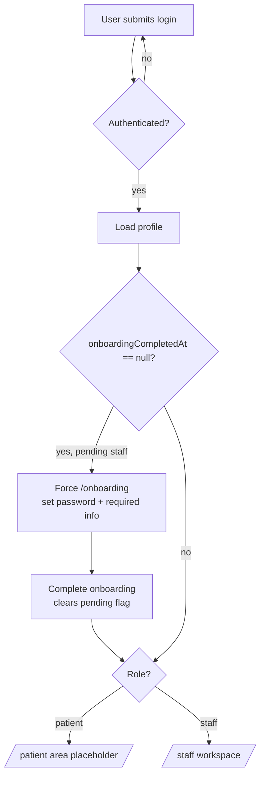
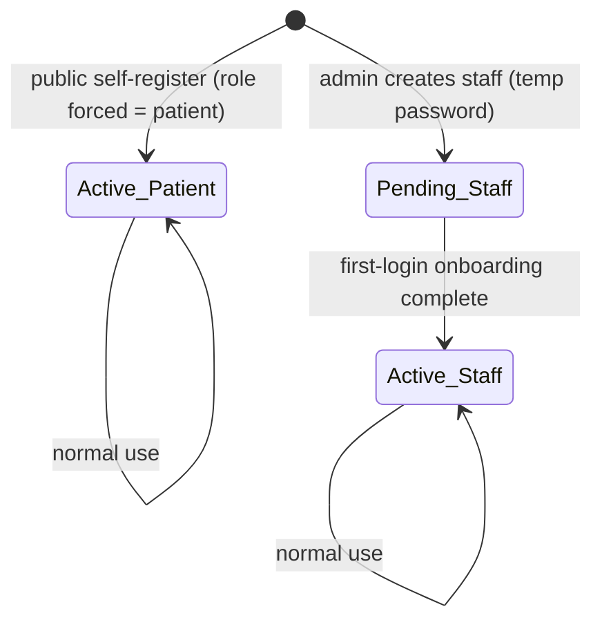
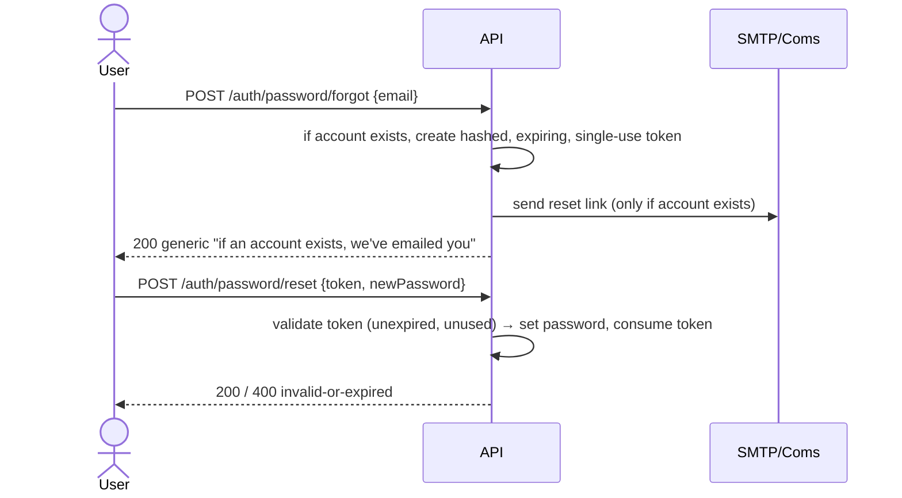

# feat: Unified hospital frontend — one door (patients + staff), brand reskin, PWA

## Summary

Reframe `@hsm/web` from a staff-only "internal console" into **one front door for the whole hospital**: a single login where role decides the view, public self-registration as patients only, admin-provisioned staff who complete a forced first-login onboarding, account recovery from the login screen, a brand-aligned redesign with a live version footer, and the single web app turned into an installable, offline-capable PWA that retires the separate mobile codebase.

---

## Problem Frame

The web app today presents itself as **HSMConsole — "Internal operations / staff access only."** That framing is wrong for the product: this is a hospital app whose audience is both patients (public) and employees (staff), built as one frontend, not two. The current login is username-only with staff-credential copy; public self-registration mints staff `Auditor` accounts; the UI uses a green/clay "Clinical Pine" design system rather than the company brand; navigation and identity assume staff-only; there is a separate empty `apps/frontend/mobile` app implying a second codebase; and the version shown is a hardcoded `console v0.1`.

This plan supersedes the **"internal-first" framing** of the origin requirements doc (`docs/brainstorms/2026-06-23-web-frontend-internal-console-requirements.md`). The staff features that doc specced — template authoring, document generation, admin settings — are unchanged and carry forward as the **staff view** behind the one-door model; their build remains the prior plan's responsibility (`docs/plans/2026-06-24-001-feat-internal-web-console-plan.md`, units U10–U15). This plan changes **identity, access, branding, and platform**, not those staff features.

**Greenfield-ish:** the app has no real users yet. The auth foundation, shell, routing, guards, and interceptor are already built (prior plan U6–U9); this plan modifies that foundation rather than creating it, and adds new backend endpoints the foundation doesn't yet have.

---

## Requirements

### Identity and access

- **R1.** One front door — a single login serves patients and staff; there is no separate console entry. Role determines the post-login destination.
- **R2.** The app's identity is a hospital app for everyone; all "internal operations / staff access only" framing is removed.
- **R3.** Public self-registration creates a **Patient** account only; the role is enforced server-side on the public signup path, not just in the client.
- **R4.** There is no public staff self-registration; staff accounts are created only by an admin.
- **R5.** An admin can create a staff account (username, email, name, role, temporary password); the new account is flagged **pending onboarding**.
- **R6.** On first login, a pending-onboarding staff member is forced to an onboarding screen to set a new password and complete required profile fields before reaching any feature; completing it clears the pending flag. Enforcement is server-side as well as in routing.
- **R7.** From the login screen ("Trouble signing in?"), a user can request a **password reset** (emailed) and/or have their **username** sent to their email.
- **R8.** Role-aware routing — after login a patient lands in a patient area and a staff member in the staff workspace; navigation shows only what the role permits.

### Branding and UI

- **R9.** The app adopts the company **brand palette** (primary `#0E4D98`, accent `#EA2128`, ink `#11304F`, neutral `#CDCFD1`, surface `#FFFFFF`) **app-wide**, replacing the green/clay tokens, preserving the contrast pairings from the brand guide.
- **R10.** The login/landing is redesigned as a hospital-branded **two-panel** screen (brand panel + sign-in) with the recovery entry point and no staff-only language.
- **R11.** A **version footer** shows the running UI version and backend API version, replacing the hardcoded `console v0.1`.

### Platform (PWA)

- **R12.** The single web app is an **installable PWA** (manifest, brand icons, install affordance); the separate mobile app is retired.
- **R13.** The PWA works **offline for app shell + static assets only**; authenticated patient/clinical API responses are **not** cached offline.
- **R18.** All new and reskinned screens are **mobile-responsive** (phone-first, since the PWA installs on phones) — the two-panel login collapses to a single column on small viewports; forms and the shell adapt to phone widths.

### Backend prerequisites

- **R14.** The backend exposes an app/API **version** value the UI can read.
- **R15.** The backend exposes **password-reset** and **username-recovery** endpoints that email via the existing SMTP/Coms infrastructure; reset tokens expire, are single-use, and responses do not reveal whether an account exists.
- **R16.** The user model carries an **onboarding/pending** state, with endpoints to create staff (admin) and to complete onboarding (first login).

### Patient area

- **R17.** A signed-in patient sees a **minimal placeholder** patient area — sufficient as a role-routing destination; real patient features are out of scope this round.

---

## Key Technical Decisions

- **KTD1 — Role-routed single entry.** Keep one public `/login`; replace the fixed `'' → profile` default redirect with a **role resolver** that sends patients to the patient area and staff to the workspace. Reuse the existing `authGuard`/`roleGuard`; add role helpers (`isPatient`/`isStaff`) to `AuthService`. (see origin: prior shell/routing, `apps/frontend/web/src/app/app.routes.ts`)
- **KTD2 — Pending state as a nullable timestamp, DB-authoritative.** Model onboarding as `onboardingCompletedAt: timestamptz | null` on `UserEntity`. Patients and the seeded admin are created complete; admin-created staff are created `null` (pending). Chosen over a separate status table or a new enum column — orthogonal to `isActive`, cheap to read, self-documenting. **The DB is the source of truth, not the access token:** `GET /auth/profile` returns the *decoded JWT* (no DB read), so the server-side onboarding guard reads the user row by id from the DB, and completing onboarding **reissues a fresh token pair** so the client reflects the cleared flag without waiting out the access-token TTL. The U1 migration **backfills all existing rows to `now()`** so only future admin-created staff are pending (otherwise the seeded admin would be locked out by the guard). `isActive` stays a separate concern (disabled accounts).
- **KTD3 — Patient role enforced server-side.** The public `/auth/signup` path **ignores any client-supplied roles** and assigns `RolesEnum.Patient.Patient`; the existing elevated-role rejection stays as defense in depth. The client no longer dictates the role (today it hardcodes `Auditor`).
- **KTD4 — Recovery via a worker transactional mailer; tokens safe-by-default.** The API has **no SMTP transport** (sending lives in the worker via `SmtpTransportProvider`), and the existing Coms path is template+batch-oriented and *persists* rendered email bodies — unsuitable for a single-use secret link. So U5 adds a **dedicated transactional send** in the worker (reusing `SmtpTransportProvider`) invoked by a queue job carrying the recipient + reset URL; the **plaintext reset link is never persisted** (only the hashed token is stored). Reset tokens are **256-bit (`crypto.randomBytes(32)`), hashed at rest, expiring (≤1h), single-use**, and ride in the URL **fragment** (not a query param) to stay out of `Referer`/server logs. `forgot-password` and `username-recovery` are **rate-limited per account** and return the **same response regardless of account existence** (non-enumerating). Before building a new token entity, U5 checks the existing PIN-generation stub (`auth.service.ts` TODO for "email verification and password reset") and either reuses or supersedes it deliberately.
- **KTD5 — Reskin is a token swap.** Centralize brand values as CSS custom properties in `src/styles.css` and the PrimeNG theme preset; replace the pine/clay tokens and any hardcoded pine/clay hexes in component styles so the whole app re-themes from one source. (Audit for hardcoded hexes is part of the unit.)
- **KTD6 — Version from two sources.** Web version injected at build from a **CI build identifier (git short SHA / build number)** — *not* the static `package.json` `0.0.1`, which never bumps and would freeze the footer; API version from a public endpoint that returns **only the semantic version** (no git SHA / branch / build timestamp, to avoid handing anonymous callers exact-build recon). The UI renders both in the footer.
- **KTD7 — PWA caches assets, never PHI.** Use `@angular/service-worker` (the `@angular/pwa` schematic), service worker **enabled in production only**. `ngsw-config.json` declares **`assetGroups` (app shell + static assets) only — no `dataGroups`** for authenticated endpoints, so no patient/clinical data is written to the cache. `assetGroups` URL patterns are constrained to **explicit static file extensions** (never a `/**` or `/*.json` wildcard that could match `/v1/` API responses), and a config test asserts no asset pattern matches the API base path. Offline navigation falls back to a cached shell page. (Health-data caching guidance — see Sources.)
- **KTD8 — Retire the mobile app.** Remove `apps/frontend/mobile` from the workspace and clean its references (`pnpm-workspace.yaml`, `turbo.json`, root `CLAUDE.md`). The PWA is the single mobile experience.

---

## High-Level Technical Design

### Post-login routing and the onboarding gate

### Account lifecycle

### Password reset (non-enumerating)

*Diagrams are authoritative design intent; prose governs on any disagreement.*

---

## Implementation Units

Ordered by dependency: backend endpoints first (frontend consumes them), then app-wide tokens, then frontend identity/auth, then PWA, then cleanup. UI-facing units carry a `/frontend-design` execution note.

### Phase A — Backend

### U1. Onboarding/pending state on the user model

- **Goal:** Add the pending-onboarding state and surface it to the frontend.
- **Requirements:** R6, R16 (KTD2)
- **Dependencies:** none
- **Files:** `packages/database/src/entities/modules/core/users/users.entity.ts`; a new TypeORM migration under `packages/database` migrations dir; the signed-user/profile assembly in `apps/backend/api/src/modules/security/auth/auth.service.ts` and its `ISignedUser` interface in `packages/common`; profile DTO/interface in `packages/common`; tests alongside the auth service.
- **Approach:** Add `onboardingCompletedAt: timestamptz | null`. Include it in the profile payload `GET /v1/auth/profile` returns and in the JWT-derived signed user (note: profile is JWT-derived, so the cleared flag only reaches the client via a reissued token — see U4 / KTD2). Default is `null`; creation paths set it explicitly (U2 sets it to now for patients; U3 leaves it null for staff). The migration **backfills all existing rows to `now()`** so the seeded admin and any pre-existing accounts are not treated as pending.
- **Patterns to follow:** existing nullable columns (`lastLoginAt`) and migration style in `packages/database`.
- **Test scenarios:**
  - Profile of a user with `onboardingCompletedAt = null` returns the field as null/absent-flag so a client can detect pending.
  - Profile of a completed user returns a concrete timestamp.
  - Migration applies and rolls back cleanly on a seeded DB.
  - Migration backfills pre-existing rows (including the seeded admin) to a non-null timestamp — no existing account is left pending.
- **Verification:** Profile endpoint exposes the field; migration runs in the dev DB.

### U2. Patient-only public signup

- **Goal:** Public signup always creates an active Patient, regardless of client input.
- **Requirements:** R3 (KTD3)
- **Dependencies:** U1
- **Files:** `apps/backend/api/src/modules/security/auth/auth.service.ts` (`signup`), `apps/backend/api/src/modules/security/auth/auth.controller.ts`, signup DTO in `apps/backend/api/src/modules/security/auth/` / `packages/common`; tests.
- **Approach:** Introduce a **dedicated public signup DTO that omits `roles`** — the current `SignupPayloadDto` requires a non-empty `roles` array and the global `forbidNonWhitelisted` validation pipe would 400 a missing/extra field, so U9's "stop sending roles" fails without this DTO change. In `signup`, **force-assign** `RolesEnum.Patient.Patient` (do *not* just extend the block-list — any future staff role would otherwise be self-assignable), guard against an absent `roles` array before `.some(...)`, and set `onboardingCompletedAt = now` (patients are immediately active). Reject `Family` on the public path too (R3/R4 — only `Patient` self-registers).
- **Patterns to follow:** existing role-assignment + `BadRequestException` logic in `signup`.
- **Test scenarios:**
  - Signup with no roles → user created with exactly the Patient role.
  - Signup attempting `roles: [admin]`, `[auditor]`, or `[family]` → result is still a Patient (role ignored), no elevation.
  - Signup with the legacy `SignupPayloadDto` shape (extra `roles` field) is accepted by the new public DTO without a 400.
  - Created patient has `onboardingCompletedAt` set (active, not pending).
  - `Covers AE (one door / patient identity).` A self-registered account cannot reach staff-gated routes (role is patient).
- **Verification:** A fresh public signup yields a patient-only, active account.

### U3. Admin creates staff account (pending)

- **Goal:** Let an admin provision a staff member with a temporary password, flagged pending.
- **Requirements:** R4, R5 (KTD2)
- **Dependencies:** U1
- **Files:** `apps/backend/api/src/modules/core/users/user.controller.ts` (admin section), `apps/backend/api/src/modules/core/users/users.service.ts` (`createUser`), a create-staff DTO; `@Roles(RolesEnum.System.Admin)` guard; tests.
- **Approach:** Admin-only `POST` to create a user with username, email, name, a staff role, and a temporary password; set `onboardingCompletedAt = null`. Reject patient/family roles on this path (this path is for staff). Reuse the transaction-aware `createUser`. The **temporary password is emailed to the new staff member** — not returned in the API response — and the create-staff DTO password field is **excluded from `HttpLoggingInterceptor` request/response logging**; the temp password must meet the same complexity rules as a real password.
- **Patterns to follow:** existing admin endpoints (`@Get()`, `@Patch(':id/role')`) and `@Roles` usage in `user.controller.ts`.
- **Test scenarios:**
  - Admin creates staff → user persisted with the given staff role and `onboardingCompletedAt = null`.
  - Non-admin caller → 403.
  - Duplicate username/email → conflict error, no partial write.
  - Attempt to create with a patient role on this endpoint → rejected.
  - The temporary password does not appear in the API response body or in request/response logs.
- **Verification:** Admin can mint a pending staff account; non-admins cannot.

### U4. First-login onboarding completion

- **Goal:** Let a pending user set a new password + required info and become active.
- **Requirements:** R6 (KTD2)
- **Dependencies:** U1, U2, U3
- **Files:** an onboarding endpoint in `apps/backend/api/src/modules/security/auth/auth.controller.ts` (e.g. `POST /auth/onboarding`) + service method; onboarding DTO; an `APP_GUARD` registered in `SecurityModule` enforcing pending state; tests.
- **Approach:** Authenticated pending user submits new password + required profile fields; hash the password, persist the fields, set `onboardingCompletedAt = now`, and **reissue a fresh token pair** (invalidating the pre-onboarding refresh token, mirroring `changeOwnPassword`) so the cleared flag reaches the client and the pre-onboarding token can't be replayed. Server-side enforcement is a **global `APP_GUARD` that loads the user row from the DB by id** (the JWT claim is stale until reissue) and rejects pending users from feature endpoints, **allow-listing** the onboarding endpoint plus profile, logout, and refresh so completion can't deadlock. The profile-field update **delegates to the users service** (the prior plan's self-service update) rather than duplicating it; this unit owns the password change, the flag clear, and the guard. **Required fields: a new password and contact information (phone number + confirm email).**
- **Patterns to follow:** password hashing in `auth.service.ts`; `changeOwnPassword` in `users.service.ts`.
- **Test scenarios:**
  - Pending user completes onboarding → flag cleared, password updated, can authenticate with new password.
  - Already-completed user calls the endpoint → rejected/no-op.
  - Pending user calls a representative feature endpoint before completing → rejected by the global guard; the allow-listed endpoints (onboarding, profile, logout, refresh) remain reachable.
  - After completion, the pre-onboarding token is rejected and the reissued token is required.
  - Weak/short new password → validation error.
- **Verification:** A pending staff account transitions to active only via onboarding; pending accounts are blocked from features server-side.

### U5. Password reset + username recovery

- **Goal:** Email-based recovery for forgotten credentials.
- **Requirements:** R7, R15 (KTD4)
- **Dependencies:** none (uses existing SMTP)
- **Files:** `apps/backend/api/src/modules/security/auth/auth.controller.ts` (+ service); a password-reset-token entity + migration under `packages/database`; email send via the existing SMTP transport (`apps/backend/worker/src/modules/core/coms/email/` / the Coms queue from `apps/backend/api/src/modules/core/coms/coms.service.ts`); DTOs; tests.
- **Approach:** `POST /auth/password/forgot {email}` → if the account exists, create a token and email a reset link; always return a generic 200. `POST /auth/password/reset {token, newPassword}` → validate (unexpired, unused), set password, consume token. `POST /auth/username/recover {email}` → if the account exists, email the username; always return generic 200. Tokens are **256-bit (`crypto.randomBytes(32)`), hashed at rest, expire ≤1h, single-use**, and the reset link carries the token in the URL **fragment** (out of `Referer`/logs). `forgot` and `recover` are **rate-limited per account** (≤5/hour) on top of the global IP throttle. Email is sent by a **dedicated transactional job in the worker** reusing `SmtpTransportProvider`; the **plaintext link is never persisted** (the batch/template Coms path is not used). Before adding the token entity, inspect the existing PIN-generation stub (`auth.service.ts` TODO for "email verification and password reset") and reuse or supersede it deliberately.
- **Patterns to follow:** token/entity + migration conventions in `packages/database`; the existing email send path.
- **Test scenarios:**
  - Forgot for an existing account → token row created, email enqueued/sent; response is the generic message.
  - Forgot for a non-existent account → no token, no email, **same** generic response (non-enumerating).
  - Reset with a valid token → password changed, token marked used.
  - Reset with an expired token / already-used token / unknown token → rejected, password unchanged.
  - Username recovery for an existing account emails the username; for a non-existent one, same generic response, no email.
  - Flooding `forgot` for the same account returns 429 after the per-account threshold.
- **Verification:** Recovery works end-to-end via email; responses never reveal account existence; tokens are one-time and expiring.

### U6. Backend version endpoint

- **Goal:** Expose the API version for the UI footer.
- **Requirements:** R11, R14 (KTD6)
- **Dependencies:** none
- **Files:** `apps/backend/api/src/main.controller.ts` (or a small new public controller) reading `apps/backend/api/package.json` version (and optional build/git metadata via env); test.
- **Approach:** Public `GET` (e.g. `/health/version` or `/version`) returning **only `{ version }` (the semantic version)** — no git SHA, branch, or build timestamp, to avoid handing anonymous callers exact-build recon. `@Public()` like the health check.
- **Patterns to follow:** the existing `@Public() @Get()` health endpoint in `main.controller.ts`.
- **Test scenarios:**
  - Endpoint returns the API version string without auth.
- **Verification:** UI can read the API version from an unauthenticated call.

### Phase B — Design system

### U7. Brand design tokens (app-wide reskin)

- **Goal:** Re-theme the whole app to the company brand palette.
- **Requirements:** R9 (KTD5)
- **Dependencies:** none
- **Execution note:** Use `/frontend-design` for the palette application, derived shades, and state colors; honor the brand guide's contrast pairings.
- **Files:** `apps/frontend/web/src/styles.css` (custom properties), `apps/frontend/web/src/app/app.config.ts` (PrimeNG theme preset), `apps/frontend/web/src/app/layout/shell.ts` (component styles), `apps/frontend/web/src/app/features/auth/auth.css`, plus any component CSS that hardcodes pine/clay hexes (audit `src/` for `--pine`, `--clay`, and the literal hexes).
- **Approach:** Replace the pine/clay token set with brand tokens (`--color-primary`, `--color-accent`, `--color-ink`, `--color-neutral`, `--color-surface` + derived hover/disabled/status shades). Map existing semantic tokens (`--ok`, `--pending`, `--fail`, active-nav accent) onto the brand palette. Update the PrimeNG Aura preset to the brand primary. Audit and replace hardcoded pine/clay hexes so nothing is left green.
- **Patterns to follow:** the existing custom-property block in `src/styles.css`; the brand guide at `apps/frontend/brand-color-style-guide.md`.
- **Test scenarios:** `Test expectation: none — pure styling.` Verify visually across login, shell, and admin screens; spot-check WCAG contrast on primary/accent/ink pairings; confirm no residual pine/clay hexes remain in `src/`.
- **Verification:** The whole app renders in the brand palette; no green/clay remnants; contrast holds.

### Phase C — Frontend identity & auth

### U8. Login redesign + version footer

- **Goal:** Hospital-branded two-panel login with recovery + version footer.
- **Requirements:** R2, R7, R10, R11 (KTD1, KTD6)
- **Dependencies:** U6 (API version), U7 (tokens)
- **Execution note:** Use `/frontend-design` for the two-panel layout and brand panel.
- **Files:** `apps/frontend/web/src/app/features/auth/login/{login.ts,login.html}`, `apps/frontend/web/src/app/features/auth/auth.css`; a small version service under `apps/frontend/web/src/app/core/` calling U6; `apps/frontend/web/src/environments/` for the build-time web version; tests under the login feature.
- **Approach:** Keep the two-panel structure; replace the left "Internal operations / systems list / staff access only" content with a hospital brand panel and reassuring tagline. Right side: sign-in (username + password — auth stays username-based), a **"Trouble signing in?"** link to recovery (U10), and a subtle **"New patient? Create an account"** link to register. Add a quiet footer showing UI version (build-time) + API version (from the version service). Remove all staff-only copy. The login is **tuned for patient trust first** while keeping staff friction low (remembered username, de-emphasized register link) rather than a separate staff entrance. The UI version comes from the **CI build identifier** (KTD6), not `package.json`. The footer has a fallback display value when the API-version call fails/offline (no indefinite spinner).
- **Patterns to follow:** the current two-panel markup in `login.html`; signal-based form state in `login.ts`.
- **Test scenarios:**
  - Login renders the recovery link and the register link; no "staff access only" text present.
  - Valid submit calls login and navigates to the role-resolved destination (see U12).
  - Version service returns API version (mocked) and the footer shows both versions.
  - Auth error surfaces inline (existing behavior preserved).
- **Verification:** Login looks on-brand, is patient-friendly, offers recovery, and shows live versions.

### U9. Register as patient

- **Goal:** Reframe self-registration as creating a patient account.
- **Requirements:** R3 (client side), R2
- **Dependencies:** U2, U7
- **Execution note:** Use `/frontend-design` for copy/visuals consistent with U8.
- **Files:** `apps/frontend/web/src/app/features/auth/register/{register.ts,register.html}`, `apps/frontend/web/src/app/core/api/response.ts` (drop `roles` from the signup payload if the public contract drops it).
- **Approach:** Replace "Sets up a staff account with auditor access" and the staff/auditor systems list with patient-account copy. Stop sending a `roles` payload (backend forces patient per U2). Keep the screen public with a link back to sign-in.
- **Patterns to follow:** the current register form and shared auth chrome.
- **Test scenarios:**
  - Register submits a patient signup (no role in payload) and lands authenticated in the patient area.
  - Copy contains no "staff" / "auditor" language.
  - Validation (email format, password length) preserved.
- **Verification:** A new public sign-up is a patient, framed as such.

### U10. Account recovery screens

- **Goal:** Implement the "Trouble signing in?" flow.
- **Requirements:** R7 (KTD4)
- **Dependencies:** U5
- **Execution note:** Use `/frontend-design` for the recovery screens.
- **Files:** `apps/frontend/web/src/app/features/auth/recovery/` (request-reset, reset-with-token, recover-username components); `apps/frontend/web/src/app/app.routes.ts` (public routes); response types in `core/api/response.ts`; tests.
- **Approach:** Public routes: request password reset (email field → U5 forgot), reset password (token from link + new password → U5 reset), recover username (email → U5 recover). Show the same non-committal confirmation the backend returns (don't leak existence). The reset route reads the token from the URL **fragment** and renders distinct states: valid token (form), **missing / malformed / expired / already-used token** (error before the form), success, and weak-password rejection.
- **Patterns to follow:** existing public auth routes and form patterns.
- **Test scenarios:**
  - Request-reset submits the email and shows the generic confirmation.
  - Reset form validates token presence + password rules; success and invalid/expired states render distinctly.
  - Recover-username submits and shows the generic confirmation.
- **Verification:** A user who forgot credentials can recover via email from the login screen.

### U11. Staff first-login onboarding (forced)

- **Goal:** Force pending staff through onboarding before any feature.
- **Requirements:** R6 (KTD1, KTD2)
- **Dependencies:** U1, U4
- **Execution note:** Use `/frontend-design` for the onboarding screen.
- **Files:** `apps/frontend/web/src/app/features/onboarding/` (component); a `pendingOnboardingGuard` under `core/auth/`; `apps/frontend/web/src/app/app.routes.ts`; `apps/frontend/web/src/app/core/auth/auth.service.ts` (expose a `needsOnboarding` computed from profile); `apps/frontend/web/src/app/core/api/response.ts` (`onboardingCompletedAt`); tests.
- **Approach:** Add `onboardingCompletedAt` to `UserProfile`; `needsOnboarding` computed. A guard on the shell redirects any pending user to `/onboarding` and blocks other routes; the onboarding form (U4 required fields: new password + contact info — phone, confirm email) calls U4, **stores the reissued token pair**, reloads the profile (so the cleared flag is reflected), then routes to the workspace; focus moves to the onboarding heading on the forced redirect (WCAG 2.4.3). Non-pending users never see it.
- **Patterns to follow:** existing functional guards (`auth.guard.ts`, `role.guard.ts`) and signal-based `AuthService`.
- **Test scenarios:**
  - Pending user navigating to any protected route is redirected to `/onboarding`.
  - Completing onboarding clears the flag (profile reload) and routes to the workspace.
  - A non-pending user is never redirected to onboarding.
  - Guard interaction: an unauthenticated user still goes to `/login`, not `/onboarding`.
- **Verification:** Pending staff cannot reach features until onboarding completes; everyone else is unaffected.

### U12. Role-aware routing + shell reframe + patient placeholder

- **Goal:** One door routes by role; the shell stops being a "console".
- **Requirements:** R1, R2, R8, R11, R17 (KTD1, KTD6)
- **Dependencies:** U6, U7, U11; prior plan (the staff features the workspace home links into)
- **Execution note:** Use `/frontend-design` for the shell/brand chrome.
- **Files:** `apps/frontend/web/src/app/app.routes.ts` (role-based default redirect; patient route), `apps/frontend/web/src/app/layout/shell.ts` (brand wordmark, dynamic version footer), `apps/frontend/web/src/app/layout/nav-items.ts` (role-scoped nav sets), `apps/frontend/web/src/app/features/patient/` (placeholder area), `apps/frontend/web/src/app/features/workspace/` (staff workspace home), `apps/frontend/web/src/app/core/auth/auth.service.ts` (`isPatient`/`isStaff` helpers); the version service from U8 (reuse — do not re-implement); tests.
- **Approach:** Replace the fixed `'' → profile` redirect with a role resolver: patient → `/patient` (placeholder), staff → a **dedicated workspace home** (`/workspace`) built this round — a small staff landing (greeting + quick links into the prior plan's templates/documents features) rather than dropping staff on the profile screen. Extend `nav-items.ts` so nav is filtered by audience (patient vs staff) in addition to the existing `adminOnly`; this also reworks the shell's `mainNav`/`adminNav` computeds, so unlike the prior plan's data-only nav invariant, `shell.ts` logic changes here. Rebrand the shell: hospital wordmark instead of "HSMConsole", and a dynamic version footer (UI + API) replacing the hardcoded `console v0.1`. Add a minimal patient placeholder that is a **deliberate, trust-preserving landing** (welcome, hospital contact info, "your records are coming soon") rather than a blank/spinner screen, with a patient nav showing wordmark + logout (R17).
- **Patterns to follow:** the data-driven `NAV_ITEMS` + `mainNav`/`adminNav` computeds in `shell.ts` (KTD8 of the prior plan — adding/scoping nav is data-only).
- **Test scenarios:**
  - A patient logs in → lands in the patient area → sees only patient nav.
  - A staff member logs in → lands in the workspace → sees staff nav (admin entries still gated by admin role).
  - The default redirect resolves correctly per role.
  - The shell shows the hospital brand (no "console") and the live UI+API version.
- **Verification:** One login, two role-appropriate destinations; the console identity is gone.

### U13. Admin "create staff" UI

- **Goal:** Give admins a UI to provision staff.
- **Requirements:** R5
- **Dependencies:** U3
- **Execution note:** Use `/frontend-design` for the form.
- **Files:** `apps/frontend/web/src/app/features/admin/users/` (create-staff form/action); response types in `core/api/response.ts`; tests.
- **Approach:** Add a "Create staff" action to the admin Users screen: username, email, name, staff role, temporary password → U3. On success the user appears in the list as pending.
- **Patterns to follow:** the existing admin users screen scaffold and the typed API client.
- **Test scenarios:**
  - Admin submits a valid create-staff form → user created, list refreshes.
  - Validation errors (missing fields, bad email) surface inline.
  - Duplicate username/email surfaces the backend conflict.
- **Verification:** An admin can create a staff account end-to-end; that staff member then hits onboarding on first login (U11).

### Phase D — PWA

### U14. PWA setup (installable)

- **Goal:** Make the web app installable.
- **Requirements:** R12 (KTD7)
- **Dependencies:** U7 (brand icons)
- **Files:** `apps/frontend/web/package.json` (`@angular/service-worker`), `apps/frontend/web/angular.json` (`serviceWorker`/ngsw + assets), `apps/frontend/web/src/manifest.webmanifest`, `apps/frontend/web/src/app/app.config.ts` (`provideServiceWorker(..., { enabled: production })`), `apps/frontend/web/public/` brand app icons, `apps/frontend/web/src/index.html` (manifest link + theme-color), `apps/frontend/web/ngsw-config.json`.
- **Approach:** Apply the `@angular/pwa` schematic (or equivalent manual wiring) for Angular 21's application builder; service worker **enabled in production only** (orthogonal to zoneless). Brand-colored icons + manifest (name, theme-color = brand primary, display standalone). Add an install affordance.
- **Patterns to follow:** Angular service-worker docs (see Sources); existing `app.config.ts` provider style.
- **Test scenarios:**
  - Production build emits `ngsw-worker.js` + a valid `manifest.webmanifest`.
  - Manifest has name, icons, `theme_color`, `display: standalone`.
  - `Test expectation: light` — mostly config; an install-affordance unit test is optional.
- **Verification:** The app is installable to a phone home screen with brand icons.

### U15. Offline caching strategy + update flow

- **Goal:** Offline shell without caching sensitive data.
- **Requirements:** R13 (KTD7)
- **Dependencies:** U14
- **Files:** `apps/frontend/web/ngsw-config.json`, an offline fallback component/route, the `SwUpdate` prompt wired inline in the app initializer/component (no separate one-consumer core service); tests.
- **Approach:** `ngsw-config.json` declares `assetGroups` for the app shell + static assets (JS/CSS/icons/fonts) only; **no `dataGroups`** for authenticated API endpoints (no patient/clinical data cached). `assetGroups` URL patterns are constrained to explicit static file extensions (no `/**` or `/*.json` wildcard that could match `/v1/`). Navigation offline → cached shell/fallback. `SwUpdate` prompts when a new version is available (the prompt defers reload so a staff member mid-form isn't interrupted).
- **Patterns to follow:** Angular `SwUpdate` pattern; the security guidance in Sources.
- **Test scenarios:**
  - `ngsw-config.json` contains no `dataGroups` referencing authenticated/PHI endpoints (assert in a config test).
  - Offline navigation serves the cached shell/fallback.
  - An available update triggers the update prompt path.
- **Verification:** App shell works offline; no patient/clinical responses are written to the cache.

### Phase E — Cleanup

### U16. Retire the mobile app

- **Goal:** Remove the separate mobile codebase.
- **Requirements:** R12 (KTD8)
- **Dependencies:** U14, U15 (retire only after the PWA is installable and offline-capable — do last to avoid churn)
- **Files:** remove `apps/frontend/mobile/`; update `pnpm-workspace.yaml`, `turbo.json`, root `CLAUDE.md` (workspace table), and any root references.
- **Approach:** Delete the placeholder app and scrub its workspace/build references so `pnpm install` and `pnpm build` stay green.
- **Test scenarios:** `Test expectation: none — workspace removal.` Verify `pnpm install` and `pnpm build` succeed and Turborepo no longer references the mobile project.
- **Verification:** Repo builds with no mobile app and no dangling references.

---

## Scope Boundaries

### Deferred for later (from origin)
- Real **patient-facing features** — the patient area is a placeholder this round (R17).
- **Patient-record access control** — which staff roles may read Patient-role accounts via `GET /v1/user[/:id]` is **not opened this round**; those endpoints stay admin-only and patient accounts are not browsable by non-admin staff until a real access policy lands with patient features (HIPAA-relevant — flagged so U3/U12 don't inadvertently widen the endpoint).
- **Email/comms management screens** (sends, batches, recipients, webhook events) — staff operational feature, still deferred.
- The prior internal-console **staff feature units** (templates editor, document generation, admin settings — prior plan U10–U15) carry forward as the staff view; their build is the prior plan's job, not this one.
- **SMS** features (backend stub).

### Outside this product's identity
- A separate native/Flutter mobile app — explicitly replaced by the PWA. *Accepted trade-off:* a PWA has a native-capability ceiling (push notifications, biometric login, iOS install friction), and re-introducing a native shell later means rebuilding the workspace — acceptable for the foreseeable patient roadmap, which needs none of these yet.
- A standalone marketing/public-content site — the front door is the login; logged-out patients are not served public hospital content this round.

### Deferred to Follow-Up Work
- Email-based **login** (login stays username-based; email is recovery-only) — a larger auth change if ever wanted.
- The "**can't log in**" bug — handled separately via `/ce-debug` (likely username-vs-email entry or seeded-admin env not reaching the API), not a unit here.

---

## Risks & Dependencies

- **Frontend depends on backend.** U8–U13 consume U1–U6. Sequence the backend phase first, or stub endpoints; don't merge-block frontend on backend availability.
- **Onboarding must be enforced server-side (R6/U4), not just in routing** — otherwise a pending user could call feature endpoints directly. The U4 guard is the real enforcement; the U11 guard is UX.
- **Reset-token security (KTD4).** Hashing, expiry, single-use, and non-enumerating responses are required; getting any of these wrong is a real account-takeover / enumeration risk. Security review recommended on U5.
- **Offline cache leaking PHI (KTD7/R13).** The whole-app default must be asset-only caching; a stray `dataGroup` on an authenticated endpoint would write patient data to disk. The U15 config test guards this.
- **Reskin completeness (KTD5).** Hardcoded pine/clay hexes outside the token block would leave green remnants; the U7 audit must be exhaustive.
- **PWA + stale shell.** Service-worker caching can serve an old app; the U15 `SwUpdate` prompt mitigates.
- **Login bug may block manual testing** of these flows until resolved separately.

---

## System-Wide Impact

- **All users** — identity, login, and navigation change for everyone; this is the front door.
- **Data layer** — a `UserEntity` migration (onboarding state) and a reset-token table.
- **Security surface** — new public endpoints (signup behavior, recovery, version); trust-boundary review warranted.
- **Every screen** — the app-wide token swap re-themes the entire UI.
- **Build/workspace** — removing the mobile app changes the workspace graph; PWA adds a service worker to the production build.

---

## Alternatives Considered

- **Pending state as a separate status table / enum column** instead of a nullable timestamp (KTD2). Rejected: heavier for a single boolean-ish concern; a nullable timestamp also records *when* onboarding completed for free.
- **Recovery via the queued template/batch Coms pipeline** vs a direct transactional SMTP send (KTD4). Prefer the simplest reliable path that reuses the existing SMTP transport; the batch/recipient model is built for bulk comms, not single transactional security emails. Final wiring is an implementation detail for U5.
- **Login-only reskin** vs app-wide (resolved with user): app-wide, so the product is consistently on-brand rather than half pine-green.

---

## Sources & Research

- `apps/frontend/brand-color-style-guide.md` — the company brand palette + contrast pairings (R9/KTD5).
- Conversation brainstorm (this session) — the confirmed reframe scope; supersedes the internal-first framing of `docs/brainstorms/2026-06-23-web-frontend-internal-console-requirements.md`.
- Current code grounding: `apps/frontend/web/src/app/{features/auth,core/auth,layout}`, `apps/backend/api/src/modules/security/auth`, `apps/backend/api/src/modules/core/users`, `packages/database/.../users.entity.ts`, `packages/common/src/enums/roles.enum.ts`, `apps/backend/api/src/main.controller.ts`, worker `coms/email`.
- [Angular Service Workers & PWA](https://angular.dev/ecosystem/service-workers) — `@angular/pwa` schematic, production-only SW (KTD7/U14).
- [Service worker security / caching sensitive data](https://www.zeepalm.com/blog/service-worker-security-best-practices-2024-guide) — cache static assets only, never PHI (R13/KTD7/U15).
