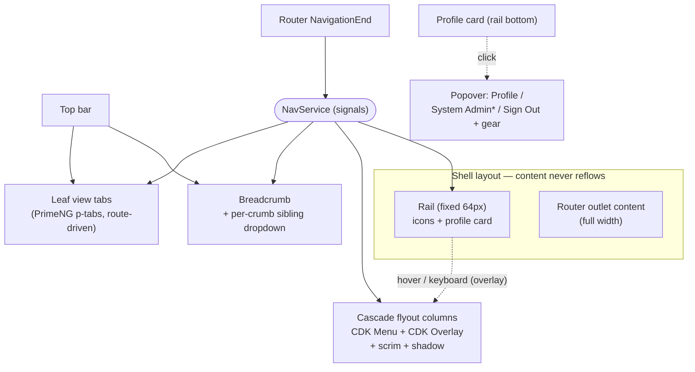
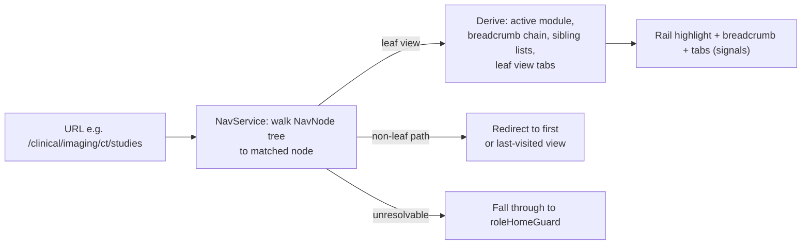
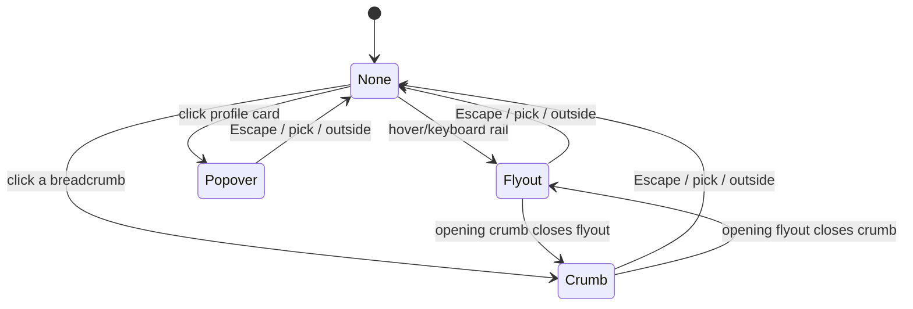

# feat: Sidebar Navigation Redesign — Hover-Expand Rail, Cascade Flyouts, Overlay Model

## Summary

Replace the web console's flat 244px push-grid rail with a 64px icon rail that expands on hover and cascades N-level flyout columns, all overlaying the content so it never reflows. A new signal-based `NavService` reconstructs the rail highlight, breadcrumb, and leaf-level view tabs from the URL, so deep-links and reloads land correctly. The profile card moves to the bottom of the rail with a popover (Profile / System Admin / Sign Out) and a Settings gear; admin leaves the rail and re-homes under a `/system-admin` area. The cascade is built custom on Angular CDK Menu + Overlay (PrimeNG's hover menus are broken), with a link+disclosure accessibility model, a hover-intent controller, and a touch fallback.

## Problem Frame

The current shell (`apps/frontend/web/src/app/layout/shell.ts`) is a fixed 244px grid track carrying a flat, two-section `NAV_ITEMS` list ("Workspace" / "Administration"). It cannot model nested modules, it reflows content when nav width changes, and it mixes admin destinations into the nav. The redesign keeps the visual identity (navy `#11304f`, accent-red `#ea2128` marker) but rebuilds the structure and behavior. The interaction model is well specified in the origin doc; the missing spine is the state model — deriving chrome from the URL, a hierarchical node contract, and role-driven filtering — none of which exist today (the shell has no `router.events` wiring and uses `routerLinkActive` over a flat list).

---

## High-Level Technical Design

Layout: the rail is a fixed 64px column; everything that expands (label strip, flyout columns, breadcrumb dropdown, profile popover) renders as a CDK Overlay *above* the content with a faint scrim — the content keeps full width. A single `NavService` owns nav state as signals; one `openSurface` signal enforces mutual exclusion across the flyout, breadcrumb dropdown, and popover.



State derivation on every navigation (and on cold load / deep-link):



Mutual exclusion is a single signal, not per-component flags:



These diagrams are directional — the prose and unit definitions are authoritative where they differ.

---

## Key Technical Decisions

- KTD1. Build the icon rail and N-level flyout cascade as custom components on `@angular/cdk/menu` + `@angular/cdk/overlay`. Do not use the PrimeNG menu family (`p-tieredmenu`/`p-megamenu`/`p-panelmenu`/`p-menubar`) for the nav tree: its hover-to-open (`autoDisplay`) regressed and is unfixed (primefaces/primeng#17341, Backlog). CDK Menu supplies accessible cascade structure, keyboard nav, and `cdkTargetMenuAim` (diagonal hover-intent); CDK Overlay supplies connected positioning, scrim, and no-reflow overlay placement.
- KTD2. Set a global `OVERLAY_DEFAULT_CONFIG` of `{ usePopover: false }` in `app.config.ts`. CDK 21 renders overlays in the browser top-layer by default, which paints *above* all PrimeNG overlays and ignores z-index (primefaces/primeng#19389). This token governs only `@angular/cdk/overlay` — the app has no CDK-overlay consumers today, so it does not change how existing PrimeNG overlays (dialogs, selects, toasts) render; it brings the new CDK flyouts into PrimeNG's shared z-index world rather than the top layer, so the scrim/shadow layering is predictable. Import `@angular/cdk/overlay-prebuilt.css` once.
- KTD3. Use link + disclosure semantics for the nav tree, not ARIA `menu`/`menubar`/`menuitem` roles: leaf items are `<a>`, expandable items are `<button aria-expanded aria-haspopup aria-controls>`. ARIA menu roles would strip link semantics and force the wrong keyboard contract. PrimeNG `p-tabs` keeps proper `tablist` widget roles for leaf view tabs — that is the correct place for widget roles.
- KTD4. Overlay, not push (origin Key Decision). The rail stays a fixed 64px track; the expanded label strip and all flyout columns are absolutely/fixed-positioned overlays. Rework `--sidebar-w` (`styles.css:78`) into `--rail-w` (64px) and `--rail-w-expanded`; drop the `grid-template-columns: var(--sidebar-w) 1fr` reflow.
- KTD5. A signal-based `NavService` is the single source of truth. It subscribes to `NavigationEnd`, resolves the URL to a `NavNode` path, and exposes computed signals for active module, breadcrumb chain, sibling lists, and leaf view tabs. A single `openSurface` signal (`'flyout' | 'crumb' | 'profile' | null`) drives mutual exclusion.
- KTD6. `NavNode` is a recursive discriminated node carrying `kind` (`module` | `group` | `view`), optional `route`, `icon`, and optional `roles?` / `audience?` for top-down filtering. A node whose children are all `kind: 'view'` renders top tabs (origin R8); any other branch renders a flyout column (origin R5/R6); only leaves carry a route. Tree filtering is presentation-only: every node carrying `roles`/`audience` MUST have its route protected by a matching `roleGuard` (with `data.roles`) — hiding a node never substitutes for guarding its route, or a deep-link bypasses the filter.
- KTD7. Implement a dedicated hover-intent controller (open delay ~100ms rail / ~300ms deep, close delay ~300–500ms, plus `cdkTargetMenuAim` safe-triangle) as its own tested unit. It no-ops on coarse pointers detected via `@media (hover: hover) and (pointer: fine)`; sequence capability detection before it so it cleanly disables on touch.
- KTD8. Re-home routes with back-compat redirects: `/profile` → `/settings` (personal Settings, identical for all users — no admin section), and `/admin/users` + `/admin/settings` → `/system-admin/*` under `adminGuard`. "Elevated admin mode" this round is simply being within `/system-admin/*`; a deeper console is deferred.
- KTD9. Persist last-visited view per module in-memory only (a `Map` on `NavService`), never to disk — this sidesteps the repo's PHI-cache guard (commit `0bb7a11`). Re-entering a module or switching a breadcrumb sibling restores its last view, falling back to the node's first view. The map resets on a full page reload (in-memory only), so a cold-load entry to a non-leaf path always uses the node's first view — this reload reset is intended behavior, not a regression.
- KTD10. Zoneless discipline: all hover/open/active state is signals written in template/host event handlers (which trigger change detection under `provideZonelessChangeDetection()`); no `ChangeDetectorRef`. Tests call `fixture.detectChanges()` manually after simulating hover/keyboard.

---

## Requirements

### Rail, expansion, and overlay

- R1. The rail renders a fixed 64px icon-only strip of top-level modules — no sub-modules, no "Workspace"/"Administration" group labels. (origin R1)
- R2. Hovering or keyboard-focusing the rail expands it to show labels; pointer-away or blur collapses it (hover-only, no pin). (origin R2)
- R3. The expanded rail and all flyout columns overlay the content; the content keeps its width and never reflows when the menu opens or closes. (origin R3)
- R4. The rail keeps the visual identity: navy `#11304f` background, accent-red `#ea2128` active marker, existing iconography. (origin R4)

### Navigation model and state

- R5. Hovering or activating a module opens a flyout column of its children; a child with its own children cascades a further column, to whatever depth the module nests. (origin R5)
- R6. Sub-modules at every level render in flyout columns, never as top-bar tabs. (origin R6)
- R7. The leaf level (views) of the landed sub-module renders as horizontal route-driven tabs in the top bar. (origin R7)
- R8. A module whose direct children are all views opens no flyout; activating it lands on its view tabs directly. (origin R8)
- R9. The top bar shows a breadcrumb of the current path; each crumb opens a dropdown to switch to a sibling at that level without opening the rail. (origin R9)
- R10. The breadcrumb dropdown and the flyout are mutually exclusive — at most one is open at any time. (origin R10)
- R11. Nav state (rail highlight, breadcrumb, view tabs) is reconstructed from the URL on cold load and after every navigation, including direct deep-links to a leaf view.

### Profile, settings, and admin re-homing

- R12. A fixed profile card sits at the rail bottom: collapsed shows the avatar/initials only; expanded shows name and role. (origin R11)
- R13. Clicking the card opens a popover with Profile, System Admin (admins only), and Sign Out; Sign Out moves here from the top bar. (origin R12)
- R14. System Admin opens the `/system-admin` area (the re-homed admin surfaces) and is the only place admin lives in the nav. (origin R13)
- R15. When the rail is expanded, a Settings gear sits on the right of the profile card and opens personal Settings, identical for every user including admins — no admin section. (origin R14, R15)
- R16. Existing routes stay reachable: `/profile` redirects to `/settings`, and `/admin/*` redirects to `/system-admin/*`, so bookmarks and the `returnUrl` round-trip keep working.

### Accessibility and responsiveness

- R17. The whole nav (rail, every flyout level, breadcrumb dropdowns, profile popover) is operable by keyboard alone; Escape closes the current surface and returns focus to its trigger.
- R18. Hover-revealed surfaces satisfy WCAG 2.2 SC 1.4.13 — dismissible (Escape without moving the pointer), hoverable (pointer can cross into the surface without it vanishing), and persistent (no auto-timeout while hovered/focused).
- R19. On coarse-pointer / `<880px`, the hover cascade degrades to tap-to-open within the existing off-canvas drawer; hover-intent timers are disabled.

---

## Output Structure

New and reworked files under `apps/frontend/web/src/app/`:

```text
layout/
  shell.ts                      # reworked: 64px rail, overlay layout, top bar host
  shell.spec.ts                 # rewritten
  nav/
    nav-node.ts                 # NavNode discriminated model + NAV_TREE data
    nav-node.spec.ts
    nav.service.ts              # signal state spine (active node, breadcrumb, tabs, last-visited)
    nav.service.spec.ts
    hover-intent.ts             # hover-intent controller (directive/service)
    hover-intent.spec.ts
    pointer-capability.ts       # hasHover signal helper (hover/pointer media)
    pointer-capability.spec.ts
    rail.ts                     # icon rail + expand-on-hover + profile card
    rail.spec.ts
    flyout.ts                   # CDK Menu + Overlay cascade columns
    flyout.spec.ts
    breadcrumb.ts               # breadcrumb + per-crumb sibling dropdown
    breadcrumb.spec.ts
    view-tabs.ts                # route-driven p-tabs for leaf views
    view-tabs.spec.ts
    profile-card.ts             # popover (Profile / System Admin / Sign Out) + gear
    profile-card.spec.ts
features/
  settings/                     # personal Settings (re-homed from /profile)
  system-admin/                 # parent area re-homing admin/users + admin/settings
```

The per-unit Files lists are authoritative; the implementer may adjust this layout.

---

## Implementation Units

### Phase A — Data and state foundation

### U1. NavNode hierarchy model and data-driven tree

- Goal: replace the flat `NavItem` with a recursive discriminated `NavNode` model and migrate the nav data to a tree; remove Users/Settings from the rail data.
- Requirements: R1, R5, R6, R8 (origin R5–R8).
- Dependencies: none.
- Files: `apps/frontend/web/src/app/layout/nav/nav-node.ts` (new model + `NAV_TREE`), `apps/frontend/web/src/app/layout/nav/nav-node.spec.ts`. Retire/replace `apps/frontend/web/src/app/layout/nav-items.ts`.
- Approach: `NavNode { id; label; icon?; route?; kind: 'module' | 'group' | 'view'; children?: NavNode[]; roles?: string[]; audience?: 'staff' | 'patient' }`. A pure helper classifies a node's child set (all-views → tabs vs. otherwise → flyout). Build `NAV_TREE` from the brainstorm's illustrative examples (Clinical › Imaging › CT › views; Billing › Invoices › views) — explicitly a placeholder tree pending the real IA. Carry forward `audience`/`adminOnly` semantics as `roles`/`audience`. Import enums from `@hsm/common/enums` only (never dto barrels).
- Patterns to follow: existing `nav-items.ts` data style; `RolesEnum` usage in `features/admin/users/users.ts`.
- Test scenarios:
  - A module whose children are all `kind:'view'` is classified as tab-bearing (origin R8). Covers AE2.
  - A module with mixed/sub-module children is classified as flyout-bearing.
  - An uneven tree (depth 2 in one branch, depth 4 in another) resolves child kinds correctly per branch.
  - Only `kind:'view'` leaves carry a `route`; non-leaf nodes have no route.
  - A node tagged with `roles` is retained/filtered correctly by a pure filter helper for an authorized vs unauthorized role set.
- Verification: the model compiles, `NAV_TREE` type-checks, and the classification/filter helpers return expected shapes for the example tree.

### U2. NavService — URL-derived signal state spine

- Goal: a single signal-based service that reconstructs nav state from the URL and owns mutual-exclusion + last-visited state.
- Requirements: R5, R7, R9, R10, R11.
- Dependencies: U1.
- Files: `apps/frontend/web/src/app/layout/nav/nav.service.ts`, `apps/frontend/web/src/app/layout/nav/nav.service.spec.ts`.
- Approach: subscribe to `Router` `NavigationEnd` (via `toSignal`/`takeUntilDestroyed`); resolve the current URL to a `NavNode` path by walking `NAV_TREE`. Expose computed signals: `activeModule`, `breadcrumbChain`, `siblingsOf(level)`, `leafTabs`, `roleFilteredTree` (filter by `auth.isAdmin`/`hasAnyRole` + `audience`). Hold `openSurface = signal<'flyout'|'crumb'|'profile'|null>(null)` and an in-memory `lastVisited = new Map<moduleId, route>()` (KTD9). Resolution rules (Open Questions Q1): a path resolving to a non-leaf redirects to its first or last-visited view; a valid but off-tree route (`/settings`, `/system-admin/*`) clears the active-module marker and breadcrumb and renders no leaf tabs without triggering any redirect; an unresolvable path falls through to `**`/`roleHomeGuard`.
- Patterns to follow: `auth.service.ts` computed-signal style; `hasAnyRole`/`isAdmin` for filtering.
- Execution note: start with a failing test for URL→node resolution (cold-load deep-link) before wiring the router subscription.
- Test scenarios:
  - Deep-link to a leaf view URL on cold load yields the correct `activeModule`, `breadcrumbChain`, and `leafTabs`. Covers AE6.
  - A URL resolving to a non-leaf module redirects to its first view (no last-visited yet).
  - With a recorded last-visited view, re-entering the module restores that view rather than the first.
  - An unresolvable/partial path produces no crash and signals fall-through (empty active path).
  - `roleFilteredTree` hides a branch whose every leaf is role-excluded for the current user; admin sees the admin-gated nodes.
  - Setting `openSurface` to one value is exclusive — reading it reflects only the last set surface (drives R10).
  - The top-level landing (`/workspace`) yields an empty breadcrumb and no leaf tabs without error.
  - Navigating to a valid off-tree route (`/settings`, `/system-admin`) clears the active-module marker and breadcrumb and does not trigger the `roleHomeGuard` fallback.
  - When `roleFilteredTree` is empty (a user with no visible modules), the derived state is a defined empty result (no active module, empty breadcrumb), not an error.
- Verification: navigating between routes in a `provideRouter` test updates the state signals; deep-link reconstruction matches expectations after manual `detectChanges()`.

### Phase B — Overlay infrastructure

### U3. App-level overlay config and capability detection

- Goal: make CDK and PrimeNG overlays share one stacking world and expose a pointer-capability signal.
- Requirements: R3, R19.
- Dependencies: none (can land in parallel with U1/U2).
- Files: `apps/frontend/web/src/app/app.config.ts` (providers), `apps/frontend/web/src/app/layout/nav/pointer-capability.ts` (small signal helper), `apps/frontend/web/src/styles.css` (import CDK overlay css; rework `--sidebar-w` → `--rail-w`/`--rail-w-expanded`), spec for the capability helper.
- Approach: provide `{ provide: OVERLAY_DEFAULT_CONFIG, useValue: { usePopover: false } }` (KTD2); import `@angular/cdk/overlay-prebuilt.css`. `pointer-capability` exposes `hasHover = signal(matchMedia('(hover: hover) and (pointer: fine)').matches)` updated on media-query change. PrimeNG already sits under a CSS layer, so unlayered rail rules win without `!important`.
- Patterns to follow: existing `app.config.ts` provider array; `test-setup.ts` already polyfills `matchMedia` for tests.
- Test scenarios:
  - `hasHover` reflects the `matchMedia` result and updates when the media query changes (using the test `matchMedia` polyfill).
  - Test expectation for the config provider: none — provider wiring, exercised indirectly by overlay-using units.
- Verification: overlays from CDK and PrimeNG render in the same stacking context (no PrimeNG overlay buried behind a CDK flyout) in a smoke check.

### U4. Hover-intent controller

- Goal: a reusable, tested controller giving open/close delays and a diagonal safe-path, no-op on touch.
- Requirements: R5, R18, R19.
- Dependencies: U3.
- Files: `apps/frontend/web/src/app/layout/nav/hover-intent.ts`, `apps/frontend/web/src/app/layout/nav/hover-intent.spec.ts`.
- Approach: a directive/service exposing `intentToOpen()`/`intentToClose()` backed by signals and timers (open ~100ms rail / ~300ms deep; close ~300–500ms, cleared on re-enter). Lean on CDK Menu's `cdkTargetMenuAim` for the safe-triangle where the cascade uses CDK Menu; the controller adds the rail-expand timing and the no-op gate. When `pointer-capability.hasHover` is false, all methods no-op (tap drives open instead). Timers run outside any zone — write results through signals so CD fires (KTD10).
- Patterns to follow: signal + `effect()` scheduling; `prefers-reduced-motion` is already honored in `shell.ts` CSS — snap without transition when set.
- Execution note: build test-first — timing/grace behavior is the whole value of the unit.
- Test scenarios:
  - Open intent followed by close intent within the close-delay window keeps the surface open (no flicker).
  - Pointer leaving then re-entering within the close delay cancels the close.
  - On `hasHover === false`, open/close intents no-op (surface only opens via explicit tap path).
  - Reduced-motion: transitions are skipped while open/close still toggle state.
  - Rapid module switching cancels the prior pending open before opening the new one.
- Verification: simulated pointer sequences (fake timers) produce the expected open/closed signal transitions.

### Phase C — Chrome components

### U5. Rail component — icon strip, hover-expand, profile-card host

- Goal: rebuild the rail as a 64px overlay-model strip with expand-on-hover labels, accent-red active marker, focus-triggered icon labels, and the profile card docked at the bottom.
- Requirements: R1, R2, R3, R4, R12, R17, R18.
- Dependencies: U2, U4.
- Files: `apps/frontend/web/src/app/layout/nav/rail.ts`, `rail.spec.ts`; `apps/frontend/web/src/app/layout/shell.ts` (host the rail; drop the push grid; preserve the version footer and `<880px` drawer shell), `shell.spec.ts` (rewrite).
- Approach: rail is a fixed `--rail-w` column; the expanded label strip is an overlay so content never reflows (KTD4, AE1). Link+disclosure semantics (KTD3): leaf modules are `<a>`, flyout-bearing modules are `<button aria-expanded aria-haspopup aria-controls>`. Each collapsed icon has an accessible name and a focus+hover label tooltip that Escape dismisses (R18). Active marker reuses the `.is-active::before` accent bar (`shell.ts:274`). Expand state is a signal driven by hover-intent and focus. When `roleFilteredTree` is empty (a user with no visible modules), the rail still renders the profile card plus a defined empty affordance rather than a bare strip. Preserve `VersionService` footer and the existing mobile drawer/scrim (adapted in U10).
- Patterns to follow: current `shell.ts` rail markup and `--accent` marker; `initials()`/`displayName()` computeds (reuse for the profile card).
- Test scenarios:
  - Hover/focus expands the rail (label strip visible) after manual `detectChanges()`; blur/pointer-away collapses it.
  - Expanding the rail does not change the content column width (overlay, not push). Covers AE1.
  - A flyout-bearing module renders a `<button>` with `aria-expanded` toggling true/false; a leaf module renders an `<a>`.
  - Each collapsed icon exposes an accessible name; tabbing to it reveals its label; Escape dismisses the label without moving focus. Covers R18.
  - The active module shows the accent-red marker for the current route.
  - The version footer still renders `UI vX · API vY`.
  - With an empty `roleFilteredTree`, the rail renders the profile card and a defined empty state (no bare 64px strip).
- Verification: the rail renders at 64px, expands as an overlay, and the rewritten `shell.spec.ts` passes.

### U6. Cascade flyout columns

- Goal: N-level flyout columns on CDK Menu + Overlay that overlay content with scrim+shadow, with keyboard nav, Escape-to-close, and mutual exclusion.
- Requirements: R3, R5, R6, R10, R17, R18.
- Dependencies: U2, U4, U5.
- Files: `apps/frontend/web/src/app/layout/nav/flyout.ts`, `flyout.spec.ts`.
- Approach: each flyout column is a CDK Overlay positioned `flexibleConnectedTo` its trigger (`originX:'end' → overlayX:'start'`, fallback position for viewport edges, `reposition()` scroll strategy) with a `panelClass` shadow and a backdrop scrim that does not block content interaction (non-modal — no focus trap, no `inert`). Cascade structure uses CDK Menu (`cdkMenuTriggerFor`, `cdkTargetMenuAim`) for accessible roles and keyboard traversal; render leaf-vs-submodule per U1 classification. Opening sets `openSurface = 'flyout'` (closes breadcrumb/popover). Escape closes the current column and returns focus to its trigger; ArrowLeft closes a child column. On leaf activation the cascade marks the chosen item selected-pending and holds until `NavigationEnd` (or surfaces the route-loading affordance) so the lazy-chunk load is not silent. Each cascaded column carries a programmatic accessible name tied to its parent item so a screen-reader user perceives which level cascaded (link+disclosure gives no automatic level announcement).
- Patterns to follow: CDK Menu cascade (`cdkMenu`/`cdkMenuItem`/`cdkMenuTriggerFor`); `--shadow-lg` token for the overlay shadow.
- Test scenarios:
  - Activating a module opens its flyout column with the module's children (origin R5/R6).
  - A child with its own children cascades a second column; a leaf navigates and closes the cascade.
  - The content column does not reflow while columns are open (overlay). Covers AE1.
  - Opening the flyout closes an open breadcrumb dropdown (and vice-versa). Covers AE3.
  - Escape closes the focused column and restores focus to its triggering item. Covers R17.
  - Keyboard: Enter/ArrowRight opens a column, ArrowLeft/Escape closes it; Tab moves through links without being trapped.
  - A diagonal pointer move from a parent item toward its child column does not close the cascade (hover-intent / aim).
  - Activating a leaf keeps the item visibly selected-pending until navigation resolves (no silent gap during lazy-chunk load).
  - A cascaded column exposes a programmatic name referencing its parent item (screen-reader orientation across depth).
- Verification: cascade opens/closes via pointer and keyboard; overlay never reflows content; mutual exclusion holds.

### U7. Top bar — breadcrumb with sibling dropdowns and route-driven view tabs

- Goal: a breadcrumb whose crumbs open sibling-switch dropdowns, plus leaf view tabs, both wired to `NavService` and mutually exclusive with the flyout.
- Requirements: R7, R9, R10, R17.
- Dependencies: U2, U3.
- Files: `apps/frontend/web/src/app/layout/nav/breadcrumb.ts`, `breadcrumb.spec.ts`, `apps/frontend/web/src/app/layout/nav/view-tabs.ts`, `view-tabs.spec.ts`; host both in `shell.ts` top bar.
- Approach: breadcrumb is custom markup in a `nav` landmark (`aria-label`), current crumb `aria-current="page"`, separators `aria-hidden`. Each crumb is an `aria-haspopup` menu-button toggling a shared `p-popover` (or `p-menu`) listing that level's siblings from `navService.siblingsOf(level)`; selecting navigates and (per KTD9) restores that sibling's last-visited view. Opening a crumb sets `openSurface='crumb'` (closes the flyout, R10/AE3). View tabs use PrimeNG `p-tabs` in the routing pattern (`p-tab [routerLink]`, no `p-tabpanels`); `[value]` is a `computed()` off the active route (guard against primefaces/primeng#18426 — verify the active tab tracks navigation). A single-view module renders no tab strip (Open Questions Q-singleview default).
- Patterns to follow: `features/admin/settings/settings.ts` shows the panel-based `p-tabs` API (`Tabs/TabList/Tab/TabPanels/TabPanel` with an `onTabChange` handler) — general usage only. The route-driven tab pattern here (`p-tab [routerLink]` + route-derived `computed()` `[value]`, no `p-tabpanels`) is new to this app and not yet proven in-repo; treat it as greenfield and rely on the #18426 regression-guard test below. `p-popover` for the per-crumb dropdown.
- Test scenarios:
  - The breadcrumb reflects the active path; the last crumb carries `aria-current="page"`.
  - Clicking a crumb opens its sibling dropdown; picking a sibling navigates to that sibling's view.
  - Opening a crumb dropdown closes an open flyout (mutual exclusion). Covers AE3.
  - Leaf views render as tabs; the active route's tab is marked active, and it updates after navigation (regression guard for #18426). Covers AE5.
  - Sub-modules never render as tabs — only leaf views do. Covers AE5 / origin R6.
  - A single-view module renders no tab strip.
  - Escape closes an open crumb dropdown and returns focus to the crumb.
- Verification: breadcrumb + tabs track the URL; sibling switching works; mutual exclusion with the flyout holds.

### U8. Profile card and popover

- Goal: the bottom profile card with a popover (Profile / System Admin* / Sign Out) and a Settings gear, gated by role and driven by a derived role label.
- Requirements: R12, R13, R14, R15, R17.
- Dependencies: U2, U5.
- Files: `apps/frontend/web/src/app/layout/nav/profile-card.ts`, `profile-card.spec.ts`; remove the Sign Out / system-admin controls from the `shell.ts` top bar.
- Approach: collapsed card shows initials (reuse `initials()`); expanded shows `displayName()` and a derived role label. Role label = a priority-ordered "primary role" from a role→label/priority map (Open Questions Q-rolelabel; the concrete map is a data deliverable, the mechanism ships here); avatar is initials only this round (no image field on `UserProfile`). The card click toggles a `p-popover` (`role=dialog`, focus trap, Escape, outside-click) holding Profile, System Admin (rendered only when `auth.isAdmin()`), and Sign Out (moved from the top bar). The gear shows when the rail is expanded and routes to `/settings`. Opening the popover sets `openSurface='profile'`.
- Patterns to follow: `p-popover`; existing `*ifAdmin`/`hasRole` structural directives; `auth.logout()` wiring currently in `shell.ts`.
- Test scenarios:
  - A non-admin sees no System Admin item; Settings (gear) shows no admin section. Covers AE4.
  - An admin sees System Admin (routing to `/system-admin`); Settings still shows no admin section. Covers AE4.
  - Sign Out triggers logout and no longer appears in the top bar.
  - The role label resolves to the highest-priority role for a multi-role user via the map.
  - The gear appears only when the rail is expanded and routes to `/settings`.
  - Escape closes the popover and returns focus to the card.
- Verification: popover gating and routing are correct for admin vs non-admin; logout moved off the top bar.

### Phase D — Routing and re-homing

### U9. Route re-homing, redirects, and the System Admin area

- Goal: move `/profile` → `/settings` (personal Settings) and `/admin/*` → `/system-admin/*`, with redirects so existing links keep working.
- Requirements: R14, R15, R16.
- Dependencies: U8.
- Files: `apps/frontend/web/src/app/app.routes.ts`; new `apps/frontend/web/src/app/features/settings/` (personal Settings shell, repurposing the self-service `/profile` content) and `apps/frontend/web/src/app/features/system-admin/` (parent wrapper lazy-loading the existing `admin/users` + `admin/settings`).
- Approach: add `/settings` (personal, no guard beyond `authGuard`) and redirect `/profile → /settings`. Add `/system-admin` parent under `adminGuard` (`data: { roles: [Admin] }`), move the existing admin children beneath it keeping `adminGuard` on each child as defense-in-depth (the current routes guard per-child; a parent-only guard would leave a child reachable if it is ever registered as a sibling), and redirect `/admin → /system-admin`, `/admin/users → /system-admin/users`, `/admin/settings → /system-admin/settings`. Re-homing is additive to the lazy-child pattern — guards are unchanged in behavior. Confirm `roleHomeGuard`'s staff landing (`/workspace`) still maps to a tree module; if the tree renames it, update the guard.
- Patterns to follow: existing `app.routes.ts` lazy `loadComponent` children + `adminGuard` wiring; the existing `admin` → `redirectTo: 'users'` pattern.
- Test scenarios:
  - `/profile` redirects to `/settings`; `/settings` loads for any authenticated user.
  - `/admin/users` and `/admin/settings` redirect to their `/system-admin/*` equivalents.
  - Each re-homed child path (`/system-admin/users`, `/system-admin/settings`) is independently blocked for a non-admin and allowed for an admin — not only the parent — so a nesting/guard-placement regression fails the build.
  - A `returnUrl` round-trip to an old path lands on the re-homed path after login.
  - `roleHomeGuard` still lands staff on a valid module route.
- Verification: old bookmarks resolve via redirects; admin guard still gates the admin surfaces.

### Phase E — Responsive degradation

### U10. Touch and small-screen degradation

- Goal: degrade the hover cascade to tap-to-open inside the existing `<880px` drawer; disable hover-intent on touch.
- Requirements: R3, R19.
- Dependencies: U5, U6, U7.
- Files: `apps/frontend/web/src/app/layout/shell.ts` (drawer + breakpoint), `apps/frontend/web/src/app/layout/nav/rail.ts` / `flyout.ts` (tap path), relevant specs.
- Approach: keep the existing off-canvas drawer + scrim (`shell.ts:376–401`) as the small-screen surface, routed by `pointer-capability.hasHover === false` and/or the `<880px` breakpoint. Render the tree inside it as a tap-to-expand accordion (no hover-intent); leaf views remain tabs; the profile card sits at the drawer bottom. The hover-intent controller already no-ops on coarse pointers (U4). Accordion rows, leaf links, and the drawer profile card use a minimum 44×44px touch target.
- Patterns to follow: current `navOpen` signal, `toggleNav()`/`closeNav()`, `.scrim` backdrop, `prefers-reduced-motion` handling in `shell.ts`.
- Test scenarios:
  - With `hasHover === false`, a tap on an expandable module opens its level (no hover dependency); a tap on a leaf navigates.
  - The drawer opens/closes via the existing toggle and scrim.
  - Hover-intent timers do not fire on the coarse-pointer path.
  - The profile card and view tabs render inside the drawer layout.
- Verification: on a simulated touch/narrow viewport the nav is fully operable by tap with ≥44×44px targets; the drawer behavior is preserved.

---

## Scope Boundaries

### In scope

The full navigation mechanism: `NavNode` model, `NavService` state spine, the custom rail + cascade flyout, breadcrumb + view tabs, profile card + popover, personal Settings + System Admin re-homing with redirects, accessibility (link+disclosure, keyboard, WCAG 1.4.13), and touch degradation — plus the test rewrites these force.

### Deferred to follow-up work

- A dedicated System Admin **console** redesign and a richer "elevated admin mode" beyond being within `/system-admin/*`.
- An optional pin/persist toggle for the rail (hover-only ships first).
- Persisting last-visited view to disk (in-memory only this round).
- Avatar images on the profile card (initials only — `UserProfile` has no avatar field).

### Data deliverables (inputs, not invented here)

- The concrete module tree (which modules nest, to what depth, and their views).
- The role→node visibility matrix and the role→display-label/priority map (40+ roles across 12 families exist; the mechanism is built role-agnostic and consumes these). Wiring the matrix MUST attach a `roleGuard` to each role-gated node's route, not only filter the tree — node visibility is UX, the route guard is the authorization control.

### Out of scope

- Redesigning individual feature/module pages — only the navigation chrome changes.
- Any restyle: the five-color palette, navy rail, accent marker, PrimeNG Aura + HSM preset, and light-only scheme are unchanged.

---

## Open Questions

These have safe defaults recorded; resolve during implementation unless they shift.

- Q1. Deep-link resolution for a non-leaf path. Default: redirect to the node's first (or last-visited) view; unresolvable paths fall through to `**`/`roleHomeGuard` (U2).
- Q2. Profile "role" label for multi-role users. Default: highest-priority role from a role→label/priority map (the map is a data deliverable; mechanism in U8).
- Q3. Hover-intent exact timings. Default: ~100ms open (rail) / ~300ms open (deep), ~300–500ms close, plus `cdkTargetMenuAim` safe-triangle (U4) — tune from QA.
- Q4. Last-visited persistence location. Default: in-memory `Map` on `NavService`, not disk (KTD9, PHI-cache safe).
- Q5. Staff landing route. Default: `roleHomeGuard` keeps landing on the workspace module; revisit only if the real tree renames it (U9).

---

## System-Wide Impact

- Routing: new `/settings` and `/system-admin/*` routes plus redirects from `/profile` and `/admin/*`; `adminGuard`/`authGuard` behavior unchanged, the `returnUrl` round-trip must resolve through the redirects (U9).
- Change detection: introduces several event-driven overlays under zoneless — all state must be signal-driven (KTD10); a regression here shows as overlays that don't update.
- Overlay stacking: the global `usePopover:false` (KTD2) governs only CDK overlays (none exist today), so it does not alter existing PrimeNG overlay rendering; it brings the new CDK flyouts into PrimeNG's z-index world, and any future CDK/PrimeNG overlay inherits this shared-stacking assumption.
- PHI posture: last-visited paths stay in memory (KTD9) to respect the existing PHI-cache guard.
- Tests: `shell.spec.ts` and any nav-link/footer/logout assertions are rewritten; new specs accompany each nav unit.

---

## Risks & Dependencies

- PrimeNG hover-cascade is broken/unfixed (primefaces/primeng#17341) — mitigated by building custom on CDK (KTD1). CDK Menu opens a top-level trigger on click, not first-hover, so U4 bolts hover-open onto it; add a go/no-go spike after U4 validating first-hover-open and diagonal traversal across ≥2 columns before building U5/U6. If the ergonomics fail, the fallback is a custom overlay cascade owning roles/keyboard manually — a high-reversal-cost path, so close this before the chrome units.
- CDK 21 top-layer vs PrimeNG overlays (primefaces/primeng#19389) — mitigated by `usePopover:false` (KTD2); decide and apply before building any overlay (U3 first).
- `p-tabs` programmatic `[value]` may not switch the active tab (primefaces/primeng#18426) — and a route-derived `computed()` bound to `[value]` is itself that programmatic path, so the mitigation may not work. Spike the route-driven pattern against the pinned 21.1.9 in U7 before committing; record a fallback (`ViewChild().value.set()` in an `effect`, or `routerLinkActive`-driven tab state) if `[value]` binding does not track navigation.
- Zoneless + third-party overlays: state writes must go through signals/event handlers; the only place for `afterNextRender` is post-render measurement, not open/close state (KTD10).
- The concrete module tree and role matrices are external data dependencies; the plan builds against illustrative examples and must not hard-code a specific tree.
- Deep module routes do not exist yet (routes are flat today); U9 only re-homes `/profile` and `/admin/*`. R11 and AE6 (deep-link reconstruction) are validated against the illustrative `NAV_TREE` plus matching test-only routes; satisfying them in production depends on the real deep routes landing as part of the module-tree data deliverable.
- Path correction: the auth service is at `apps/frontend/web/src/app/core/auth/auth.service.ts` (the origin doc cites `src/core/...`).

---

## Acceptance Examples

- AE1. Given a module page with content, when the rail expands and the flyout cascades two columns, then the top bar, view tabs, and content cards stay at the same width and position; closing the menu reveals identical, unshifted content. (origin AE1; R3, U5/U6)
- AE2. Given a module with no sub-modules (only views), when the user activates it, then no flyout column appears and the user lands directly on the module's view tabs. (origin AE2; R8, U1/U6)
- AE3. Given a flyout is open, when the user opens a breadcrumb dropdown, then the flyout closes first — the two are never visible simultaneously. (origin AE3; R10, U6/U7)
- AE4. Given a non-admin, then the profile popover shows no System Admin item and Settings shows only personal settings; given an admin, then the popover shows System Admin (opening `/system-admin`) and Settings still shows no admin section. (origin AE4; R13–R15, U8)
- AE5. Given the user is in `Billing › Invoices`, then Invoices/Payments/Claims appear as flyout sub-modules and Invoices' views (Open/Paid/Overdue/Drafts) appear as top tabs — sub-modules never render as tabs. (origin AE5; R6/R7, U7)
- AE6. Given the user opens a deep-link directly to a leaf-view URL (cold load), then the rail highlights the correct module, the breadcrumb shows the full path, and the correct view tab is active — with no prior hover interaction. (R11, U2)

---

## Sources & Research

- Origin requirements: `docs/brainstorms/2026-06-25-sidebar-redesign-requirements.md`.
- Current shell/layout: `apps/frontend/web/src/app/layout/shell.ts` (244px push grid `:156`, accent marker `:274`, mobile drawer `:376–401`, version footer); flat model `apps/frontend/web/src/app/layout/nav-items.ts`; routes/guards `apps/frontend/web/src/app/app.routes.ts`; roles `apps/frontend/web/src/app/core/auth/auth.service.ts`; admin surfaces `apps/frontend/web/src/app/features/admin/settings/settings.ts` and `.../admin/users/users.ts`.
- Theme/brand to preserve: `apps/frontend/web/src/styles.css` (`--sidebar-w:78`, `--shadow-lg`), `apps/frontend/web/src/theme/hsm-preset.ts`, `apps/frontend/brand-color-style-guide.md`.
- Stack: PrimeNG 21.1.9 + `@primeng/themes` 21.0.4, `@angular/cdk` 21.2, Angular 21 zoneless/signals (`apps/frontend/web/package.json`, `apps/frontend/web/CLAUDE.md`); Vitest + `provideZonelessChangeDetection()` in tests (`src/test-setup.ts` matchMedia polyfill).
- Framework guidance: Angular CDK Menu (`cdkTargetMenuAim`) + Overlay (`FlexibleConnectedPositionStrategy`); `OVERLAY_DEFAULT_CONFIG { usePopover: false }`; primefaces/primeng#17341 (hover menu), #19389 (top-layer stacking), #18426 (`p-tabs` value). PrimeNG `p-popover`/`p-tabs`/`p-breadcrumb` docs.
- Accessibility: W3C WAI-ARIA APG disclosure + breadcrumb patterns; WCAG 2.2 SC 1.4.13 (content on hover or focus); Adrian Roselli "don't use ARIA menu roles for site nav"; NN/g + Baymard hover-intent (300–500ms) and safe-triangle.
- No prior frontend learnings exist in `docs/solutions/` — this redesign is a candidate for capture afterward (zoneless + CDK/PrimeNG overlay gotchas, role-gated nav).
