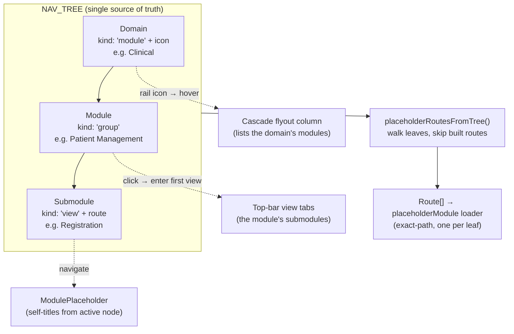

# feat: Wire the committed module taxonomy into the navigation (UI-frame scaffold)

## Summary

Replace the placeholder `NAV_TREE` (8 illustrative modules) with the **committed
6-domain / ~30-module taxonomy** from the module-taxonomy brainstorm, scaffolded at
**full submodule depth**: the rail becomes the six domains, each cascades to its
modules, and every submodule lands on a shared placeholder screen. Placeholder
routes are **generated from the nav tree itself** so the tree stays the single
source of truth and ~150 leaves don't have to be hand-listed. The already-built
modules (Documents, Templates, Workspace, System Admin) keep their real screens.
This is Goal #1 of the platform effort — a clickable frame of the whole product —
and flips the **UI Frame** column of the build tracker to ✅ across the board.

This is a presentation/IA change only: no backend, no new feature screens, no role
model. Every not-yet-built leaf resolves to the existing self-titling
`ModulePlaceholder`.

---

## Problem Frame

The navigation chrome — rail, cascade flyouts, breadcrumb, leaf view-tabs, and the
signal-based `NavService` — is already built and fully data-driven
(`apps/frontend/web/src/app/layout/nav/`). It renders whatever `NAV_TREE`
(`apps/frontend/web/src/app/layout/nav/nav-node.ts`) describes, to arbitrary depth.
But `NAV_TREE` today is eight placeholder modules (Workspace, Clinical, Scheduling,
Billing, Pharmacy, Laboratory, Templates, Documents) explicitly flagged in-file as
"a sensible placeholder IA, not a committed one."

The brainstorm now commits the real IA: six domains (Clinical; Diagnostics &
Therapeutics; Business/ERP; Governance & Support; Patient Portal; Platform) holding
~30 modules, organized ERPNext-style as a suite of toggleable domain apps, with the
built modules absorbed as Platform shared services and roles deferred to a future
data-driven registry. Wiring that taxonomy into `NAV_TREE` turns the app into a
navigable frame of everything to be built — every module has a home before its
functionality exists — and gives every later build wave a place to slot into.

Because the chrome is already generic, this is almost entirely a **data** change
(`NAV_TREE`) plus a **route-generation** seam so the ~150 placeholder leaves are
reachable without hand-authoring each route.

---

## Requirements

Traceable to the origin taxonomy
(`docs/brainstorms/2026-06-25-hospital-platform-module-taxonomy-requirements.md`):

- **PR1.** `NAV_TREE` expresses the committed taxonomy: six domains as top-level
  rail modules, their ~30 modules below, and every submodule listed in the origin
  doc as a leaf view. (origin: Module Tree + R6–R36 — the module/submodule
  requirements; R1–R5/R37 are architectural decisions, already reflected in this
  plan's KTDs, not new tree structure.)
- **PR2.** The rail's top level is the **domains**, not the modules — keeps the 64px
  icon rail usable. Modules render as flyout columns; submodules as leaves.
  (origin: "ERPNext suite-of-apps" decision)
- **PR3.** Every leaf in `NAV_TREE` is **reachable** — navigating to its route renders
  a screen (the shared `ModulePlaceholder`) titled from the active node.
- **PR4.** The **built / special** routes keep their real screens and are excluded
  from placeholder generation: Workspace, Documents, Templates, the patient stub
  (`/patient`), personal `/settings` and `/profile` (and System Admin in its own
  console). These are exactly the `BUILT_MODULE_ROUTES` skip-set (U1). They are not
  replaced by placeholders. (origin: R33/R34 "built today; absorbed as shared
  services")
- **PR5.** Patients see only the **Patient Portal**; staff see the five staff domains
  plus Workspace. Existing audience filtering is reused unchanged.
  (origin: Actor A10; one-front-door model)
- **PR6.** No per-module **role** gates are introduced — roles remain greenfield until
  the data-driven registry exists. (origin: R2; "roles are greenfield")
- **PR7.** The build tracker's **UI Frame** column reflects the new state.

---

## Key Technical Decisions

- **KTD1 — Rail = the six domains, audience-gated, + Workspace.** A 30-icon rail
  is unusable; the domains are the natural top level and match the suite-of-apps
  axis. Of the six domains, **five are staff-visible** (Clinical, Diagnostics &
  Therapeutics, Business/ERP, Governance & Support, Platform) and **Patient Portal is
  the sixth, patient-only**. So a **staff** rail shows Workspace + the five staff
  domains (six entries); a **patient** rail shows only Patient Portal (one entry).
  Workspace is a standalone "home" rail entry (a dashboard, not one of the six
  domains).
- **KTD2 — Full-tree depth (user-selected).** Every submodule in the origin doc
  becomes a `view` leaf with its own route and placeholder. ~130–150 leaves. This is
  the richest frame; the cost (volume of nav data) is absorbed by KTD3.
- **KTD3 — Generate placeholder routes from `NAV_TREE`.** A pure helper walks the
  tree, collects every leaf/destination route, skips the built-module routes, and
  returns one exact-path `Route` → shared `placeholderModule` loader per leaf. The
  tree stays the single source of truth; adding a module later is a tree edit only,
  with its route appearing automatically. Chosen over (a) ~150 hand-written route
  entries (drift-prone, noisy) and (b) per-domain `**` wildcards (would swallow 404s
  and shadow built routes). Exact-path generation matches before the existing
  `** → ''` catch-all, so unknown URLs still redirect home.
- **KTD4 — Built modules absorbed, not rebuilt.** Documents and Templates re-home
  into the **Platform** domain flyout but keep their existing lazy routes
  (`/documents`, `/templates`); they are excluded from placeholder generation.
  System Administration stays in `ADMIN_NAV_TREE` (reached from the profile popover),
  unchanged — it is not added to the rail.
- **KTD5 — No role gates yet.** Every node is `audience: 'staff'` except Patient
  Portal (`audience: 'patient'`). Adding `roles` to a node would also obligate a
  matching `roleGuard` on its route (per the `NavNode` contract) — out of scope until
  the roles registry lands. Audience filtering alone gives the patient/staff split.
- **KTD6 — Kind mapping + sibling-homogeneity rule.** domain → `module` (carries an
  icon); module → `group`; submodule → `view` (carries a route). A module-`group`
  whose children are all views renders those submodules as **top-bar tabs** and enters
  the first one on click — the existing, already-tested `Clinical › Imaging › CT ›
  {views}` pattern. **Homogeneity rule (chrome constraint):** the chrome's tabs-vs-
  flyout split is binary on sibling kind, so a node's children must be **all `view`
  (→ tabs) or all `group` (→ flyout) — never mixed**, or the lone `view` siblings
  render as routeless, unclickable flyout rows. For the two naturally two-level modules
  the origin implies (ADT — OPD/IPD/ED; Imaging — by modality), the **scaffold default
  is to flatten every submodule to a flat `view` list (tabs)**; only introduce a nested
  `group` column when *every* sibling at that level is also a group. A module with a
  **single** submodule renders **no** tab strip (`leafTabs` suppresses a one-tab bar)
  and lands directly on that submodule's placeholder — expected, not a bug.
- **KTD7 — URL scheme.** Generated leaves are domain-prefixed and slugged:
  `/<domain>/<module>/<submodule>` (e.g. `/clinical/patient-management/registration`).
  Built modules keep their existing non-prefixed routes (`/documents`, `/templates`,
  `/workspace`) to avoid breaking bookmarks and the redesign's routing.
- **KTD8 — Patient Portal is a group-wrapped domain whose home resolves.** Patient
  Portal (`module`, `audience: 'patient'`) wraps its submodules in a single `group`
  (e.g. "My Health") so the rail icon opens a **flyout** like every other domain
  (without the wrapper its all-`view` children would render tabs directly on rail
  click — inconsistent). Its **first leaf carries the exact route `/patient`** (the
  existing patient stub), so a patient landing on the role-resolved home `/patient`
  resolves to a real nav chain (rail highlight + breadcrumb), mirroring how Workspace
  resolves for staff; the remaining portal leaves are `/patient/` placeholders.
- **KTD9 — Overflow is bounded, no chrome change.** Flyout columns (Clinical has 9
  modules, Business/ERP 8) cap at viewport height with `overflow-y: auto`; submodule
  tab strips (Laboratory ~7, Billing, HR) accept horizontal scroll for the scaffold.
  No sub-grouping of module rows and no chrome-component changes this pass; if a module
  exceeds ~6 submodules and reads poorly as tabs, prefer a nested `group` (honoring the
  KTD6 homogeneity rule) over an overflowing strip.

---

## High-Level Technical Design

How each taxonomy level maps to a `NavKind` and how the chrome renders it, and how
routes are derived from the same tree:

Rail composition (top to bottom): **Workspace** · **Clinical** · **Diagnostics &
Therapeutics** · **Business / ERP** · **Governance & Support** · **Platform**
(staff); **Patient Portal** (patient). System Admin is reached from the profile
card, not the rail.

*Directional guidance — the per-unit detail below is authoritative for what each
unit creates.*

---

## Implementation Units

### U1. Placeholder route generator

**Goal:** A pure helper that turns a `NavNode[]` tree into the `Route[]` of
placeholder destinations, so `app.routes.ts` never hand-lists leaves.

**Requirements:** PR3, KTD3.

**Dependencies:** none (operates on any `NavNode[]`; can be built and tested against
a fixture before `NAV_TREE` is rewritten).

**Files:**
- `apps/frontend/web/src/app/layout/nav/nav-routes.ts` (new)
- `apps/frontend/web/src/app/layout/nav/nav-routes.spec.ts` (new)

**Approach:** Export `placeholderRoutesFromTree(tree, placeholderLoader, opts?)`
that depth-first walks the tree, collects the `route` of every `view` leaf **and every
childless `module`/`view` destination**, drops any route in a `BUILT_MODULE_ROUTES`
skip-set (exported constant: `/workspace`, `/documents`, `/templates`, `/patient`,
`/settings`, `/profile`), normalizes the leading slash to a child-route `path`
(strip the leading `/`), and returns `{ path, loadComponent: placeholderLoader }`
entries. De-duplicate by path. **Normalize both sides of the skip comparison** (apply
`normalizeUrl` to the node route *and* each skip-set entry) so a leaf carrying a built
route is reliably excluded regardless of trailing-slash/format drift — in a well-formed
tree every routable taxonomy leaf is a `view`, so the childless-`module` branch exists
only to *skip* built nodes (Documents/Templates/Workspace), never to emit. Keep the
helper free of Angular DI — it takes the loader fn as an argument so it stays
unit-testable.

**Patterns to follow:** route-matching/normalization helpers already in
`nav-node.ts` (`resolveRoutePath`, `normalizeUrl`); reuse their slug/normalization
conventions rather than re-deriving.

**Test scenarios:**
- A deep `view` leaf (`/a/b/c`) produces a route `{ path: 'a/b/c' }`.
- Nested `group` levels are traversed to their leaves (no leaf missed).
- A `view` leaf whose route is in `BUILT_MODULE_ROUTES` is excluded.
- A **childless `module`** node whose route is in the skip-set (e.g. `/documents`,
  `/workspace`) yields **no** generated route (the built lazy route owns it).
- The skip comparison holds under format drift (a `/documents/` vs `/documents`).
- Two leaves with the same route yield one route (dedupe).
- A `group`/`module` node with no `route` produces no route for itself.
- **Collision guard:** no generated `path` duplicates any explicit built route — a
  spec asserts `BUILT_MODULE_ROUTES` covers every non-placeholder route in
  `app.routes.ts`, so a future built route added without a skip-set entry fails CI
  rather than silently shadowing the real component at runtime.

**Verification:** Helper unit-tested green against a small uneven fixture; returns
exact-path routes pointing at the supplied loader, with built routes provably absent.

### U2. Commit the taxonomy into `NAV_TREE`

**Goal:** Replace the placeholder `NAV_TREE` with the committed six-domain taxonomy
at full submodule depth.

**Requirements:** PR1, PR2, PR4, PR5, PR6, KTD1, KTD4, KTD5, KTD6, KTD7, KTD8, KTD9.

**Dependencies:** U1 (so the rewritten tree is route-covered in U3; U2 itself only
needs the `NavNode` model, which exists).

**Files:**
- `apps/frontend/web/src/app/layout/nav/nav-node.ts` (rewrite `NAV_TREE` + the
  top-of-export doc comment; `ADMIN_NAV_TREE` unchanged)
- `apps/frontend/web/src/app/layout/nav/nav-node.spec.ts` (rewrite the
  `NAV_TREE (live placeholder modules)` describe block; the generic `TREE`-fixture
  blocks are untouched)

**Approach:** Author the tree from the origin doc's Module Tree + R6–R36 submodule
lists. Each **domain** = `{ kind: 'module', icon, audience }` with `group` children;
each **module** = `{ kind: 'group' }`; each **submodule** = `{ kind: 'view', route }`
using the `/<domain>/<module>/<submodule>` slug scheme (KTD7). Domain rail order and
icons per the HTD (suggested PrimeIcons: Workspace `pi-th-large`, Clinical
`pi-heart`, Diagnostics `pi-image`, Business `pi-briefcase`, Governance `pi-shield`,
Platform `pi-cog`, Patient Portal `pi-user` — implementer may refine). Place
Documents and Templates as leaves under **Platform** carrying their real routes
(`/documents`, `/templates`); add **Scheduling** as a placeholder leaf under Platform
this pass (`/platform/scheduling`, not yet built). Keep Workspace as a standalone
top-level module entry.

**Sibling homogeneity (KTD6):** every module's children are all-`view` or all-`group`,
never mixed. The two naturally two-level modules (ADT — OPD/IPD/ED; Imaging — by
modality) are authored **flat** (all submodules as `view` leaves → tabs) for the
scaffold; revisit nesting per-module later.

**Patient Portal (KTD8):** a top-level `module`, `audience: 'patient'`, whose six
submodules are wrapped in a single `group` (e.g. "My Health") so the domain renders a
**flyout** (not tabs on rail-click). Its **first leaf carries route `/patient`** (the
existing patient stub, in the skip-set so it isn't double-routed) so the patient home
resolves to a nav chain; the rest are `/patient/` placeholders.

No `roles` on any node (KTD5) — if `NavNode` doesn't already make `roles` structurally
require a paired guard, the "no `roles`" spec below is the compensating runtime check.

**Patterns to follow:** the existing `NAV_TREE`/`ADMIN_NAV_TREE` literals in
`nav-node.ts` (shape, `as const`, icon usage); the cascade depth already exercised by
the `Clinical › Imaging › CT` example.

**Test scenarios:**
- Top-level staff ids equal the committed staff rail set (Workspace + the five staff
  domains) in order; the patient rail is Patient Portal only.
- A sample deep cascade resolves root-first via `resolveRoutePath`
  (e.g. `/clinical/patient-management/registration` →
  `['clinical','patient-management','registration']`).
- `rendersAsFlyout` is true for a domain with module children; `rendersAsTabs` is
  true for a module whose children are all views.
- `filterTree` for a patient yields only Patient Portal; for staff, the six staff
  rail entries (Workspace + five staff domains) and not Patient Portal.
- Patient Portal renders as a **flyout** (`rendersAsFlyout` true — it has a `group`
  child), not tabs, and `resolveRoutePath('/patient')` returns a non-empty chain (the
  patient home resolves to rail highlight + breadcrumb, like `/workspace` for staff).
- Each module's children are homogeneous in kind (no module mixes `view` and `group`
  siblings); ADT and Imaging are authored flat (all `view`).
- Documents and Templates appear under the Platform domain and carry their existing
  real routes (`/documents`, `/templates`); Scheduling appears as a placeholder leaf.
- No node carries a `roles` array (guards against accidental gating without a
  matching `roleGuard`).

**Verification:** App boots; the staff rail shows Workspace + the five staff domains
(patients see only Patient Portal);
hovering a domain cascades its modules; the tree spec is green.

### U3. Wire placeholder routes via the generator

**Goal:** Make every taxonomy leaf reachable by feeding `NAV_TREE` through the U1
generator, replacing the hand-listed placeholder routes.

**Requirements:** PR3, PR4, KTD3, KTD4.

**Dependencies:** U1, U2.

**Files:**
- `apps/frontend/web/src/app/app.routes.ts` (replace the `clinical/* … laboratory`
  hand-listed placeholder block with a spread of
  `placeholderRoutesFromTree(NAV_TREE, placeholderModule)`; keep the built lazy
  routes — workspace, settings, profile, templates, documents, patient — and the
  whole `system-admin` subtree and back-compat redirects intact)
- `apps/frontend/web/src/app/app.routes.spec.ts` (update placeholder-route
  assertions)

**Approach:** Insert the generated routes as children of the authenticated `Shell`
parent, before the `** → ''` catch-all. Built routes stay explicit and continue to
`loadComponent` their real components; they are absent from the generated set via the
skip-list, so no duplicate-path collision. Update the route-shape doc comment.

**Patterns to follow:** existing lazy-child route registration and the
`placeholderModule` loader already in `app.routes.ts`; the `findRoute` recursion in
`app.routes.spec.ts`.

**Test scenarios:**
- A sample deep placeholder path (e.g. `clinical/patient-management/registration`)
  resolves to a route whose `loadComponent` is the placeholder loader.
- A built route (`documents`, `templates`, `workspace`) still resolves to its real
  lazy component, not the placeholder.
- `system-admin` and its children remain `adminGuard`-protected.
- The `** → ''` redirect is still present and last.
- No two child routes share the same `path` (generated + explicit don't collide).

**Verification:** Deep-linking to a placeholder leaf cold-loads its placeholder
screen with the correct title, breadcrumb, and view-tabs; built modules still open
their real screens; `pnpm --filter @hsm/web test` is green.

### U4. Reflect the new state in the build tracker

**Goal:** Flip the **UI Frame** column to ✅ across modules and refresh the snapshot.

**Requirements:** PR7.

**Dependencies:** U2, U3.

**Files:**
- `docs/roadmap/2026-06-26-hospital-platform-build-tracker.md`

**Approach:** Set **UI Frame** ✅ for every module now wired into `NAV_TREE` (all six
domains' modules; Documents/Templates remain ✅/✅). **System Admin is unchanged by
this plan** (it lives in `ADMIN_NAV_TREE`) — read its current tracker value and
preserve it exactly; do not flip it. Update the snapshot line and the "How to use"
note to record that the UI-frame pass landed at full submodule depth and that
**Build** remains the per-module work. Leave the cross-cutting R1–R5/R37 rows (no UI
surface) as `—`.

**Patterns to follow:** the existing table format and legend in the tracker.

**Test expectation:** none — documentation only.

**Verification:** Tracker's UI Frame column matches the shipped nav tree.

---

## Scope Boundaries

**In scope:** the `NAV_TREE` data, the route-generation seam, the specs for both, and
the tracker update.

### Deferred to follow-up work
- **Build (Goal #2):** all actual module functionality — backend entities, FHIR
  models, feature screens. Each module earns its own brainstorm → plan → work cycle;
  first wave is the Clinical core spine then Imaging.
- **Roles & module-enablement registry (R1/R2):** per-node role gating and
  per-deployment toggling of domains/modules. Until then the full tree shows for all
  staff.
- **Refining icons/labels/ordering** with clinical/operational owners — the values
  here are sensible defaults, cheap to change later (it is just tree data).

### Out of scope
- Any change to the chrome components (rail, flyout, breadcrumb, view-tabs,
  `NavService`) — they already handle arbitrary depth; this plan only feeds them
  different data.
- Moving System Administration onto the rail — it stays in the profile-popover
  console.

---

## Open Questions (deferred to implementation)

- **Exact submodule slug spellings** per leaf — derive mechanically from the origin
  doc's labels; no product decision needed. Ensure no leaf route is an exact prefix of
  a sibling's (the prefix-matching `resolveRoutePath` would mis-resolve) — the
  `/<domain>/<module>/<submodule>` scheme makes this unlikely but confirm during
  authoring.
- **Two-level modules (ADT, Imaging) — resolved:** authored **flat** (all `view`
  leaves → tabs) for the scaffold per KTD6's homogeneity rule; nesting into a `group`
  column is a later per-module refinement, and only when *every* sibling becomes a
  group.

---

## Sources & Research

- `docs/brainstorms/2026-06-25-hospital-platform-module-taxonomy-requirements.md` —
  the committed taxonomy (Module Tree, R1–R37, actors, scope).
- `apps/frontend/web/src/app/layout/nav/nav-node.ts` — current `NAV_TREE`,
  `NavNode`/`NavKind` contract, `filterTree`/`resolveRoutePath` helpers.
- `apps/frontend/web/src/app/layout/nav/nav.service.ts` — the signal spine that reads
  `NAV_TREE`; `entryRouteFor` first-leaf behavior relied on by KTD6.
- `apps/frontend/web/src/app/app.routes.ts` — the `placeholderModule` loader and the
  shell child-route pattern.
- `apps/frontend/web/src/app/features/placeholder/module-placeholder.ts` — the
  self-titling placeholder every leaf reuses.
- `apps/frontend/web/src/app/layout/nav/nav-node.spec.ts` &
  `app.routes.spec.ts` — the spec patterns U2/U3 extend.
- `docs/roadmap/2026-06-26-hospital-platform-build-tracker.md` — the UI Frame / Build tracker
  updated in U4.
