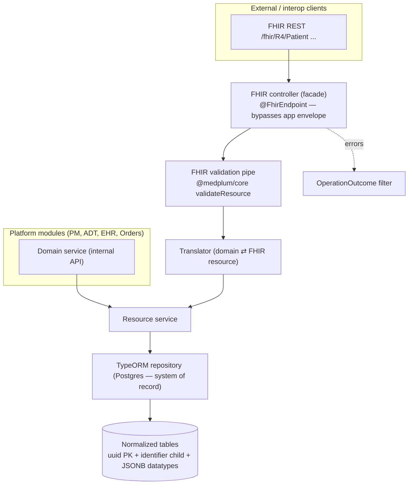

# feat: FHIR R4 Clinical Data Spine — relational core + FHIR facade foundation

## Summary

Lay the **shared clinical foundation** that Patient Management, ADT, Encounters/EHR,
and Orders/CPOE all build on: a FHIR R4-aligned resource layer in the backend,
modeled as **normalized TypeORM/Postgres tables (the system of record) projected to
FHIR resources through a thin translator + FHIR REST facade** — the OpenMRS `fhir2`
pattern, adapted to NestJS. This plan delivers the architecture, the reusable
`Repository → Translator → FHIR controller` seam, the cross-cutting concerns
(identity model, references, validation, the prod schema-delivery path, the
response-envelope bypass), and **three worked resources** — `Patient` (identity /
MPI seam), `Encounter` (cross-resource reference), and `ServiceRequest` (the orders
routing spine) — that prove the pattern end to end. The named clinical modules then
become "add a resource + a translator + a controller," not "invent the foundation."

This is the spine, not the modules: it does **not** build Patient Management /
ADT / Encounters / Orders feature workflows or screens — those are separate
brainstorm → plan → work cycles that consume this layer.

---

## Problem Frame

The taxonomy brainstorm commits to **FHIR R4 as the platform's primary external
clinical-data contract** (origin R37) and an **Orders/CPOE spine** that routes to
Lab/Imaging/Pharmacy (origin R4), under an EHR-centered clinical core (origin
R6–R9). Retrofitting FHIR onto non-FHIR models later is expensive, so the brainstorm
explicitly calls for designing the clinical resources against FHIR from the start.

Today the backend is **fully greenfield clinically** — no clinical module, no
patient/encounter/order entities, no FHIR anywhere (confirmed by repo search). What
*does* exist is a clean, well-documented backend: a feature-module pattern to mirror
(`apps/backend/api/src/modules/core/docs/*`, `.../coms/*`), a global `@hsm/database`
with a disciplined entity-registration chain, an auto-wrapping response envelope, and
a two-source (Postgres + read-only Oracle) setup. A `clinical.module.ts` is already
named as the intended home in both `apps/backend/api/CLAUDE.md` and
`packages/database/CLAUDE.md`.

Three structural realities shape this work:
1. **The entity-barrel circular-dep hazard** (`packages/database/CLAUDE.md`) — a new
   clinical entity domain with many cross-resource relations must hook all four
   barrel links and import only from `@hsm/database/entities`, or entities silently
   vanish at runtime.
2. **No production schema-delivery path** — dev relies on `dataSource.synchronize()`
   gated to `ENVIRONMENT==='dev'`; prod has neither synchronize nor a migration
   runner. The spine is the first prod-bound entity set, so it must establish one.
3. **The global `ResponseInterceptor`/`ResponseFilter` wrap every response** in the
   app envelope — FHIR REST must instead emit raw FHIR resources and
   `OperationOutcome`, so the spine needs a per-route bypass.

The goal is to settle these once, prove the pattern on three resources, and leave a
foundation the clinical modules extend cheaply.

---

## High-Level Technical Design

**Layering (per resource), mirroring OpenMRS fhir2's DAO → Translator → Resource
Provider split, adapted to NestJS:**



**Request flows:**
- *External FHIR:* `GET/POST /fhir/R4/<Resource>` → controller (bypass envelope) →
  validate (POST) → translator → service → repository. Responses are raw FHIR
  resources / `Bundle` / `OperationOutcome`.
- *Internal:* platform modules call the **resource service** directly (typed domain
  DTOs), never paying the FHIR translation cost for their own screens.

**Resource & identity model:**
- `Resource.id` = opaque **UUID** = TypeORM PK = relative reference target
  (`Patient/{uuid}`).
- Business identifiers (MRN, order #, accession #) live in `identifier[]`, persisted
  in a **normalized identifier child table** with a unique `(system, value)` index —
  this is the MPI lookup seam, not the PK.
- Cross-resource references persist as **FK columns** (e.g. `encounter.subject_id →
  patient.id`) and serialize to relative references via the translator.
- Complex FHIR datatypes that aren't searched on (`HumanName[]`, `Address[]`,
  `ContactPoint[]`, `CodeableConcept`) persist as **typed JSONB columns**; scalar
  searchable fields (`birthDate`, `gender`, `status`) are real columns.

**Orders spine (`ServiceRequest` + `MedicationRequest`):**

```mermaid
flowchart LR
  SR["ServiceRequest<br/>intent=order · category=lab|imaging|procedure<br/>code · subject→Patient · performer→service"]
  MR["MedicationRequest<br/>(pharmacy spine)"]
  SR -. "routed by category/performer" .-> Lab["Laboratory"]
  SR -. .-> Img["Imaging"]
  MR -. .-> Pharm["Pharmacy"]
  Lab -. "result basedOn→SR" .-> DR["DiagnosticReport / Observation"]
  Img -. .-> IS["ImagingStudy"]
```

The spine defines the **routing contract** (a fulfilling module finds work by
querying `ServiceRequest` on `category`/`performer` + `status=active`, and links
results back with `basedOn`); it does **not** build the fulfilling modules.

*The diagrams are authoritative for the layering and contracts; per-unit detail
below governs file-level decisions.*

---

## Requirements

Spine requirements (SP-IDs), traced to the origin taxonomy
(`docs/brainstorms/2026-06-25-hospital-platform-module-taxonomy-requirements.md`):

- **SP1.** Clinical data is persisted relationally (system of record) and exposed
  through a FHIR R4 REST facade. (origin R37)
- **SP2.** A reusable per-resource seam — entity + translator + service + FHIR
  controller — so adding a clinical resource is mechanical, not architectural.
  (origin R8/R9 enablement)
- **SP3.** Identity model: UUID logical id as PK, business identifiers in a unique
  `(system,value)` child table (the MPI seam), relative references between resources.
- **SP4.** FHIR endpoints return native FHIR (`Resource`/`Bundle`/`OperationOutcome`),
  bypassing the app's success/error envelope.
- **SP5.** Inbound FHIR resources are validated against R4 before persistence.
- **SP6.** A production-capable schema-delivery path exists for clinical entities
  (not dev-only `synchronize`).
- **SP7.** `Patient` is exposed as a FHIR resource with identifier-based lookup.
  (origin R6)
- **SP8.** `Encounter` is exposed, referencing `Patient` as `subject`. (origin R7/R8)
- **SP9.** `ServiceRequest` is exposed with the orders routing + result-linkage
  contract (`category`/`performer`/`basedOn`). (origin R4/R9)
- **SP10.** The clinical domain module is wired into the app, entity registration is
  circular-dep-safe, and startup is verified at runtime. (constraint-driven)
- **SP11.** Clinical FHIR endpoints are authorization-gated (clinical-staff `@Roles`)
  and do not leak PHI into application logs. (PHI-protection, KTD11)

---

## Key Technical Decisions

- **KTD1 — Relational core + FHIR projection facade (not FHIR-native storage).**
  Normalized TypeORM/Postgres tables are the system of record; FHIR resources are
  produced/consumed by a per-resource translator at the API edge (OpenMRS fhir2
  model). Rationale: a transactional HIS needs FK integrity, status-transition
  invariants, and ordinary domain queries for its own screens — relational strengths.
  FHIR is the *contract*, not the truth. See Alternatives for the rejected
  FHIR-native (JSONB document) and hybrid options. **A JSONB "raw resource" escape
  hatch is deliberately deferred** (add later only if lossless round-trips of
  un-modeled elements are needed). **Reversal cost / falsification trigger:** this is
  the load-bearing decision — every other KTD and consuming module builds on it, and
  reversal cost scales with the number of consuming modules (after PM/ADT/EHR/Orders
  build on the typed service per KTD10, flipping to FHIR-native means rewriting every
  entity, translator, FK, and internal consumer). Revisit toward the hybrid escape
  hatch (b) — not full FHIR-native — if either trigger fires: an interop partner
  requires lossless round-trips of elements we don't natively model, **or** more than
  ~30% of a resource's fields end up in JSONB rather than columns. Re-evaluate at each
  new resource while reversal is still cheap, not after the consuming modules land.
- **KTD2 — UUID logical id + `identifier[]` child table.** PK is a server-assigned
  UUID (`@PrimaryGeneratedColumn('uuid')`, matching every existing entity); MRNs and
  order/accession numbers are `identifier[]` rows with a unique `(system,value)`
  index. Business ids are never the PK. This gives the MPI lookup seam without a
  probabilistic matcher (deferred).
- **KTD3 — References as FK + relative serialization.** Cross-resource references are
  real FK columns (`subject_id`), serialized as relative references (`Patient/{uuid}`)
  by the translator. Avoids absolute URLs and survives environment moves.
- **KTD4 — FHIR datatype persistence: searchable scalars as columns, complex
  datatypes as JSONB.** `HumanName[]`/`Address[]`/`ContactPoint[]`/`CodeableConcept`
  → typed `jsonb` columns; `birthDate`/`gender`/`status`/`intent`/`category` → real
  columns (so they're indexable and searchable). Identifiers are normalized (KTD2),
  not JSONB, because they need cross-row uniqueness/lookup. **Caveat (dated
  assumption):** `name`/`address`/`telecom` are *standard* FHIR Patient search params
  the MPI and Patient Management module will likely need, so "not searched on" is true
  for the spine's targeted search set but expires once name/address search lands. When
  it does, the choice is a GIN/expression index over the JSONB column or promoting the
  field to a real column — a prod-table migration. Reserve that as a known future
  migration rather than treating JSONB placement as permanent.
- **KTD5 — `@medplum/fhirtypes` for types, `@medplum/core` for runtime validation.**
  Strict R4 TS types for translator outputs and a `validateResource`-backed NestJS
  pipe for inbound bodies — no second FHIR server, no Java. Client libs
  (`fhir-kit-client`) only if/when we call *external* FHIR servers (out of scope).
- **KTD6 — Base R4, no profiles, deferred terminology.** Conform to base R4; use US
  Core/IPS only as a checklist for which elements to populate. Store `CodeableConcept`
  with `system`+`code`+`display` against a small curated code set (LOINC/SNOMED/ICD)
  for actual orderables; **no terminology server / ValueSet expansion** in the spine.
  **Routing-critical coded fields are the exception:** `status`, `intent`, and
  `category` (which drive ServiceRequest routing, KTD8) are validated against the
  shared `clinical.enum.ts` sets at the pipe/service boundary — an unvalidated
  `category` would silently route an order nowhere. Distinguish these enum-enforced
  codes from the free-text curated `CodeableConcept` codes, which stay advisory in v1.
- **KTD7 — FHIR endpoints bypass the global envelope.** A `@FhirEndpoint()` marker +
  reflector check in `ResponseInterceptor` lets FHIR routes return raw bodies; a
  dedicated exception filter renders `OperationOutcome` for FHIR routes. The app's
  `SuccessResponseDto` envelope stays the default everywhere else.
- **KTD8 — Two order spines, one routing contract.** `ServiceRequest` carries
  lab/imaging/procedure/consult orders; `MedicationRequest` (deferred to Pharmacy's
  own plan, but the contract is reserved) carries drug orders. Fulfilling modules
  poll by `category`/`performer` + `status`; results link back via `basedOn`. The
  spine defines and tests the contract; it builds no fulfilling module.
- **KTD9 — Introduce TypeORM migration *tooling* now; defer prod *activation* to the
  first prod-bound module.** The migration runner, data-source CLI config, and a
  generated baseline migration land in U2 so the capability exists and is exercised,
  but — since every consuming clinical module is deferred to its own cycle and the
  spine has no prod consumer yet — the spine ships **dev-only** (`synchronize`) and the
  prod migration runner is *activated* by the first module that actually deploys to
  prod. This avoids a standing ops obligation ahead of the value that justifies it
  while still building and de-risking the tooling. **Drift guard (required because dev
  `synchronize` and migration-generated schema can silently diverge):** generate
  migrations against a *clean* (non-synchronized) DB, and add a CI check that a fresh
  `migration:run` yields a schema equal to `synchronize`'s output (no pending diff
  after entities change). This is the classic TypeORM trap; the spine is the first
  prod-bound entity set, so there is no prior baseline to lean on.
- **KTD10 — Internal callers use the resource service, not the FHIR facade.** Platform
  modules depend on the typed resource **service** (domain DTOs); the FHIR controller
  is a thin external facade over the same service+translator. Avoids forcing every
  internal screen through FHIR verbosity (a documented OpenMRS pain point).
- **KTD11 — Clinical FHIR endpoints are authorization-gated from day one (PHI).** The
  global `AuthJwtAtGuard` authenticates but does not authorize — without a role gate,
  any authenticated staffer (or a compromised token) could read every patient's
  record, a HIPAA minimum-necessary violation. So `/fhir/R4/*` controllers carry a
  `@Roles(...)` gate scoped to clinical staff from U5 onward, even though the
  fine-grained roles registry is future work; "open to any authenticated user" is not
  a defensible interim posture for PHI. Row-level isolation (which clinician sees which
  patient) is acknowledged as a deliberate follow-up (see Open Questions), but the
  coarse role gate ships now.

---

## Alternatives Considered

- **(a) FHIR-native document store (JSONB resources, Medplum/Aidbox model).**
  Store whole FHIR resources as JSONB, project search params to columns. **Rejected
  for the spine:** great for a FHIR-first data platform, but it fights a transactional
  HIS — enforcing FK integrity, bed/ward state, and order-status transitions inside
  JSONB blobs is awkward, and even Medplum ends up projecting search params into
  per-resource relational columns. Our heart is transactional ADT/orders.
- **(b) Hybrid (relational + full-fidelity JSONB shadow).** Relational truth plus a
  JSONB column holding the complete FHIR resource for lossless round-trips. **Deferred,
  not rejected:** sensible escape hatch, but adds drift-management cost (two
  representations to keep in sync) we don't need until an integration partner demands
  elements we don't natively model. KTD1 leaves the door open.
- **(c) Separate FHIR server (`node-fhir-server-core`, HAPI, `@medplum/server`).**
  **Rejected:** duplicates the NestJS app we already own and operate; the facade
  approach reuses our auth, DI, DB, and ops.
- **Rollout: Patient-only vertical slice before generalizing.** An alternative
  *sequencing* — prove the entire cross-cutting seam (envelope bypass, validation,
  migrations tooling, identity model) end-to-end on `Patient` alone, ship it, then add
  Encounter/ServiceRequest. **Chosen against, but partially adopted:** the unit order
  already lands Patient (U5) before Encounter (U6) and ServiceRequest (U7), so if a
  foundational assumption (`validateResource` depth, the interceptor/filter bypass) is
  wrong it surfaces on the first resource, not the third. Three resources are still
  committed up front because the plan's deliverable *is* the reusable seam, and a
  single resource cannot prove cross-resource references (Encounter→Patient) or the
  orders-routing contract (ServiceRequest) — the two seams most likely to need rework.

---

## Output Structure

```text
apps/backend/api/src/modules/clinical/
├── clinical.module.ts                  # domain module → imported by MainModule
├── fhir/                               # cross-cutting FHIR seam (KTD4–KTD7)
│   ├── fhir.decorator.ts               # @FhirEndpoint() marker
│   ├── fhir-validation.pipe.ts         # @medplum/core validateResource
│   ├── fhir-operation-outcome.filter.ts
│   ├── fhir-controller.base.ts         # shared controller conventions
│   └── translator.interface.ts         # domain ⇄ FHIR contract
├── patient/    { patient.module, .controller, .service, .translator, *.spec, patient.http }
├── encounter/  { encounter.module, .controller, .service, .translator, *.spec, encounter.http }
└── service-request/ { ...module/.controller/.service/.translator/*.spec/.http }

packages/database/src/
├── entities/modules/clinical/          # new entity domain (all 4 barrel links)
│   ├── patient.entity.ts
│   ├── patient-identifier.entity.ts
│   ├── encounter.entity.ts
│   ├── service-request.entity.ts
│   └── index.ts
├── migrations/                         # new (KTD9)
└── sources/postgres/                   # +CLINICAL schema; +clinical entity registration

packages/common/src/enums/clinical.enum.ts   # FHIR status/intent/category codes (shared FE/BE)
```

The per-unit `**Files:**` sections are authoritative; the tree is the intended shape.

---

## Implementation Units

### Phase 1 — Foundation

### U1. Clinical schema + domain module + circular-dep-safe entity registration

**Goal:** Stand up the `clinical` Postgres schema, the `ClinicalModule` skeleton, and
the new entity-barrel domain — wired through all four registration links so entities
actually reach `forFeature`.

**Requirements:** SP10.

**Dependencies:** none.

**Files:**
- `packages/database/src/sources/postgres/database-postgres.schemas.ts` (add
  `CLINICAL = 'clinical'`)
- `packages/database/src/entities/modules/clinical/index.ts` (new barrel)
- `packages/database/src/entities/modules/index.ts` (add `export * from './clinical'`)
- `packages/database/src/sources/postgres/database-postgres.entities.ts` (add
  `import * as clinicalEntities` + spread `...Object.values(clinicalEntities)`)
- `apps/backend/api/src/modules/clinical/clinical.module.ts` (new, empty domain module)
- `apps/backend/api/src/app.module.ts` / `main.module.ts` (import `ClinicalModule`)

**Approach:** Follow `packages/database/CLAUDE.md` "Adding a Postgres entity" exactly —
the four-link chain is the documented root cause of the template-entities bug. Keep
`sources/postgres/index.ts` schemas-only (never re-export `database-postgres.entities`).
`onModuleInit` auto-creates the schema in dev. The module is empty until U5–U7 add
the Patient/Encounter/ServiceRequest feature modules (U4 wires the shared FHIR seam,
not a feature module).

**Patterns to follow:** `core.module.ts` (domain module shape); the existing
`USERS/DOCS/...` schema enum members; the `Object.values(...)` spread already present
for other domains in `database-postgres.entities.ts`.

**Test scenarios:**
- `DatabasePostgresSchemasEnum.CLINICAL` exists and equals `'clinical'`.
- The clinical entity barrel's `Object.values` is non-empty once U3 lands (guard
  against the silent-drop bug) — assert the registration array includes a clinical
  entity.

**Execution note:** Run `pnpm --filter @hsm/api start:dev` after wiring — DI/missing-
entity failures surface only at runtime, never at build.

**Verification:** App boots to the DB-connection phase with `ClinicalModule` loaded
and no DI errors; the `clinical` schema is created in dev.

### U2. TypeORM migration tooling + drift guard (prod activation deferred)

**Goal:** Build and de-risk the migration *capability* (runner, CLI config, drift
check) without imposing a standing prod ops obligation while the spine has no prod
consumer (KTD9). Prod *activation* rides with the first clinical module that deploys.

**Requirements:** SP6 (KTD9).

**Dependencies:** U1 (schema exists). **Sequencing:** the migration *tooling/runner*
sets up in Phase 1, but the baseline migration is *generated* only after the entity
files exist (U5–U7). To avoid an empty/wrong diff, run `migration:generate` as the
first step of Phase 4 (U8), not mid-Phase-1. (This resolves the cross-phase ordering:
nothing in Phase 1 generates a migration before entities exist.)

**Files:**
- `packages/database/src/sources/postgres/database-postgres.module.ts` (keep
  `synchronize` gated to dev; add a *non-dev migration-run path that is off by default*
  — activated by config when the first prod-bound module ships)
- `packages/database/` data-source/CLI config for `migration:generate`/`migration:run`
- `packages/database/src/migrations/` (baseline migration, generated in Phase 4)
- `packages/database/package.json` (migration scripts)
- CI config (the drift check below)

**Approach:** Add the TypeORM migrations runner + CLI for the Postgres source. Dev keeps
`dataSource.synchronize()`; the non-dev runner exists but stays inert until a deploy
explicitly enables it (the spine ships dev-only). **Drift guard (KTD9):** generate
migrations against a *clean, non-synchronized* DB, and add a CI check asserting a fresh
`migration:run` produces a schema equal to `synchronize`'s output (no pending diff
after entities change). Document the workflow + the deferred-activation posture in
`packages/database/CLAUDE.md`.

**Patterns to follow:** the existing `database-postgres.module.ts` `onModuleInit`
environment gate; TypeORM's standard migration CLI.

**Test scenarios:**
- Dev path still uses `synchronize` (env-gated branch unchanged).
- The non-dev migration runner is present but inert unless its activation flag is set.
- The baseline migration creates the clinical tables + the unique `(system,value)`
  identifier index.
- *Drift:* CI fails if entities change with no corresponding migration (clean-DB
  `migration:run` schema ≠ `synchronize` schema).

**Verification:** Tooling installs; `migration:run` against a fresh DB creates the
clinical schema/tables; the drift check runs in CI; dev boot is unchanged and prod
activation stays off by default.

### Phase 2 — FHIR seam (the reusable pattern)

### U3. FHIR types, base resource entity, and datatype/reference persistence

**Goal:** Establish how FHIR resources are typed and persisted — the conventions every
resource entity reuses.

**Requirements:** SP1, SP2, SP3 (KTD2, KTD3, KTD4, KTD5).

**Dependencies:** U1.

**Files:**
- `apps/backend/api/package.json` (add `@medplum/fhirtypes`, `@medplum/core`, and
  `@medplum/definitions` if needed for validation — **pinned to exact versions**, not
  semver ranges, since these gate PHI ingestion)
- `packages/common/src/enums/clinical.enum.ts` (+ barrel export) — FHIR status/intent/
  category code enums shared FE/BE
- `packages/database/src/entities/modules/clinical/patient.entity.ts` etc. (created in
  U4–U7, but the **base conventions** — uuid PK, `@Create/Update/DeleteDateColumn`,
  jsonb datatype columns, FK references — are defined and documented here, optionally
  via a shared mapped-superclass or a documented convention)
- `apps/backend/api/src/modules/clinical/fhir/translator.interface.ts` (the
  `toFhir(entity)` / `fromFhir(resource)` contract)

**Approach:** Add the Medplum deps (run `pnpm audit` + add `@medplum/*` to the repo's
dependency-review policy before merge). Define the `Translator<TEntity, TResource>`
interface (bidirectional, datatype-reusable). Decide the base-entity convention (uuid
PK + timestamps + soft-delete, matching existing entities; `jsonb` columns for complex
datatypes; FK + relative-ref serialization for references). Add shared clinical enums
to `@hsm/common/enums` (pure barrel — both FE and BE import).

**Validation spike (do first — it shapes SP5 and U4's tests):** confirm exactly what
`@medplum/core` `validateResource` checks *standalone* — JSON structure only, or
cardinality, or terminology bindings — and whether it requires base-R4
`StructureDefinition` bundles (from `@medplum/definitions`) to be loaded. If it noops
without loaded definitions, "validated against R4" (SP5) and U4's `422`-on-invalid
tests silently degrade to near-nothing. Pin the validation contract here so downstream
test expectations match reality; load definitions if needed.

**Patterns to follow:** existing entities (`documents.entity.ts` PK/timestamp/soft-
delete shape); the pure-enum discipline in `@hsm/common/enums`.

**Test scenarios:**
- A reference round-trips: FK uuid → `Patient/{uuid}` string and back.
- A JSONB datatype column (`HumanName[]`) persists and rehydrates with shape intact.
- The clinical enums expose the R4 code sets used by U4–U7 (status/intent/category).
- *Validation contract:* a known-invalid resource fails `validateResource` and a valid
  one passes — proving the validator is actually enforcing R4, not nooping (per spike).

**Verification:** Deps install and type-check; the translator interface compiles
against `@medplum/fhirtypes`; a sample entity using the conventions persists in dev.

### U4. FHIR REST facade convention — controller base, envelope bypass, validation, OperationOutcome

**Goal:** The shared FHIR-controller mechanics so each resource controller is thin.

**Requirements:** SP4, SP5 (KTD7).

**Dependencies:** U3.

**Files:**
- `apps/backend/api/src/modules/clinical/fhir/fhir.decorator.ts` (`@FhirEndpoint()`)
- `apps/backend/api/src/interceptors/response.interceptor.ts` (reflector check →
  passthrough for `@FhirEndpoint()`)
- `apps/backend/api/src/interceptors/http-logging.interceptor.ts` (suppress/mask
  request+response **body** logging for `@FhirEndpoint()` routes — PHI)
- `apps/backend/api/src/modules/clinical/fhir/fhir-operation-outcome.filter.ts`
- `apps/backend/api/src/modules/clinical/fhir/fhir-validation.pipe.ts`
  (`@medplum/core` `validateResource`)
- `apps/backend/api/src/modules/clinical/fhir/fhir-search.pipe.ts` (search-param
  allowlist/validation)
- `apps/backend/api/src/modules/clinical/fhir/fhir-controller.base.ts`
- co-located `*.spec.ts` for interceptor bypass, log suppression, pipe, filter

**Approach.** The `fhir-controller.base.ts` is justified by concrete shared behavior
(not a speculative one-consumer abstraction): it binds the OperationOutcome filter at
controller scope, declares `@Version(VERSION_NEUTRAL)`, sets `application/fhir+json`,
applies the raw-body and search pipes, and carries the `@Roles` gate — so the three
resource controllers (and every future one) inherit all of it. Specifically:

- **Version prefix (KTD7).** The app uses global URI versioning (`defaultVersion: '1'`)
  — a plain `/fhir/R4/Patient` controller would serve at `/v1/fhir/R4/Patient`. FHIR
  controllers declare `@Version(VERSION_NEUTRAL)` so routes are served at the
  advertised `/fhir/R4/*` with no `/v1` prefix.
- **Envelope bypass (success).** `@FhirEndpoint()` sets metadata; the global
  `ResponseInterceptor` reflector-checks it and returns the raw body for marked routes,
  wrapping as today otherwise.
- **Envelope bypass (error) — must out-rank the global `ResponseFilter`.** The global
  `@Catch(HttpException)` `ResponseFilter` would otherwise render the app error
  envelope for 404/422. Bind the FHIR `OperationOutcome` filter at **controller scope**
  (via `@UseFilters` on the base) catching `HttpException`, so NestJS's nearest-scoped
  filter resolution shadows the global one for FHIR routes only.
- **Inbound body — bypass the global `ValidationPipe`.** The global pipe
  (`whitelist` + `forbidNonWhitelisted`) would strip/reject un-DTO'd FHIR fields before
  the Medplum pipe runs. FHIR routes take the body as the raw resource (no
  class-validated DTO param, so `forbidNonWhitelisted` never fires) and run only the
  `validateResource` pipe.
- **Search inputs.** A `fhir-search.pipe` allowlists enum params (`category`, `status`,
  `intent`) against `clinical.enum.ts`, regex-validates `identifier` (`system|value`),
  and guarantees all params reach TypeORM as **bound parameters** (never interpolated).
- **PHI in logs.** Extend the global `HttpLoggingInterceptor` to suppress/mask request
  and response *bodies* for `@FhirEndpoint()` routes (Patient names, MRNs, birthdates
  must not hit plaintext logs).

**Patterns to follow:** the existing `ResponseInterceptor`
(`apps/backend/api/src/interceptors/response.interceptor.ts`), `ResponseFilter`, and
`HttpLoggingInterceptor`; NestJS `VERSION_NEUTRAL`, `@UseFilters`, pipe idioms.

**Test scenarios:**
- A `@FhirEndpoint()` route returns the raw resource (no `{ metadata, data }` wrapper)
  **at `/fhir/R4/...` with no `/v1` prefix**.
- A non-FHIR route still gets the app envelope AND still version-prefixes (no regression).
- An invalid inbound resource yields a `422` `OperationOutcome` (not the app envelope),
  proving the FHIR filter out-ranks the global `ResponseFilter`.
- A not-found FHIR read yields a `404` `OperationOutcome`; a non-FHIR 404 still returns
  the app error envelope.
- A POST with extra FHIR fields is **not** stripped/rejected by the global ValidationPipe.
- A search with an out-of-allowlist `category` is rejected; a valid one binds as a param.
- The log interceptor emits **no body** for `/fhir/R4/*` routes.

**Verification:** A throwaway FHIR test endpoint returns raw FHIR at the un-prefixed
path + OperationOutcome on error, accepts a full FHIR body, and logs no PHI; existing
non-FHIR endpoints are unaffected (full API suite green).

### Phase 3 — Spine resources (prove the pattern)

### U5. `Patient` resource — identity + MPI seam (worked example #1)

**Goal:** First end-to-end resource: entity + identifier child table + translator +
FHIR controller (read by id, search by identifier, create).

**Requirements:** SP7 (+ SP2, SP3).

**Dependencies:** U3, U4. (U2 generates its migration after this lands.)

**Files:**
- `packages/database/src/entities/modules/clinical/patient.entity.ts`
- `packages/database/src/entities/modules/clinical/patient-identifier.entity.ts`
  (unique `(system,value)`)
- `.../clinical/index.ts` (export both)
- `apps/backend/api/src/modules/clinical/patient/{patient.module,patient.controller,
  patient.service,patient.translator}.ts` + `patient.http`
- co-located `*.spec.ts` (service + translator + controller)

**Approach:** Patient entity = uuid PK, real columns (`active`, `gender`, `birthDate`),
jsonb datatypes (`name[]`, `telecom[]`, `address[]`), normalized `identifier[]` child
(MPI seam). Translator maps entity ⇄ FHIR `Patient`. Controller (`/fhir/R4/Patient`):
`GET /:id`, `GET ?identifier=system|value`, `POST`. Service is the internal API
(domain DTOs). **Authorization (KTD11):** the controller carries a `@Roles(...)` gate
scoped to clinical staff via the base — authentication alone is not authorization, and
PHI must not be readable by any authenticated user. The grant can be a single broad
clinical role for now; the fine-grained registry refines it later. **MPI scope:** this
delivers the deterministic identifier-lookup *seam* only — probabilistic matching and
record merge/dedup (origin R6) are explicitly the Patient Management module's job, not
the spine's, so the downstream plan inherits them as a known gap.

**Patterns to follow:** `docs.service.ts` (repository injection, `getManyAndCount`,
pagination, `manager.transaction` for multi-row writes); `docs.controller.ts`
(`@ApiDocumentation` + `@Roles` + verb) adapted to `@FhirEndpoint()` for FHIR routes.

**Test scenarios:**
- *Happy:* create a Patient → persists entity + identifier rows; `GET /:id` returns a
  valid FHIR `Patient` with relative-id and `identifier[]` rebuilt from the child table.
- *Search:* `GET ?identifier=mrn-system|123` returns the matching Patient as a `Bundle`.
- *Edge:* duplicate `(system,value)` identifier is rejected (unique constraint → 409
  / OperationOutcome).
- *Edge:* missing required element on create → `422` OperationOutcome (validation pipe).
- *Translator:* entity → FHIR → entity round-trip preserves name/identifier/birthDate.
- *Authz:* `Covers SP11.` a user with no clinical role gets `403` on Patient read/create.
- *Integration:* `Covers SP7.` end-to-end create→read returns spec-valid R4 `Patient`.

**Verification:** `patient.http` create/read/search work against a running dev API;
returned bodies are raw FHIR; specs green; `start:dev` clean.

### U6. `Encounter` resource — cross-resource reference (worked example #2)

**Goal:** Prove references: `Encounter.subject → Patient` as FK + relative ref.

**Requirements:** SP8 (+ SP2, SP3).

**Dependencies:** U5.

**Files:**
- `packages/database/src/entities/modules/clinical/encounter.entity.ts` (FK `subject_id`)
- `.../clinical/index.ts` (export)
- `apps/backend/api/src/modules/clinical/encounter/{module,controller,service,
  translator}.ts` + `encounter.http` + `*.spec.ts`

**Approach:** Encounter entity = uuid PK, real columns (`status`, `class`, `period`
start/end), `subject_id` FK → patient. Translator serializes `subject` as
`Patient/{uuid}` and resolves inbound references to the FK. **Reference integrity:** the
*service* pre-resolves the referenced Patient (existence check) and raises a clean
`422` `OperationOutcome` on a dangling reference — do **not** rely on the raw DB FK
violation, which would surface as a generic error via `TypeOrmExceptionFilter` rather
than a FHIR `OperationOutcome`. Controller `GET /:id`, `GET ?subject=Patient/{uuid}`,
`POST`.

**Patterns to follow:** U5 (same resource seam); KTD3 reference handling from U3.

**Test scenarios:**
- *Happy:* create Encounter referencing an existing Patient → `subject` serializes to
  `Patient/{uuid}`; `GET /:id` returns valid FHIR `Encounter`.
- *Search:* `GET ?subject=Patient/{uuid}` returns that patient's encounters as a Bundle.
- *Error:* create referencing a non-existent Patient → service pre-resolution raises a
  `422` `OperationOutcome` (not a raw FK-violation error).
- *Translator:* `subject` round-trips FK ⇄ relative reference.
- *Integration:* `Covers SP8.` Encounter correctly linked to its Patient across a
  create-then-read cycle.

**Verification:** `encounter.http` flows work; reference serialization correct; specs
green.

### U7. `ServiceRequest` resource — the orders routing spine (worked example #3)

**Goal:** Prove the orders spine: `ServiceRequest` with the category/performer routing
contract and the `basedOn` result-linkage contract.

**Requirements:** SP9 (+ SP2, SP3) (KTD8).

**Dependencies:** U5 (subject) hard. U6 **soft** — the `encounter_id` FK is optional,
so U7 can build in parallel with U6 and add the nullable FK column once U6's entity
lands.

**Files:**
- `packages/database/src/entities/modules/clinical/service-request.entity.ts`
- `.../clinical/index.ts` (export)
- `apps/backend/api/src/modules/clinical/service-request/{module,controller,service,
  translator}.ts` + `service-request.http` + `*.spec.ts`
- `packages/common/src/enums/clinical.enum.ts` (ensure `status`/`intent`/`category`
  code sets present)

**Approach:** Entity = uuid PK, real columns (`status`, `intent`, `category`, `code`
as CodeableConcept jsonb + a denormalized `category` code column for routing/search),
`subject_id` FK, optional `encounter_id` FK, `performer` (target service), and
`basedOn` as a **nullable self-FK** (`based_on_id → service_request.id`) — chosen over
free-text so result attribution has DB-level integrity, with the same service
pre-resolution → `422` rule as U6. Controller `GET /:id`, `GET ?subject=&category=&status=`,
`POST`. **Routing-code validation:** `status`/`intent`/`category` are validated against
`clinical.enum.ts` at the pipe/service boundary (KTD6) — an unvalidated `category`
would silently route an order nowhere. Define and document the **routing contract**
(fulfilling modules query `category`+`performer`+`status=active`) and the
**result-linkage contract** (`DiagnosticReport/Observation/ImagingStudy.basedOn →
ServiceRequest`) — the seam future Lab/Imaging modules consume.

**MedicationRequest — prove the contract generalizes (origin R4 includes medication
orders).** Without building the Pharmacy module, add a **contract-only** check that the
routing/`basedOn` seam generalizes to a second order resource: a thin
`MedicationRequest` stub (entity shell + translator) exercised by a translator/routing
spec only. This validates the "one routing contract" claim across both order resources
*before* PM/ADT/EHR build on the ServiceRequest-shaped seam — guarding against the
Pharmacy plan discovering the reserved contract doesn't fit after consumers exist.

**Patterns to follow:** U5/U6 seam; FHIR R4 `ServiceRequest` field semantics from
research (`intent=order`, `category` for routing, `basedOn` for results).

**Test scenarios:**
- *Happy:* create a lab `ServiceRequest` (`intent=order`, `category=laboratory`,
  `code=...`, `subject=Patient/{uuid}`) → valid FHIR on read.
- *Routing:* `GET ?category=laboratory&status=active` returns active lab orders (the
  fulfilling-module poll contract) and excludes imaging/other categories.
- *Edge:* invalid `intent`/`status`/`category` (out of `clinical.enum.ts`) → `422`
  OperationOutcome — proving routing codes can't silently break.
- *Linkage:* a stored `basedOn` self-FK resolves back to its ServiceRequest; a dangling
  `basedOn` is pre-resolved to a `422` (contract test for result attribution).
- *Contract generalization:* the MedicationRequest stub routes/links through the same
  seam (translator/routing spec) — the "one routing contract" claim holds for both.
- *Integration:* `Covers SP9.` an order created for a patient is discoverable by the
  routing query and carries a resolvable subject reference.

**Verification:** `service-request.http` create/route/read flows work; the routing and
basedOn contracts are exercised by specs; `start:dev` clean.

### Phase 4 — Assemble & hand off

### U8. Wire-up, capability metadata, and consuming-module handoff

**Goal:** Assemble the clinical module, expose minimal FHIR metadata, and document how
the next modules extend the spine.

**Requirements:** SP10 (+ SP2).

**Dependencies:** U5, U6, U7. **First step:** generate the U2 baseline migration now
that all entities exist (`migration:generate` against a clean DB; verify the drift
check passes).

**Files:**
- `apps/backend/api/src/modules/clinical/clinical.module.ts` (import Patient/Encounter/
  ServiceRequest feature modules)
- `packages/database/src/migrations/` (baseline clinical migration — generated here)
- `apps/backend/api/CLAUDE.md` and/or `packages/database/CLAUDE.md` (a short "adding a
  FHIR resource" recipe pointing at the Patient seam)
- `docs/roadmap/2026-06-26-hospital-platform-build-tracker.md` (update the cross-cutting R4/R37
  rows only — the tracker already exists; this is a one-line note, not a deliverable)

**Approach:** Compose the domain module; generate the baseline migration; write the
extension recipe so PM/ADT/EHR/Orders plans just follow the Patient pattern. Update the
existing tracker's R4/R37 rows (module **Build** stays per-module).

**CapabilityStatement — optional, deferred unless an integration partner needs it.**
A `GET /fhir/R4/metadata` endpoint is *not* a committed deliverable of the spine; build
it only when an external FHIR client requires discovery. If built: it conventionally
needs `@Public()`, so restrict the payload to resource/interaction names only (no
internal URL patterns, server version strings, or extension metadata) to avoid an
unauthenticated recon surface on a clinical system, and document the `@Public()`
rationale.

**Patterns to follow:** `core.module.ts` aggregation; existing CLAUDE.md "Adding a
feature module" recipe style.

**Test scenarios:**
- `ClinicalModule` boots with all three feature modules and no DI errors.
- The baseline migration applies cleanly to a fresh DB and the drift check passes.
- *(If the optional CapabilityStatement is built)* `GET /fhir/R4/metadata` returns a
  CapabilityStatement listing Patient, Encounter, ServiceRequest with a minimal payload.

**Verification:** Full API suite green; `start:dev` clean with the clinical module
fully wired; the three resources reachable under `/fhir/R4/*`.

---

## Scope Boundaries

**In scope:** the architecture + reusable seam, identity/reference model, FHIR
validation + envelope bypass, prod schema-delivery, and the three worked resources
(Patient, Encounter, ServiceRequest) with read/search-by-key/create.

### Deferred to follow-up work
- **The clinical modules themselves** — Patient Management, ADT, Encounters/EHR,
  Orders/CPOE feature workflows, business rules, and frontend screens. Each is its own
  brainstorm → plan → work cycle consuming this spine.
- **`MedicationRequest`, `Observation`, `DiagnosticReport`, `Condition`,
  `AllergyIntolerance`, `ImagingStudy`** — named/contract-reserved here; modeled when
  their owning module is built (Pharmacy, Lab, Imaging, EHR).
- **Comprehensive FHIR Search** — the spine ships targeted search params (`identifier`,
  `subject`, `category`, `status`); the full FHIR Search grammar (chaining,
  `_include`, modifiers — the fhir2 DAO equivalent) is a later subsystem.
- **Terminology server / ValueSet expansion / `$validate-code`**, **probabilistic
  MPI**, **JSONB raw-resource fidelity layer**, **FHIR profiles (US Core/IPS)**,
  **bulk export**, **`update`/`delete`/history interactions** — all explicitly later.
- **Frontend FHIR consumption / DTO mirroring** in `@hsm/web` — the spine is backend;
  consuming modules mirror shapes per the web CLAUDE.md rules when they build screens.

### Out of scope
- Mapping patients from the Oracle legacy system (no patient tables exist in the
  generated Oracle entities; a one-time migration is its own project).
- Any change to non-clinical modules beyond the `ResponseInterceptor` bypass hook.

---

## Risks & Dependencies

- **Circular-dep entity-barrel hazard (high).** The clinical domain has multiple
  cross-resource relations — exactly the amplifier the `packages/database/CLAUDE.md`
  warning describes. Mitigation: import entities only from `@hsm/database/entities`,
  keep `sources/postgres/index.ts` schemas-only, complete all four barrel links, and
  **verify at `start:dev`** (build success proves nothing). U1 owns this.
- **New external deps gate PHI ingestion:** `@medplum/fhirtypes`, `@medplum/core`
  (+ `@medplum/definitions` for validation). Because `validateResource` processes all
  inbound clinical data, treat supply-chain trust as material: **pin exact versions**,
  run `pnpm audit`, and add `@medplum/*` to the dependency-review/Dependabot policy
  (U3). Also vet license/size. **Validation efficacy is unverified until the U3 spike**
  confirms what `validateResource` checks standalone — if it noops without loaded
  StructureDefinitions, SP5 is hollow.
- **Migration tooling vs prod activation (KTD9):** U2 builds the runner + drift check
  but keeps prod activation **off by default** (spine ships dev-only). Risk if dev
  `synchronize` and migration-generated schema diverge — mitigated by generating against
  a clean DB + the CI drift check. The first prod-bound module activates the runner.
- **Envelope/error bypass regression risk:** the `ResponseInterceptor` **and**
  `ResponseFilter`/`HttpLoggingInterceptor` changes touch globals. Mitigation:
  reflector-gated, default-unchanged, controller-scoped FHIR filter, with regression
  tests that non-FHIR routes still wrap, still version-prefix, and still log (U4).
- **Row-level PHI isolation is not solved by the coarse role gate (KTD11).** The
  `@Roles` gate stops non-clinical users, but which clinician may see which patient
  (ward-level isolation) is a deliberate follow-up security design, flagged below.
- **FHIR verbosity / dual API:** internal callers use the service, not the facade
  (KTD10), avoiding the OpenMRS "everything through FHIR is verbose" pain.
- **Test env shim:** new required env vars (if any) must get dummy values in
  `apps/backend/api/src/test-setup.ts` or the whole suite fails at startup.

---

## Open Questions

### Resolved during this review
- **Prod posture (KTD9):** build migration tooling now, keep prod activation deferred to
  the first prod-bound module; spine ships dev-only. *(was: migrations now vs defer)*
- **`@Roles` gate timing (KTD11):** gate `/fhir/R4/*` to clinical staff **now** — PHI is
  not open-to-any-authenticated-user. *(reversed the earlier "lean open" stance)*
- **CapabilityStatement (U8):** optional, deferred unless an integration partner needs
  it; minimal payload + documented `@Public()` if built.

### Deferred to implementation / follow-up
- **Identifier `system` URIs** — the canonical namespaces for MRN/national-id (a naming
  decision, not a blocker; pick placeholders, document, revisit with interop needs).
- **Row-level / patient-scoped PHI access** (which clinician sees which patient) — needs
  a deliberate security design in a follow-up; the coarse role gate (KTD11) is the v1.
- **PHI-at-rest encryption** of JSONB columns and **log-aggregator exposure** — confirm
  whether logs ship externally before deploy; column/app-level PHI encryption is a
  follow-up decision, not in the spine.
- **Multi-replica migration races** — if the runner is ever activated on `onModuleInit`
  across replicas, confirm advisory-lock behavior or move to a single deploy step.
- **Soft-delete read semantics** — does `GET /:id` on a soft-deleted resource return
  `404` or `410 Gone`? Decide when `update`/`delete` interactions land (deferred).

---

## Sources & Research

**Codebase:**
- `apps/backend/api/src/modules/core/docs/*`, `.../coms/*` — the feature-module pattern
  (controller `@ApiDocumentation`+`@Roles`+verb; service repo injection,
  `getManyAndCount`, pagination, `manager.transaction`).
- `apps/backend/api/CLAUDE.md` — module tree, "adding a feature module", the
  anticipated `clinical.module.ts`, global guards/interceptor/filter, the test env shim.
- `packages/database/CLAUDE.md` — the four-link entity-barrel chain and the
  circular-dep hazard; schema enum; `synchronize` dev-gate (the prod gap).
- `packages/database/src/sources/postgres/*` — schema enum (`USERS…SETTINGS`, no
  CLINICAL/CORE), `onModuleInit` schema creation + dev-only synchronize.
- `apps/backend/api/src/interceptors/response.interceptor.ts`,
  `packages/common/src/dtos/common-response.dto.ts`, `.../utils/pagination.util.ts` —
  the envelope the FHIR facade must bypass.
- `apps/backend/api/src/decorator/api-documentation.decorator.ts` — Swagger/response
  decorator pattern.
- `packages/database/src/entities/autogenerated/oracle/*` — staff/org reference data
  only; **no patient/encounter tables** (greenfield confirmed).

**External (FHIR R4 modeling):**
- OpenMRS `fhir2` module (DAO → Translator → Resource Provider; relational-to-FHIR
  projection): https://github.com/openmrs/openmrs-module-fhir2 ·
  https://pmc.ncbi.nlm.nih.gov/articles/PMC11141833/
- Medplum (FHIR-native reference, search architecture, runtime validation):
  https://www.medplum.com/docs/contributing/search-architecture ·
  https://www.medplum.com/docs/api/fhir/operations/validate-a-resource ·
  `@medplum/fhirtypes`, `@medplum/core` on npm
- FHIR R4 specs: ServiceRequest http://hl7.org/fhir/R4/servicerequest.html ·
  Resource id vs identifier https://www.hl7.org/fhir/resource.html ·
  Observation/DiagnosticReport (basedOn linkage) ·
  References https://hapifhir.io/hapi-fhir/apidocs/...Reference.html
- OpenHospital (relational HIS, **not** a FHIR reference):
  https://github.com/informatici/openhospital
- Origin: `docs/brainstorms/2026-06-25-hospital-platform-module-taxonomy-requirements.md`
  (R4 orders spine, R6–R9 clinical core, R37 FHIR R4).
